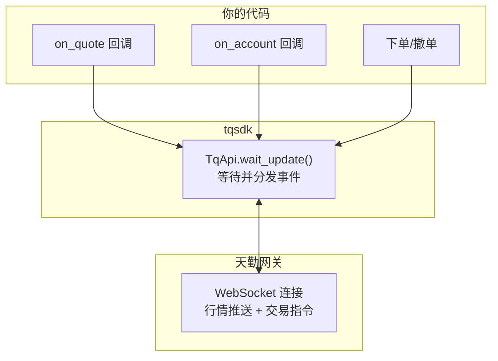

# tqsdk-python：天勤量化——A 股期货事件驱动型量化交易 SDK

> 本文基于 tqsdk-python 3.10。

## 这是什么

[tqsdk](https://github.com/shinnytech/tqsdk-python) 是信易科技（ShinnyTech）开源的 Python 量化交易 SDK，后端对接天勤（Tianqin）行情和交易网关。

和其他量化 SDK 的对比：

| | tqsdk | akshare | vnpy | Backtrader |
|---|---|---|---|---|
| 定位 | 事件驱动交易 SDK | 数据采集工具 | 完整量化框架 | 回测框架 |
| 实时行情 | ✅ 原生 WebSocket 推送 | ❌ HTTP 轮询 | ✅ 通过 CTP 等网关 | ❌ 仅回测 |
| 实盘交易 | ✅ | ❌ | ✅ | ❌ |
| 回测 | ✅ 内置 | ❌ | ✅ 需要 CTA 模块 | ✅ 核心功能 |
| 上手难度 | 低 | 低 | 高 | 中 |
| 免费 | 是（有速率限制） | 是 | 开源 | 开源 |

tqsdk 最特别的地方是它的**事件驱动模型**——不是你自己写循环去轮询行情，而是注册回调函数，行情来了自动调用。这和传统轮询式写法有本质区别。

## 安装与认证

```bash
pip install tqsdk
```

首次使用需要在[天勤官网](https://www.shinnytech.com/tianqin/)注册，获取 `username` 和 `password`。免费账户覆盖期货、股票指数、ETF 期权的实时行情，日频数据没有限制，分钟/ticks 有速率限制。

```python
from tqsdk import TqApi

# 连接天勤网关
api = TqApi()
print(api.get_quote("SHFE.cu2106"))
api.close()
```

## 核心模型：事件驱动 + 异步

tqsdk 的核心架构是一个**事件循环**：



每次 `api.wait_update()` 都是一次事件循环迭代——它阻塞等待新数据到达，然后调用你注册的回调函数。这种模式和 JavaScript 的事件驱动非常像——「别轮询，告诉我你对什么事件感兴趣，有变化我叫你」。

## 行情数据

### 实时行情

```python
from tqsdk import TqApi

api = TqApi()

# 获取合约行情——返回一个 quote 对象
quote = api.get_quote("SHFE.cu2106")
# quote 是一个动态对象——值会随行情更新自动变化

print(f"最新价: {quote.last_price}")
print(f"买一价: {quote.bid_price1}")
print(f"卖一价: {quote.ask_price1}")
print(f"成交量: {quote.volume}")
print(f"持仓量: {quote.open_interest}")

api.close()
```

`get_quote()` 返回的对象是**动态的**——每次 `wait_update()` 后字段自动更新。这消除了大量样板代码——你不用手动维护价格缓存，tqsdk 替你做了。

### 实时行情回调——事件驱动

```python
from tqsdk import TqApi, TqAuth

def on_quote_changed(quote):
    """行情变化时自动调用"""
    print(f"[{quote.datetime}] {quote.instrument_id} "
          f"最新: {quote.last_price} "
          f"买一: {quote.bid_price1} 卖一: {quote.ask_price1}")

api = TqApi(auth=TqAuth("username", "password"))

# 订阅合约
quote_copper = api.get_quote("SHFE.cu2106")

# 事件循环
while True:
    api.wait_update()          # 阻塞等待新行情
    on_quote_changed(quote_copper)
```

`wait_update()` 是 tqsdk 事件循环的核心——它等待 WebSocket 推送新数据，返回 `True` 如果事件发生过，返回 `False` 表示超时或无更新。

### K 线数据

```python
from tqsdk import TqApi
from datetime import datetime

api = TqApi()

# 拉取历史 K 线（日线）
klines = api.get_kline_serial(
    "SHFE.cu2106",
    duration_seconds=24 * 60 * 60,  # 日线
    data_length=200                   # 取 200 根
)

# klines 是 pandas DataFrame
print(klines.head())
#      datetime       open   high    low   close  volume  open_oi  close_oi
# 0  2021-01-04  58000.0   ...    ...     ...     ...      ...       ...

# 在线计算均线
klines["ma5"] = klines["close"].rolling(5).mean()
klines["ma20"] = klines["close"].rolling(20).mean()

print(klines[["datetime", "close", "ma5", "ma20"]].tail())

api.close()
```

`get_kline_serial()` 返回的是 pandas DataFrame——这意味着你可以直接用 pandas 的全部功能做数据处理。持续时间参数 `duration_seconds` 支持 60s、300s、1800s、86400s 等。

实时 K 线也用同样的方法获取——`data_length` 设大一些，每次 `wait_update()` 后 DataFrame 会自动追加新 K 线：

```python
klines = api.get_kline_serial("SHFE.cu2106", 300, data_length=500)

while True:
    api.wait_update()
    # klines 自动增长了——最新一根在 data.iloc[-1]
    latest = klines.iloc[-1]
    print(f"最新 5 分钟 K 线收盘: {latest.close} 时间: {latest.datetime}")
```

### 多合约订阅——tick 数据

```python
api = TqApi()

# 同时订阅多个合约
quotes = {
    "cu": api.get_quote("SHFE.cu2106"),
    "zn": api.get_quote("SHFE.zn2106"),
    "al": api.get_quote("SHFE.al2106"),
}

while True:
    api.wait_update()
    for name, q in quotes.items():
        print(f"[{name}] {q.last_price:.0f}  "
              f"涨跌: {q.last_price - q.pre_settlement:.0f}", end="  ")
    print()
```

多合约场景下，`wait_update()` 一次等待后，所有合约的行情都已更新——不需要为每个合约单独写循环。

## 下单与交易

tqsdk 支持实盘和模拟交易。交易前需要在[天勤官网](https://account.shinnytech.com/)注册实盘账户。

```python
from tqsdk import TqApi, TqAuth, TqAccount

# 方式一：模拟交易（免费账户默认）
api = TqApi(auth=TqAuth("username", "password"))

# 方式二：实盘交易（需要期货公司账户）
# api = TqApi(TqAccount("期货公司", "账号", "密码"),
#             auth=TqAuth("username", "password"))
```

### 开仓

```python
# 买入开仓 1 手铜
order = api.insert_order(
    symbol="SHFE.cu2106",
    direction="BUY",     # BUY / SELL
    offset="OPEN",       # OPEN / CLOSE / CLOSETODAY
    volume=1,
    limit_price=68000,   # 限价单价格
)

print(f"订单 ID: {order.order_id}")

# 等待交易所回报
while True:
    api.wait_update()
    if order.status == "FINISHED":
        print(f"全部成交，成交价: {order.trade_price}")
        break
    elif order.status == "ALIVE":
        print(f"已排队，已成交: {order.volume_orign - order.volume_left}/{order.volume_orign}")
```

`insert_order()` 是异步的——它返回一个 order 对象，然后你需要用 `wait_update()` 等待订单状态更新。这和行情数据共享同一个事件循环，意味着你的行情监听和订单监控可以在同一个 `while True` 里同时进行：

```python
quote = api.get_quote("SHFE.cu2106")
order = api.insert_order(symbol="SHFE.cu2106", direction="BUY",
                          offset="OPEN", volume=1, limit_price=68000)

while True:
    api.wait_update()

    # 行情更新
    if api.is_changing(quote, "last_price"):
        print(f"行情: {quote.last_price}")

    # 订单状态更新
    if api.is_changing(order, "status"):
        print(f"订单状态: {order.status}")
        if order.status == "FINISHED":
            break
```

### 平仓与撤单

```python
# 平仓
close_order = api.insert_order(
    symbol="SHFE.cu2106",
    direction="SELL",
    offset="CLOSE",
    volume=1,
    limit_price=68500,
)

# 撤单——在任何状态为 "ALIVE" 时都可以
api.cancel_order(order)
```

## 回测

tqsdk 内置回测引擎——不需要额外安装框架。写回测就像写实盘代码，只需要改一个参数：

```python
from tqsdk import TqApi, TqAuth, BacktestFinished, TargetPosTask

# 回测模式——比实盘多一个 backtest 参数
api = TqApi(backtest=True)

# 获取历史 K 线——回测模式下 tqsdk 会自动按时间推进
klines = api.get_kline_serial(
    "SHFE.cu2106", 24 * 60 * 60, data_length=200
)
quote = api.get_quote("SHFE.cu2106")

while True:
    try:
        api.wait_update()

        # 策略：金叉买入，死叉卖出
        klines["ma5"] = klines["close"].rolling(5).mean()
        klines["ma10"] = klines["close"].rolling(10).mean()

        ma5 = klines["ma5"].iloc[-1]
        ma10 = klines["ma10"].iloc[-1]

        if ma5 > ma10:  # 金叉
            # 用 TargetPosTask 自动管理仓位到目标值
            target_pos = TargetPosTask(api, "SHFE.cu2106")
            target_pos.set_target_volume(1)  # 目标持仓 1 手
        else:  # 死叉
            target_pos.set_target_volume(0)  # 清仓

    except BacktestFinished:
        break
```

回测的妙处在于：几乎和实盘代码一模一样。不需要把策略「翻译」到另一个回测框架里。跑完回测，把 `backtest=True` 去掉，同样的代码就是实盘。

## 实战：双均线策略完整示例

```python
#!/usr/bin/env python3
"""双均线策略——金叉买入，死叉卖出"""
from tqsdk import TqApi, TqAuth
from tqsdk.objs import TargetPosTask

# 参数
SYMBOL = "SHFE.rb2110"       # 螺纹钢
SHORT_MA = 5                 # 短均线周期
LONG_MA = 20                 # 长均线周期
KLINE_PERIOD = 5 * 60        # 5 分钟 K 线
POSITION = 3                 # 目标持仓

api = TqApi(auth=TqAuth("user", "pass"))

# 数据初始化
klines = api.get_kline_serial(SYMBOL, KLINE_PERIOD, data_length=LONG_MA + 50)
quote = api.get_quote(SYMBOL)
position = api.get_position(SYMBOL)

# TargetPosTask 自动管理仓位——涨跌停、资金不足等情况自动处理
target_pos = TargetPosTask(api, SYMBOL)

print(f"策略启动: {SYMBOL} {SHORT_MA}均线 / {LONG_MA}均线")
last_cross = None  # 记录上一次交叉信号，避免同方向重复开仓

while True:
    api.wait_update()

    # 等 K 线数据攒够
    if len(klines) < LONG_MA + 1:
        continue

    # 计算均线
    ma_short = klines["close"].iloc[-SHORT_MA:].mean()
    ma_long = klines["close"].iloc[-LONG_MA:].mean()

    # 判断交叉
    prev_short = klines["close"].iloc[-(SHORT_MA+1):-1].mean()
    prev_long = klines["close"].iloc[-(LONG_MA+1):-1].mean()

    prev_diff = prev_short - prev_long
    curr_diff = ma_short - ma_long

    if prev_diff <= 0 and curr_diff > 0 and last_cross != "golden":
        print(f"[{klines.iloc[-1]['datetime']}] "
              f"金叉！买入 {POSITION} 手 @ {quote.last_price}")
        target_pos.set_target_volume(POSITION)
        last_cross = "golden"

    elif prev_diff >= 0 and curr_diff < 0 and last_cross != "dead":
        print(f"[{klines.iloc[-1]['datetime']}] "
              f"死叉！平仓 @ {quote.last_price}")
        target_pos.set_target_volume(0)
        last_cross = "dead"

    # 持仓盈亏
    if position.pos_long > 0 or position.pos_short > 0:
        print(f"持仓: {position.pos_long}手 / {position.pos_short}手  "
              f"浮动盈亏: {position.float_profit:.0f}")
```

## tqsdk 的限制

1. **仅支持期货/期权/股票指数**——不支持 A 股个股交易。期货覆盖面很全（上期所、大商所、郑商所、中金所），股票指数 ETF 期权也支持
2. **免费账户有速率限制**——tick 数据和分钟线需要付费升级
3. **必须保持网络连接**——tqsdk 依赖 WebSocket 长连接，断开会丢失实时行情
4. **不是开源内核**——SDK 本身是开源的，但后端天勤网关是闭源的。这意味着你不能自托管网关服务
5. **Windows/macOS/Linux 三平台**——SDK 纯 Python，跨平台没问题。但实盘交易需要单独的期货账户

## 小结

tqsdk 解决的是「散户做期货量化，怎么样最快从 0 到能下单」的问题。它的优势在于：

- **事件驱动模型**——一个 `wait_update()` 搞定行情 + 交易
- **回测即实盘**——改 `backtest=True` 就能回测，不用翻译策略
- **pandas 原生集成**——K 线数据就是 DataFrame，数据处理零转换
- **免费入门**——日频行情免费，够大多数散户用
