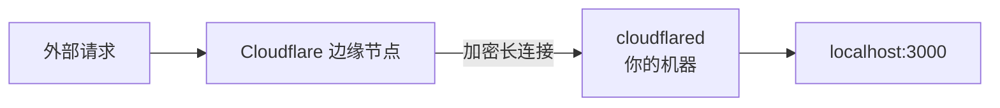

# Cloudflare Tunnel：零成本的公网隧道方案

> 上一篇讲了 ngrok——最好用的内网穿透工具，但免费版每次重启 URL 会变。如果你有自己的域名托管在 Cloudflare，Cloudflare Tunnel 给你一个完全免费的固定域名方案——`https://dev.yourdomain.com` 永远指向你的 `localhost:3000`。

## 是什么

Cloudflare Tunnel（原名 Argo Tunnel）是 Cloudflare 提供的内网穿透服务。它在你的机器上跑一个轻量 agent（`cloudflared`），和 Cloudflare 边缘网络建立一条长连接。外部请求到达 Cloudflare 边缘节点后，通过这条隧道转发到你本地。



和 ngrok 的关键区别：**隧道不走第三方服务器，走的是 Cloudflare 的全球网络**。你的流量经过 Cloudflare 边缘节点——这意味着自动获得 CDN 加速、DDoS 防护、WAF 规则和 SSL 证书。

## 前提条件

```bash
# 1. 有一个域名，DNS 托管在 Cloudflare
# 2. 安装 cloudflared
brew install cloudflare/cloudflare/cloudflared

# 3. 登录
cloudflared tunnel login
# 浏览器弹出 → 选择域名 → 授权 → 证书自动下载到 ~/.cloudflared/
```

## 创建第一个隧道

```bash
# 创建命名隧道
cloudflared tunnel create dev-tunnel
# 输出：Created tunnel dev-tunnel with id xxxxxxxx-xxxx-xxxx-xxxx-xxxxxxxxxxxx

# 配置 DNS——让 dev.yourdomain.com 指向这个隧道
cloudflared tunnel route dns dev-tunnel dev.yourdomain.com

# 启动——把 localhost:3000 暴露到 dev.yourdomain.com
cloudflared tunnel run dev-tunnel --url http://localhost:3000
```

三行命令、一个免费的固定域名——`https://dev.yourdomain.com` 指向 `localhost:3000`。

Cloudflare 自动给你配好了 SSL 证书（Edge Certificate），不需要自己申请、续签、配置。从外面访问就是标准的 HTTPS。

## 配置文件

```yaml
# ~/.cloudflared/config.yml
tunnel: dev-tunnel
credentials-file: /Users/you/.cloudflared/<tunnel-id>.json

ingress:
  # 主服务
  - hostname: dev.yourdomain.com
    service: http://localhost:3000

  # API
  - hostname: api.yourdomain.com
    service: http://localhost:8080

  # 管理后台
  - hostname: admin.yourdomain.com
    service: http://localhost:9000

  # 不匹配的请求返回 404
  - service: http_status:404
```

一个隧道，多个 hostname，分别指向不同的本地端口。ngrok 需要多个 tunnel 或付费版才能实现，Cloudflare Tunnel 免费支持。

```bash
# 后台运行
cloudflared tunnel run dev-tunnel

# 或者用 brew services 开机自启
brew services start cloudflared
```

## 访问控制——比 ngrok 更灵活

### Cloudflare Access——在隧道前加身份验证

```yaml
ingress:
  - hostname: admin.yourdomain.com
    service: http://localhost:9000
  # 不需要在 config 里配 Access——
  # 去 Cloudflare Dashboard → Zero Trust → Access 里创建策略
  # 支持：邮箱一次性验证码、GitHub OAuth、Google OAuth、SAML
```

ngrok 的访问控制是 Basic Auth（用户名密码）。Cloudflare Access 可以做 SSO——只允许你公司的 Google Workspace 账号登录，或者只允许特定 GitHub 组织成员。不需要在代码里写任何认证逻辑。

### Warp——连 VPN 都不需要

如果你的团队已经用了 Cloudflare Warp（VPN 替代品），隧道可以直接配置为「仅 Warp 用户可访问」——不用暴露到公网。

## 和 ngrok 的 Inspector 对比

ngrok 有个很实用的 Inspector（`localhost:4040` 看请求详情 + Replay）。Cloudflare Tunnel 没有对标的本地界面——但你可以用 Cloudflare 的 Logpush 把请求日志推到你的分析工具里：

```bash
# 或者在本地看 cloudflared 的日志
cloudflared tunnel run dev-tunnel --loglevel debug
```

也可以加自己的中间件来记录请求：

```yaml
ingress:
  - hostname: dev.yourdomain.com
    service: http://localhost:3000
    originRequest:
      httpHostHeader: "dev.yourdomain.com"
```

## 实际场景

### 场景一：永久的开发环境域名

```yaml
ingress:
  - hostname: dev.yourdomain.com
    service: http://localhost:3000
  - hostname: staging.yourdomain.com
    service: http://localhost:4000
```

`dev.yourdomain.com` 和 `staging.yourdomain.com` 永远不变。队友的书签、CI 的 webhook、第三方 API 的 callback URL——全部配一次就行。

### 场景二：临时分享——不需要 DNS

```bash
# 快速测试——Cloudflare 分配临时子域名
cloudflared tunnel --url http://localhost:3000
# https://random-words.trycloudflare.com → localhost:3000

# 不需要创建命名隧道、不需要配 DNS
# 和 ngrok 免费版的随机 URL 一样——但走的是 Cloudflare 网络
```

`trycloudflare.com` 是 Cloudflare 提供的临时域名——不需要登录、不需要 DNS 配置。一条命令搞定，适合临时 demo。

### 场景三：多端共享同一隧道

```bash
# 机器 A 上启动
cloudflared tunnel run shared-tunnel --url http://localhost:3000

# 另一个同事也可以启动——Cloudflare 做负载均衡
# 请求随机分发到两个人的 localhost:3000
```

## Cloudflare Tunnel vs ngrok

| | Cloudflare Tunnel | ngrok |
|---|---|---|
| 固定域名 | ✅ 免费（需域名托管 CF） | 付费 |
| 临时域名 | ✅ trycloudflare.com | ✅ ngrok-free.app |
| Inspector | ❌ | ✅ localhost:4040 |
| TCP 隧道 | ❌ 仅 HTTP | ✅ |
| 访问控制 | Cloudflare Access（SSO、GitHub OAuth） | Basic Auth |
| 自动 HTTPS | ✅ Cloudflare Edge Certificate | ✅ ngrok 签发 |
| 多 hostname | ✅ 免费 | 付费 |
| 前提条件 | 域名托管在 Cloudflare | 注册账号 + authtoken |
| 开源 | cloudflared 是 Apache 2.0 | ngrok agent 2.0+ 开源 |

**选 Cloudflare Tunnel**：你有自己的域名在 Cloudflare、需要永久固定 URL、需要 SSO 级别的访问控制、不需要 TCP 隧道。

## 总结

```bash
brew install cloudflare/cloudflare/cloudflared
cloudflared tunnel login
cloudflared tunnel create my-tunnel
cloudflared tunnel route dns my-tunnel dev.yourdomain.com
cloudflared tunnel run my-tunnel --url http://localhost:3000
```

ngrok 靠的是开箱即用的体验。Cloudflare Tunnel 靠的是「如果你已经在 Cloudflare 生态里，这是零额外成本的方案」。如果你域名已经在 Cloudflare 上——先试试 Cloudflare Tunnel，它可能是你唯一需要的隧道工具。

→ [（三）localtunnel 与轻量替代方案](03-localtunnel.md)
