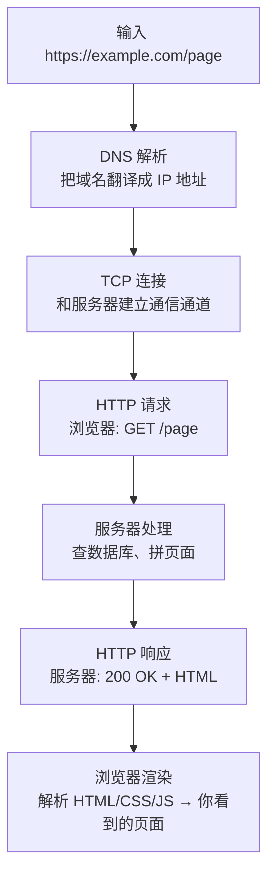

# HTTP（一）：HTTP 是什么——浏览器和服务器怎么对话

> 你在浏览器输入一个网址，敲回车，页面出现了。这不到一秒的时间里，浏览器和服务器之间说了什么？答案就是 HTTP。

## 核心比喻：寄信和收信

HTTP 的工作方式和你寄信一模一样：

```text
你写信                                    → 浏览器发 HTTP 请求
装在信封里，写上收件地址                    → 包装成 HTTP 报文，发到服务器 IP
邮局转运                                  → 互联网路由（TCP/IP，本篇不展开）
收件人拆信，写回信                         → 服务器处理请求，返回 HTTP 响应
你把回信拆开看                             → 浏览器解析响应，渲染页面
```

**每一次「请求-响应」都是一封独立的信。** 服务器不会记住上一封信说了什么——每一封都是新的。这在 HTTP 里叫「无状态」，后面 Cookie 那篇会细讲。

## 输入网址后发生了什么



我们关注的是中间两步：**请求和响应**——这才是 HTTP 协议本身。

## HTTP 1.1 长什么样

用最简单的例子——`curl -v` 能看到 HTTP 报文原文：

```bash
$ curl -v http://httpbin.org/get
```

请求（浏览器发出去的）：

```http
GET /get HTTP/1.1
Host: httpbin.org
User-Agent: curl/8.7.1
Accept: */*

```

响应（服务器返回的）：

```http
HTTP/1.1 200 OK
Content-Type: application/json
Content-Length: 134

{
  "args": {},
  "headers": {
    "Host": "httpbin.org",
    "User-Agent": "curl/8.7.1"
  },
  "url": "http://httpbin.org/get"
}
```

拆开看，总共就三部分：

```text
请求                                 响应
┌─────────────────┐                 ┌─────────────────┐
│ 起始行（方法+路径）│                 │ 起始行（状态码）  │
├─────────────────┤                 ├─────────────────┤
│ 请求头（多行键值对）│                 │ 响应头（多行键值对）│
├─────────────────┤                 ├─────────────────┤
│ 空行             │                 │ 空行             │
├─────────────────┤                 ├─────────────────┤
│ 请求体（数据）    │                 │ 响应体（HTML/JSON）│
└─────────────────┘                 └─────────────────┘
```

结构极其简单——就是**文本**，一行一行写，空行隔开头和体。你把上面的请求报文复制进 `nc`（netcat）连到服务器，服务器照样响应。没有任何二进制黑魔法。

## HTTP 版本的区别：从 0.9 到 3

你日常用的大概率是 HTTP/1.1 或 HTTP/2。版本的演进只做了一件事：**让更快地传更多数据**。

| 版本 | 年 | 一句话 | 比喻 |
|------|-----|--------|------|
| HTTP/0.9 | 1991 | 只支持 GET，没有头。请求一句话，响应一个 HTML | 发短信，只能回一个词 |
| HTTP/1.0 | 1996 | 加了请求头、状态码、POST——能用但每次请求要重建连接 | 每次打完电话必须挂机重拨 |
| HTTP/1.1 | 1997 | 加 Keep-Alive（连接复用），同一个连接发多个请求 | 电话不用挂了，一直聊 |
| HTTP/2 | 2015 | 多路复用（一个连接同时传多个请求），二进制帧 | 以前的信必须在同一列车上按顺序运，现在可以并行运 |
| HTTP/3 | 2022 | 基于 QUIC（UDP），不再用 TCP。连接迁移——WiFi 切 4G 不断连 | 把铁路换成飞机——更快，不怕转车 |

现在 HTTP/1.1 依然是占比最大的，但新项目基本都用 HTTP/2。本篇剩下的例子都用 HTTP/1.1——它最直观、文本可读、适合学原理。

## 请求体的具体例子

只发 GET 太无聊了。POST 带数据才是日常：

```http
POST /api/users HTTP/1.1
Host: api.example.com
Content-Type: application/json
Content-Length: 58

{"name": "张三", "email": "zhangsan@example.com"}
```

和寄信一模一样：收件人（Host）、信封标注（Content-Type、Content-Length）、信内容（JSON body）。下一篇细讲每个字段。

## 小结

- **HTTP 就是浏览器和服务器之间的通信协议**——用纯文本、格式简单、人类可读
- **一次交互 = 一个请求 + 一个响应**——一次寄一封信
- **报文只有三部分**——起始行 + 头部 + 可选的体
- **HTTP/1.1 是当前基准**，HTTP/2 更快，HTTP/3 换了底层传输

下一篇讲 URL 的结构和 GET/POST/PUT/DELETE 五种请求方法——用餐厅点餐来理解。

---

**下一篇：** [（二）URL 与请求方法——地址和动作](02-url-and-methods.md)
