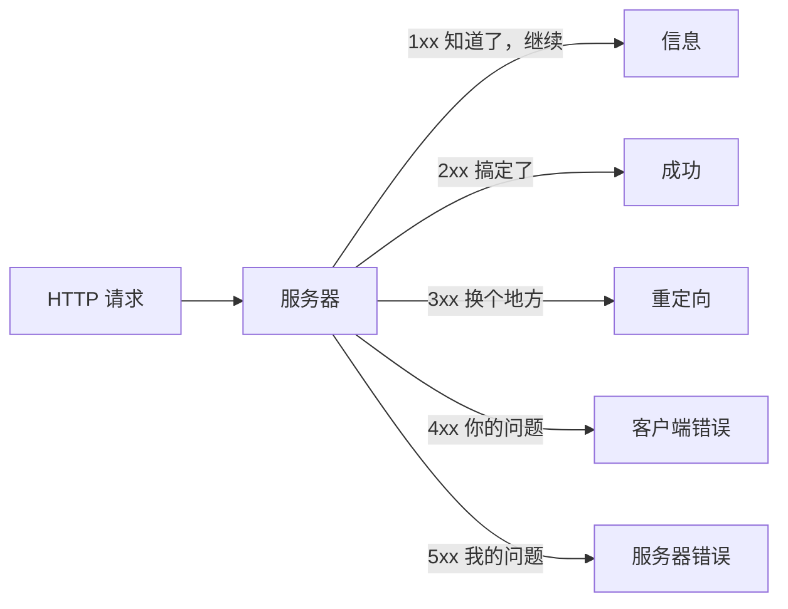

# HTTP（四）：状态码——服务器的一句话回复

> 你下了单，快递回了三个字：「已签收」。HTTP 状态码就是三位数字的快递状态——告诉你请求怎么样了。总共就五类，记住十个就够用一辈子。

## 核心比喻：快递签收

```text
你寄出一个包裹（HTTP 请求）
快递系统返回状态：
  200 = 「已签收，一切正常」
  301 = 「此人搬家了，新地址是 XXX」
  404 = 「没这个人」
  500 = 「快递站炸了」
```

五位数的分类：



助记：**1 信息 2 成功 3 重定向 4 你错了 5 我炸了**。

## 2xx：搞定了

### 200 OK

一切正常。GET 请求返回数据，POST 请求创建成功——都用 200。

### 201 Created

资源创建成功——通常用于 POST 创建后的响应。比 200 多了一层语义：「我不仅处理了请求，我还给你建了一个新资源」。

### 204 No Content

请求成功但没有返回内容——常用于 DELETE 之后。浏览器收到 204 不会刷新页面。

```http
HTTP/1.1 204 No Content    ← 删完了，没东西给你看
```

## 3xx：换个地方

### 301 Moved Permanently（永久搬家）

```http
GET /old-page HTTP/1.1

HTTP/1.1 301 Moved Permanently
Location: /new-page           ← 新地址在这
```

浏览器**自动**跳转到 `Location` 指向的 URL——用户无感知。搜索引擎会更新索引到新地址。

**永久 vs 临时**的关键区别：301 被浏览器硬盘缓存——下次你访问 `/old-page`，Chrome 直接跳到 `/new-page`，请求都不会发。改错了可能一两天恢复不了。

### 302 Found（临时外出）

和 301 一样跳转，但是**临时的**——浏览器不缓存，下次还会问。适合临时维护页面、登录后跳回原页面等场景。

```http
HTTP/1.1 302 Found
Location: /login
```

### 304 Not Modified（没变）

告诉浏览器「你缓存的版本还新鲜，用缓存就好」——不传响应体，节省带宽。配合 `If-Modified-Since` 或 `If-None-Match` 请求头使用。

```http
HTTP/1.1 304 Not Modified
```

实际效果：你刷新网页，浏览器问你 CDN「这个图片有新版吗」→ 服务器回 304 → 浏览器从本地缓存加载。比重新下载快几倍。

## 4xx：你的问题

### 400 Bad Request

请求本身有问题——JSON 格式错误、参数缺失、字段类型不对。服务器看不懂，拒收。

### 401 Unauthorized

你没有登录或凭据不对。浏览器会弹出登录框或跳转到登录页。

### 403 Forbidden

你登录了，但你没有权限看这个资源。**401 是你没带门禁卡，403 是你的卡没权限进这个房间。**

### 404 Not Found

资源不存在——最常见的 4xx。URL 拼错了、文章被删了、接口路径改了。

### 429 Too Many Requests

你发请求太快了——服务器限流。响应头通常带 `Retry-After` 指示等多久重试：

```http
HTTP/1.1 429 Too Many Requests
Retry-After: 60
```

## 5xx：我炸了

### 500 Internal Server Error

万能错误——服务器代码抛了异常但没被捕获，或配置错了。前端没法处理，只能重试。

### 502 Bad Gateway

网关或反向代理收到上游服务器无效响应。典型场景：Nginx 代理的服务挂了。客户端重试通常能好。

### 503 Service Unavailable

服务器暂时不可用——过载、重启中、维护中。响应头通常带 `Retry-After`。

## 实战中最容易踩的坑

1. **301 被缓存了改不回来**——浏览器会永久记住 301 跳转。部署前用 302 测试，确认无误再改 301
2. **API 成功全用 200**——很多项目所有成功都返回 200，然后在 JSON 里放个 `code` 字段。REST 风格应该创建用 201、删除用 204
3. **404 和 200 搞混**——列表页没数据应该返回 `200 + 空列表`，不是 404。404 只代表 URL 路径本身不存在
4. **502 不是你的问题**——前端看到 502 不要改代码，找运维

## 小结

| 看到这个 | 你的反应 |
|----------|----------|
| 200 | 正常，往下走 |
| 301 | 永久换地址了，浏览器自动跟 |
| 302 | 临时换地址 |
| 304 | 用缓存，省流量 |
| 400 | 检查请求格式 |
| 401 | 去登录 |
| 403 | 没权限，别试了 |
| 404 | 查路径拼写 |
| 500 | 等服务恢复，重试 |
| 502/503 | 等一会重试 |

下一篇讲 Cookie 与 Session——HTTP 是无状态的，服务器凭什么知道你是谁。

---

**上一篇：** [（三）请求头与响应头——信封上的备注](03-headers.md)
**下一篇：** [（五）Cookie 与 Session——服务器怎么记住你](05-cookie-and-session.md)
