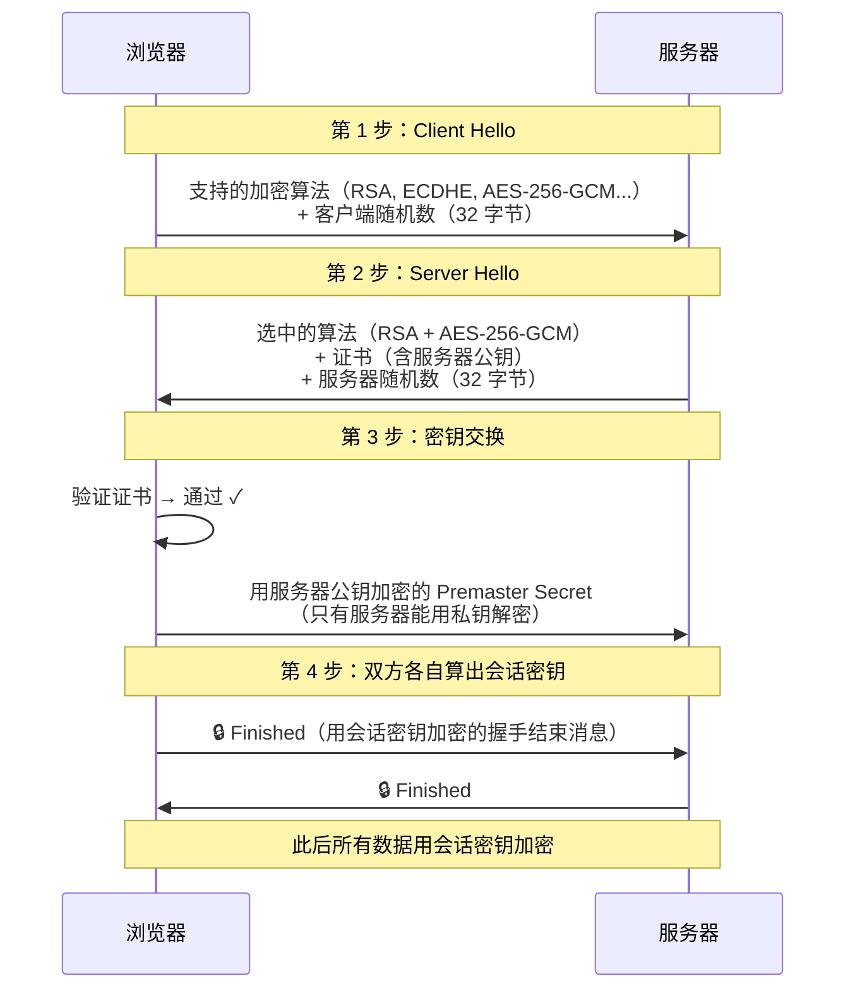
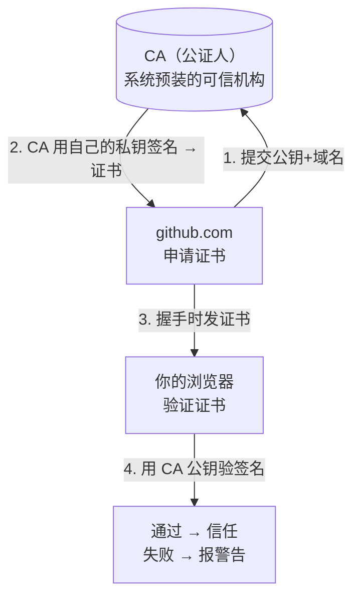

# HTTP（六）：HTTPS——给明信片加个信封

> HTTP 是明信片——中途每一站邮递员都能看清你写了什么。HTTPS 把明信片装进了信封——只有收件人能拆开。这篇讲信封怎么做的——对称加密、非对称加密、CA 证书，用最简单的比喻。

## HTTP 为什么不安全

```text
你 ──发送──→ WiFi 路由器 ──→ 运营商 ──→ 服务器
           ↑              ↑
      HTTP 明文         HTTP 明文
      任何人都能看        任何人都能改
```

你在咖啡店连 WiFi，登录了一个 HTTP 网站。咖啡店老板（或者蹭同一个 WiFi 的黑客）用 Wireshark 抓包——你的密码是明文。他不止能**偷看**，还能**篡改**：在网页里插入广告、把下载链接替换成病毒。

HTTPS 做三件事：

1. **加密**：内容被加密，中间人看不懂
2. **完整性**：内容被改过，你会知道
3. **认证**：你能确认对方确实是 `github.com`，不是假冒的

## 核心比喻：盒子 + 锁

```text
HTTP  = 明信片——谁都能看
HTTPS = 一个上锁的盒子——只有收件人能开

你给服务器寄一个带锁的盒子：
  1. 你打开锁（加密），放进信件
  2. 中途所有人只能看到盒子，看不到信
  3. 服务器用钥匙打开（解密），取出信
```

问题是：**你怎么把钥匙安全地给服务器？**

如果钥匙也通过网络发——窃听的人同时拿到盒子和钥匙，等于没加密。

这个「怎么安全传递钥匙」的问题，就是 HTTPS 加密的核心难点。答案分两步：TLS 握手。

## TLS 握手：用真实数据走一遍

以下是一段真实的 TLS 1.2 握手过程。我用**很小的数字**演示 RSA 和 AES——真正的密钥是这个长度的几百倍，但原理完全一样。



### 第 1 步：Client Hello

浏览器先开口，说它能用什么加密算法，并给出一个 32 字节随机数：

```text
浏览器 → 服务器（明文）

支持的密码套件：
  TLS_RSA_WITH_AES_256_GCM_SHA384    ← 选中这个
  TLS_ECDHE_RSA_WITH_AES_128_GCM_SHA256
  TLS_ECDHE_RSA_WITH_CHACHA20_POLY1305_SHA256

客户端随机数（示例，真实是 32 字节）:
  f3 7c 91 02 a4 d6 31 8e ...

SNI（Server Name Indication）:
  example.com    ← 告诉服务器我要访问哪个域名
```

### 第 2 步：Server Hello

服务器回话，选中一套算法，给出自己的随机数，**最重要的是——把证书发过来**：

```text
服务器 → 浏览器（明文）

选中: TLS_RSA_WITH_AES_256_GCM_SHA384

服务器随机数（示例，真实是 32 字节）:
  8a 2d 4f 16 b3 e8 7c 01 ...

证书（含服务器公钥，RSA 2048 位）:
  -----BEGIN CERTIFICATE-----
  MIIDXTCCAkWgAwIBAgIJAKZ...
  (包含 example.com 的 RSA 公钥)
  -----END CERTIFICATE-----
```

证书里的 RSA 公钥长这样（简化示例——真正的 RSA 是 2048 位大数，这里用 16 位演示原理）：

```text
RSA 公钥（服务器公开）：
  n = 3233   ← 模数（两个大素数的乘积）
  e = 17     ← 公钥指数（通常是 65537，这里用 17 演示）

RSA 私钥（服务器保密）：
  d = 2753   ← 只有服务器自己知道
```

> 真正的 RSA 密钥：n 是 2048 位（约 617 位的十进制数）。原理和这里的 16 位版本完全一样——只是数字大到暴力破解需要宇宙年龄。

**公钥怎么来的？**

```text
选两个素数: p = 61, q = 53
            n = p × q = 61 × 53 = 3233
            φ(n) = (p-1)×(q-1) = 60 × 52 = 3120
选 e = 17（和 3120 互质）
算 d：d × 17 ≡ 1 (mod 3120) → d = 2753

公钥: (n=3233, e=17)   —— 公开，放在证书里
私钥: (d=2753)          —— 保密，只有服务器知道
```

**加密解密公式：**

```text
加密: 密文 = 明文ᵉ mod n     （用公钥）
解密: 明文 = 密文ᵈ mod n     （用私钥）

示例——加密数字 123：
  密文 = 123¹⁷ mod 3233
       = 855
  解密 = 855²⁷⁵³ mod 3233
       = 123  ✓
```

### 第 3 步：密钥交换——传递 Premaster Secret

浏览器验证证书后，用服务器的 RSA 公钥加密一段 48 字节的随机数据（Premaster Secret），发给服务器。**这段数据是 HTTPS 安全的核心——公钥加密后，只有握有私钥的服务器能解开。**

```text
浏览器生成 Premaster Secret（48 字节随机数据，示例）:
  03 01 f4 2c 8a 7b d9 03 e6 51 9a 2c ...

用服务器 RSA 公钥加密:
  密文 = Premasterᵉ mod n（真实场景是对 48 字节分段加密）

浏览器 → 服务器:
  加密后的 Premaster Secret（密文）
  ┌─────────────────────────────┐
  │ 85 12 3f a7 01 9c 4d 2e ... │  ← 公钥加密，只有私钥能解
  └─────────────────────────────┘

服务器收到后:
  用 RSA 私钥解密 → 得到 Premaster Secret 明文
```

此时，双方都拿到了**三样东西**：

```text
客户端随机数    f3 7c 91 02 ...   ← 明文传输，窃听者知道
服务器随机数    8a 2d 4f 16 ...   ← 明文传输，窃听者知道
Premaster Secret 03 01 f4 2c ...  ← RSA 加密传输，窃听者不知道
```

**双方用同一个算法（PRF-TLS），输入这三样，输出同一个会话密钥：**

```text
Master Secret = PRF(Premaster Secret, "master secret",
                    客户端随机数 + 服务器随机数)[0..47]

这是一个 48 字节字符串——双方各自在内存里算出，从未在网络上传输。

从 Master Secret 再派生 6 把密钥:
  ├── 客户端写密钥 (client_write_key)  —— 浏览器加密用
  ├── 服务器写密钥 (server_write_key)  —— 服务器加密用
  ├── 客户端写 IV   (client_write_IV)   —— AES 的初始向量
  ├── 服务器写 IV   (server_write_IV)
  ├── 客户端 MAC 密钥                    —— HMAC 完整性校验
  └── 服务器 MAC 密钥
```

**为什么窃听者拿不到会话密钥？**

```text
窃听者看到的：
  ✓ 客户端随机数（明文）
  ✓ 服务器随机数（明文）
  ✓ 密文（公钥加密后的 Premaster）
  ✗ Premaster 明文  ← 这个缺了就算不出会话密钥

要解出 Premaster，窃听者需要 RSA 私钥(d)。
从公钥(n=3233, e=17) 反推 d，需要对 n 做质因数分解。
3233 = 61 × 53  ← 小的数容易分解
但真实的 n 是 2048 位，分解它需要几十年算力。
```

### 第 4 步：开始用对称加密通信

握手结束后，所有 HTTP 数据用对称加密（AES-256-GCM）。对称加密快——CPU 有 AES 硬件指令集，加解密几乎零开销。

**AES 加密一个真实的 HTTP 响应：**

```text
会话密钥（AES-256，密钥长度 32 字节）:
  7f 2e 91 b0 c3 58 1d 4a f6 e0 82 37 6c a9 14 d5
  b8 2f 6e 3c 91 d7 4a 0f 52 31 8c cf 7e a6 12 d3

IV（初始向量，12 字节）:
  a1 b2 c3 d4 e5 f6 07 08 09 0a 0b 0c

明文（HTTP 响应）:
  HTTP/1.1 200 OK
  Content-Type: text/html; charset=utf-8

  <!DOCTYPE html>
  <html>
  <head><title>安全页面</title></head>
  <body>
    <h1>欢迎回来, 张三</h1>
    <p>你的余额: ¥12,580.00</p>
  </body>
  </html>
```

**加密过程（AES-256-GCM）：**

```text
1. AES-256-GCM 加密函数:
   输入 = 明文 + 密钥 + IV + AAD（附加认证数据，通常为序列号+协议版本）
   输出 = 密文 + 认证标签（128 位）

2. 加密后的密文（看起来像乱码）:
   密文:
     9f 3c 7a d2 01 5b 8c 1e 3f a7 62 8d b4 11 9c 05
     e7 2d 4a 8f 13 c6 b0 79 1a 5d 3e f8 42 11 97 64
     d3 81 2c ae 5f 47 c6 3b 8a 19 d5 62 ef 30 7c a1
     4b f2 8d 16 c5 3a 79 0e 27 b6 4a d1 83 1c 5f a8
     ...

   GCM 认证标签:
     6d 48 2e 7c 91 a3 55 1f d8 3c b4 0e 27 9a 62 f5

3. 通过网络发送:
   ┌── 密文 ──┐ ┌── 认证标签 ──┐
   │ 9f 3c ... │ │ 6d 48 ...    │ → 窃听者看到的就是这些乱码
   └───────────┘ └──────────────┘
```

**解密过程：**

```text
服务器收到：密文 + 认证标签

1. AES-256-GCM 解密函数:
   输入 = 密文 + 密钥 + IV + 认证标签 + AAD
   → 先验认证标签（检测篡改）
   → 通过 → 解密 → 得到明文
   → 不通过 → 丢弃连接（有人改了数据！）

2. 输出:
   HTTP/1.1 200 OK
   Content-Type: text/html; charset=utf-8

   <!DOCTYPE html>
   <html><head>...
```

**中间人看到的是什么：**

```text
窃听者抓到的包（Wireshark 截图模拟）:

  源 IP: 192.168.1.100 → 93.184.216.34
  TLS 记录:
    类型: Application Data
    TLS 版本: 1.2
    加密数据:
      d3 81 2c ae 5f 47 c6 3b 8a 19 d5 62 ef 30 7c a1
      4b f2 8d 16 c5 3a 79 0e 27 b6 4a d1 83 1c 5f a8
      9f 3c 7a d2 01 5b 8c 1e 3f a7 62 8d b4 11 9c 05
      e7 2d 4a 8f 13 c6 b0 79 1a 5d 3e f8 42 11 97 64
      ...（全是乱码，没有明文）

  窃听者能知道：
    ✓ 你在和 93.184.216.34 通信
    ✓ 你用了 TLS 1.2 + AES-256-GCM
    ✓ 数据长度大约 250 字节

  窃听者不知道：
    ✗ 你访问的是 example.com 的哪个页面
    ✗ 页面内容是什么
    ✗ 你的 Cookie 是什么
    ✗ 任何 HTTP 头部或 body 内容
```

## 两种加密：各司其职

为什么 TLS 握手时用 RSA（慢），握手后用 AES（快）？因为根本任务不同。

```text
非对称加密（公钥/私钥）              对称加密（同一个密钥）
       ↓                                   ↓
  临时的：只用一次                      持久的：整个会话
  传 48 字节的 Premaster Secret         传几百 MB 的 HTTP 数据
  慢几百倍但能安全交换                  快——CPU 有硬件加速
```

| | 对称加密（AES） | 非对称加密（RSA） |
|---|---|---|
| 密钥数量 | 1 个（双方共享） | 2 个（公钥 + 私钥） |
| 速度 | GB/s 级别 | KB/s 级别 |
| CPU 开销 | 极小（硬件 AES-NI 指令） | 极大（大数模幂运算） |
| 用在哪 | 加密 TCP 流里所有 HTTP 数据 | 只加密握手时 48 字节的 Premaster |
| 安全依赖 | 密钥不能泄露 | 大数分解不可行 |

**比喻：**

```text
非对称加密 = 保险柜——任何人都能往里放东西（公钥加密），
            只有握钥匙的人能拿出来（私钥解密）。打开慢。

对称加密 = 普通锁——你俩各一把钥匙，锁上后只有对方能开。
          开锁极快。

HTTPS = 先用 RSA 保险柜把 AES 锁的钥匙传过去（48 字节），
       然后全程用 AES 锁通信（几千字节到几百 MB）
       因为 AES 锁开关太快了，RSA 保险柜开关太慢了
```

## 证书和 CA：凭什么相信服务器

你收到了一个自称 `github.com` 的公钥。你怎么知道它真的是 github.com，而不是中间人伪造的？

**CA（Certificate Authority）** 是第三方公证人。流程：

```text
GitHub 的运维:              客户端（你的浏览器）:
  生成自己的公私钥对
  ↓
  把公钥+域名发给 CA 验证
  ↓
  CA 用 CA 的私钥签名 = 证书

                        收到 GitHub 的证书
                        ↓
                        用系统内置的 CA 公钥验签名
                        ↓
                        签名通过 → 证书是真的 → 公钥可信
```



你浏览器里预装了大约 150 个根 CA 的公钥。这些机构如果作恶或被盗——整个 HTTPS 体系就挂。历史上 DigiNotar 和 WoSign 就因此被浏览器吊销。

## 实际看一个证书

```bash
$ curl -vI https://www.baidu.com 2>&1 | grep -A5 "Server certificate"
* Server certificate:
*  subject: C=CN; ST=Beijing; L=Beijing; O=Beijing Baidu Netcom Science Technology Co., Ltd; CN=baidu.com
*  start date: Jul  5 00:00:00 2025 GMT
*  expire date: Aug  5 23:59:59 2026 GMT
*  issuer: C=BE; O=GlobalSign nv-sa; CN=GlobalSign RSA OV SSL CA 2018
*  SSL certificate verify ok.
```

- `subject`：证书是给百度的
- `issuer`：由 GlobalSign 签发
- `verify ok`：浏览器认为证书有效

## HTTP vs HTTPS：肉眼可见的差别

```text
http://example.com         浏览器地址栏显示「不安全」
https://example.com        浏览器显示 🔒 锁图标
```

现代浏览器对 HTTP 网站越来越激进——Chrome 会在 HTTP 页面显示「不安全」警告，输入框会自动标记。**现在没有理由不用 HTTPS**。Let's Encrypt 提供免费证书，certbot 一行命令自动续期。

## 小结

- **HTTPS = HTTP + TLS 加密**——内容是加密的，中间人看不懂
- **TLS 握手 = 四步**：双方各说个随机数 → 服务器给证书 → 浏览器验证书 + 交换密钥 → 开始加密通信
- **对称加密传数据**（快），**非对称加密传密钥**（安全）——混合使用各取所长
- **CA 是公证人**——保证你收到的公钥确实是对方服务器的
- **Let's Encrypt 免费**——没有理由不用 HTTPS

---

**上一篇：** [（五）Cookie 与 Session——服务器怎么记住你](05-cookie-and-session.md)
