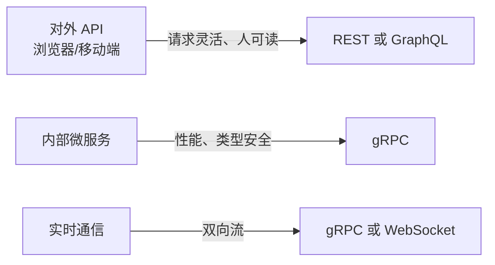

# gRPC：微服务间通信的最优解

> REST 用 JSON——「{ "user_id": 42 }」占了 16 个字符，gRPC 用 Protobuf——同一个值占 2 个字节。当你的服务每秒要调 10 万次另一个服务时，这个差距就是真金白银。

## 是什么

[gRPC](https://grpc.io) 是 Google 2015 年开源的高性能 RPC 框架。不是 REST 的竞争者——它是为**服务间通信**设计的，不是为浏览器设计的。

```text
REST     = HTTP/1.1 + JSON → 人可读，机器要解析
GraphQL  = HTTP/1.1 + JSON → 灵活查询，前端友好
gRPC     = HTTP/2 + Protobuf → 二进制，极速，类型安全
```

## 为什么需要 Protobuf

JSON 的字面表达天然膨胀：

```text
"user_id": 42
// 16 个字符 → 至少 16 字节

Protobuf: 0x08 0x2a
// 2 个字节表达了同样的内容
```

这不止是省带宽。Protobuf 的核心优势是**有 schema**：

```protobuf
syntax = "proto3";

service UserService {
  rpc GetUser (GetUserRequest) returns (GetUserResponse);
  rpc ListUsers (ListUsersRequest) returns (stream User);  // 服务端流
  rpc CreateUsers (stream User) returns (CreateUsersResponse);  // 客户端流
  rpc Chat (stream Message) returns (stream Message);  // 双向流
}

message GetUserRequest {
  int64 user_id = 1;
}

message GetUserResponse {
  User user = 1;
}

message User {
  int64 id = 1;
  string name = 2;
  string email = 3;
  int64 created_at = 4;
}
```

Schema 生成代码——不再是「看文档手写请求」：

```python
# Python 客户端（从 .proto 自动生成）
stub = UserServiceStub(channel)
user = stub.GetUser(user_pb2.GetUserRequest(user_id=42))
print(user.name)  # 类型安全，IDE 自动补全
```

不需要定义路由、不需要写序列化逻辑、不需要写 HTTP 客户端——protoc 编译器全生成好了。

## gRPC 的四种通信模式

REST 只有请求-响应。gRPC 有四种：

```text
1. 一元 RPC（Unary）
   Client → Request → Server → Response
   等价于 REST 的 POST

2. 服务端流（Server Streaming）
   Client → Request → Server → Response, Response, Response, ...
   适合：大文件下载、实时日志推送

3. 客户端流（Client Streaming）
   Client → Request, Request, Request, ... → Server → Response
   适合：批量上传、IoT 设备上报数据

4. 双向流（Bidi Streaming）
   Client ←→ Server （两个方向同时流动）
   适合：聊天、实时协作、游戏
```

## HTTP/2 带来的能力

gRPC 跑在 HTTP/2 上，有 REST/HTTP/1.1 没有的能力：

| 特性 | HTTP/1.1 (REST) | HTTP/2 (gRPC) |
|---|---|---|
| 连接复用 | 有上限（通常 6 个/域名） | **一个连接承载所有请求** |
| 头压缩 | 每次请求带完整 Header | **HPACK 压缩，Header 去重** |
| 服务端推送 | ❌ | **Server Push** |
| 流控 | ❌ | **内置** |
| 二进制分帧 | ❌ 纯文本 | **二进制帧** |

## 三种 API 风格怎么选



| | REST | GraphQL | gRPC |
|---|---|---|---|
| 协议 | HTTP/1.1 | HTTP/1.1 | HTTP/2 |
| 数据格式 | JSON | JSON | Protobuf（二进制） |
| Schema | OpenAPI（可选） | SDL（内置） | `.proto`（内置） |
| 流式传输 | ❌ | ❌ | ✅ 四种模式 |
| 代码生成 | 第三方工具 | Apollo/Relay | protoc（内置） |
| 浏览器支持 | 原生 | 原生 | 需要 grpc-web |
| 人可读 | ✅ | ✅ | ❌ 需要工具 |
| 性能 | 中 | 中 | **高** |
| 适合 | Web API | 前端多端 | **微服务间通信** |

**不是选一个替代另两个。实际情况是三个一起用**：

```text
对外 API（浏览器）  → REST（简单）或 GraphQL（灵活）
微服务间           → gRPC（快 + 类型安全）
实时推送           → gRPC 双向流
```

## 什么时候不用 gRPC

- **浏览器直接调用**——gRPC-Web 可用但多一层代理
- **公开 API**——第三方开发者不认识你的 `.proto` 文件
- **简单到不需要 schema**——一个 `GET /health` 不值得 gRPC

## 小结

gRPC 解决了 REST 在微服务场景下的三个痛点：

1. **JSON 太胖**——Protobuf 是二进制的，体积极小
2. **接口没有契约**——`.proto` 就是契约，改一行就知道哪里打破了兼容性
3. **HTTP/1.1 的连接限制**——HTTP/2 一个连接跑所有请求

如果你的系统还在同一个进程里用 REST 调自己——没事。但如果开始拆微服务了，gRPC 是第一个应该考虑的内部通信协议。

---

**相关阅读：**
- [RESTful API 设计](restful-api-guide.md)
- [GraphQL：让客户端决定要什么数据](graphql-guide.md)
- [HTTP 协议系列](index.md)
