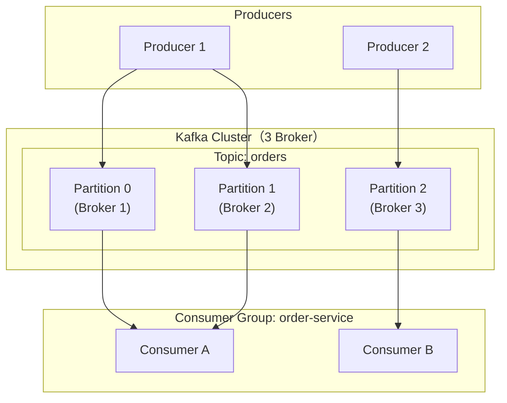
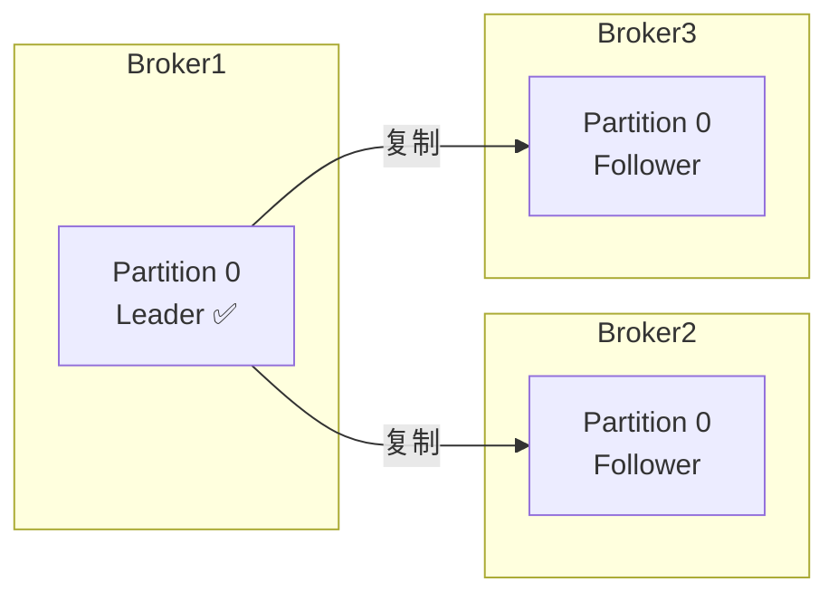

# Kafka 架构总览：Broker、Topic、Partition、Consumer Group

> 基于 Apache Kafka 3.x。

## 一句话

Kafka 是一个分布式事件流平台——Producer 把消息发到 Topic，Topic 拆成多个 Partition 分布在 Broker 上，Consumer Group 里的消费者各领一部分 Partition 消费。整个过程是追加写、顺序读、分区并行。

## 核心概念



| 概念 | 一句话 |
|---|---|
| **Broker** | Kafka 服务器节点，存储数据、服务读写 |
| **Topic** | 消息的逻辑分类（如 `orders`、`events`） |
| **Partition** | Topic 的物理分片，有序、不可变、追加写 |
| **Replication** | 每个分区有多个副本（Leader + Follower），Leader 处理读写 |
| **Consumer Group** | 一组消费者协作消费一个 Topic，每个分区只分配给组内一个消费者 |
| **Offset** | 消费者在分区里的位置（读到第几条了） |

## Partition：Kafka 的并行单元

一个 Topic 被拆成 N 个 Partition，每个 Partition 是一个**有序、不可变的消息序列**：

```
Partition 0: [msg0, msg1, msg2, msg3, ...]  → Consumer A
Partition 1: [msg0, msg1, msg2, ...]        → Consumer B
Partition 2: [msg0, msg1, ...]              → Consumer C
```

- **有序**：单个 Partition 内消息有序（按写入顺序）
- **跨 Partition 无序**：不同 Partition 之间不保证顺序
- **并行度 = Partition 数**：消费者数 ≤ Partition 数，多出来的消费者闲置

## Leader/Follower 副本



- **Leader**：处理所有读写请求
- **Follower**：从 Leader 拉取数据，保持同步
- **Leader 挂了**：ISR（In-Sync Replicas）中的 Follower 被选为新 Leader

## 小结

Kafka 的核心模型：**Topic → Partition → Replica → Consumer Group**。理解了这四层，后面的所有问题（Producer acks、Consumer offset、Rebalance、Exactly-Once）都是在这个模型上的变奏。

下一篇讲 Producer——acks、批量发送、幂等、事务。
