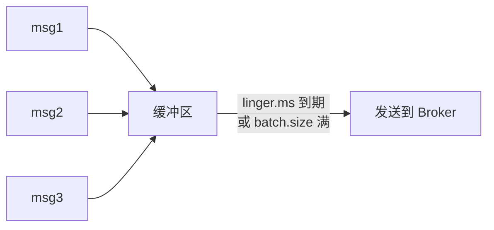

# Kafka Producer：acks、批量、幂等、事务

> 基于 Apache Kafka 3.x。

## Producer 的三个核心问题

1. **发给谁**：消息发到哪个 Partition？
2. **什么时候算成功**：acks 设多少？
3. **怎么保证不丢不重**：幂等 + 事务。

## 消息路由：Partition 选择

```java
// 1. 指定 Partition
producer.send(new ProducerRecord<>("orders", 0, key, value));

// 2. 按 Key 哈希（相同 Key → 同一 Partition）
producer.send(new ProducerRecord<>("orders", key, value));

// 3. 轮询（默认，Key 为 null 时）
producer.send(new ProducerRecord<>("orders", null, value));
```

**Key 的作用：** 保证相同 Key 的消息进同一 Partition → 同一 Partition 内有序 → 同一用户的事件有序。

## acks：什么时候算"发送成功"

```properties
acks=0   # Producer 发出去就不管了（最快，可能丢消息）
acks=1   # Leader 写入成功就返回（默认，Leader 挂了可能丢）
acks=all # 所有 ISR 副本写入成功才返回（最安全，最慢）
```

| acks | 安全性 | 延迟 | 适用场景 |
|---|---|---|---|
| 0 | 可能丢消息 | 最低 | 日志采集、监控指标（丢几条无所谓） |
| 1 | Leader 挂可能丢 | 中 | 大部分业务场景 |
| all | 最安全 | 最高 | 金融、订单（不能丢） |

```properties
# 推荐生产配置
acks=all
min.insync.replicas=2   # 至少 2 个副本同步才算成功
retries=3
```

## 批量发送：linger.ms + batch.size

Kafka Producer 不是每条消息单独发，而是攒一批一起发：

```properties
linger.ms=5      # 等 5ms 攒一批（默认 0，有消息就发）
batch.size=16384 # 每批最大 16KB
buffer.memory=33554432  # 发送缓冲区 32MB
```



**trade-off：** `linger.ms` 越大 → 批次越大 → 吞吐越高 → 延迟越高。

## 幂等 Producer：Exactly-Once 语义基础

```properties
enable.idempotence=true
```

开启后，Producer 会给每条消息加序列号（Sequence Number）。Broker 收到重复消息时自动去重。

**限制：** 只在单个 Producer Session 内有效。Producer 重启后序列号重置，不能跨 Session 去重。

## 事务 Producer：跨 Partition 原子写入

```java
producer.initTransactions();
try {
    producer.beginTransaction();
    producer.send(new ProducerRecord<>("topic-a", key1, value1));
    producer.send(new ProducerRecord<>("topic-b", key2, value2));
    producer.commitTransaction();
} catch (Exception e) {
    producer.abortTransaction();
}
```

两条消息要么同时成功，要么同时失败。配合 Consumer 的 `isolation.level=read_committed`，实现端到端的 Exactly-Once。

## 小结

| 配置 | 作用 | 推荐值 |
|---|---|---|
| `acks` | 成功条件 | `all`（不能丢）或 `1`（可以丢） |
| `linger.ms` | 批量等待时间 | `5`（平衡吞吐和延迟） |
| `batch.size` | 批次大小 | `16384`（16KB） |
| `enable.idempotence` | 幂等去重 | `true` |
| `min.insync.replicas` | 最小同步副本数 | `2` |

下一篇讲 Consumer——offset 管理、Rebalance、以及"消费了但没提交 offset"的问题。
