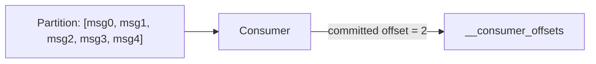
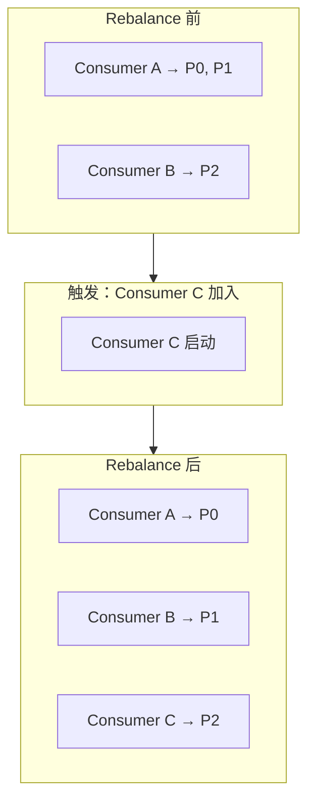

# Kafka Consumer：Offset 管理与 Rebalance

> 基于 Apache Kafka 3.x。

## Offset：消费者读到哪了

每条消息在 Partition 里有一个递增的 Offset（0, 1, 2, 3...）。消费者通过 Offset 记录"我读到第几条了"。



**Offset 存在哪：** Kafka 内部的 `__consumer_offsets` Topic（不是 Zookeeper，Kafka 3.x 已移除 ZK 依赖）。

## 自动提交 vs 手动提交

### 自动提交（默认）

```properties
enable.auto.commit=true
auto.commit.interval.ms=5000  # 每 5 秒自动提交
```

**问题：** 消息处理到一半，Auto Commit 提交了 Offset，然后 Consumer 崩溃——这条消息丢了。

### 手动提交（推荐）

```java
while (true) {
    ConsumerRecords<String, String> records = consumer.poll(Duration.ofMillis(100));
    for (ConsumerRecord<String, String> record : records) {
        process(record);  // 先处理
    }
    consumer.commitSync();  // 处理完再提交
}
```

**两种手动提交：**

```java
// 同步提交——阻塞，确认 Broker 收到
consumer.commitSync();

// 异步提交——不阻塞，可能失败
consumer.commitAsync((offsets, exception) -> {
    if (exception != null) log.error("Commit failed", exception);
});
```

## 消费语义：At-Least-Once vs At-Most-Once

```
At-Most-Once：先提交 offset，再处理消息
  → 可能丢消息（处理失败，offset 已提交）

At-Least-Once：先处理消息，再提交 offset
  → 可能重复消费（处理成功，提交前崩溃，重启后重新消费）
```

**生产环境用 At-Least-Once + 幂等处理。** 重复消费是安全的（幂等），丢消息是不安全的。

## Rebalance：消费者组的重新分配



Rebalance 触发条件：
- 消费者加入/离开组
- 心跳超时
- Topic 分区数变化

**Rebalance 的问题：** 传统模式下所有消费者暂停消费。

### 减少 Rebalance 影响

```properties
# 1. 增量 Rebalance（Kafka 2.4+）
partition.assignment.strategy=org.apache.kafka.clients.consumer.CooperativeStickyAssignor

# 2. 增大心跳超时（减少误触发）
session.timeout.ms=30000
heartbeat.interval.ms=10000

# 3. 增大 max.poll.interval.ms（给处理更多时间）
max.poll.interval.ms=600000
```

## Consumer 的关键配置

```properties
# 每次 poll 最多拉多少条
max.poll.records=500

# 两次 poll 之间的最大间隔（超过就认为 Consumer 挂了）
max.poll.interval.ms=300000

# 会话超时
session.timeout.ms=45000

# 心跳间隔
heartbeat.interval.ms=3000
```

## 小结

| 问题 | 方案 |
|---|---|
| 消息可能丢 | At-Least-Once + 手动提交 |
| 消息可能重复 | 幂等处理（数据库 UPSERT、去重表） |
| Rebalance 暂停 | CooperativeStickyAssignor |
| 心跳超时误触发 | 增大 session.timeout.ms |

下一篇讲 Partition Assignment 的三种策略细节。
