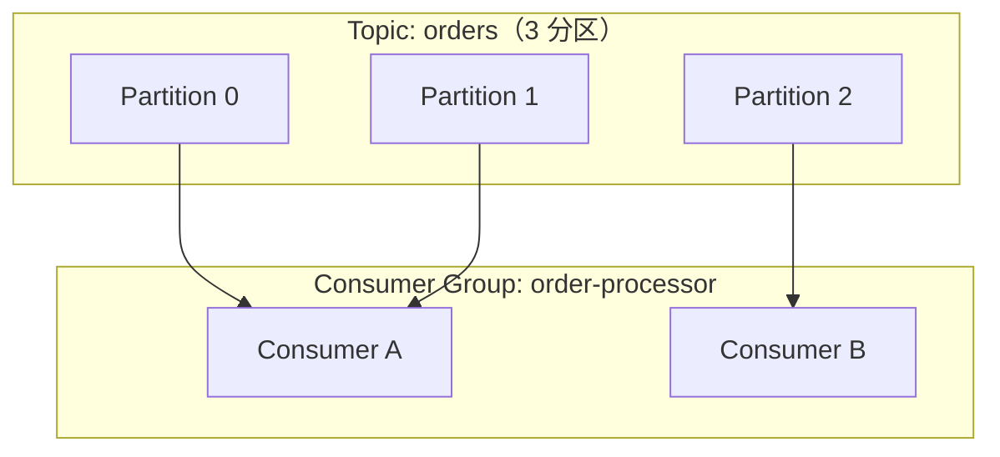

# Kafka Partition Assignment：消费者怎么"认领"分区

> 基于 Apache Kafka 3.x + KafkaJS（Node.js）。Consumer Group + Partition Assignment 是 Kafka 消费模型的核心。

## 一句话

Kafka 的 Consumer Group 里，每个分区只能被组内一个消费者消费。"谁消费哪个分区"由 **Partition Assignor** 决定。Kafka 内置三种策略：Range、RoundRobin、Sticky，也可以自定义。

## Consumer Group 的基本规则



三条铁律：
- 一个分区在同一时刻只能被组内**一个消费者**消费
- 一个消费者可以消费**多个分区**
- 分区数 ≥ 消费者数：多余的消费者会闲置

## 三种内置 Assignor

### 1. RangeAssignor（默认）

按 Topic 的分区连续分配。

```
Topic: orders（6 分区）
Consumer A → [0, 1, 2]
Consumer B → [3, 4, 5]
```

**问题：** 如果有多个 Topic，每个 Topic 都按范围分配，Consumer A 可能同时拿到两个 Topic 的前半部分——负载不均衡。

### 2. RoundRobinAssignor

把所有 Topic 的所有分区打散，轮询分配。

```
Topic1: [0, 1, 2]   Topic2: [0, 1, 2]
Consumer A → Topic1-0, Topic1-2, Topic2-1
Consumer B → Topic1-1, Topic2-0, Topic2-2
```

比 Range 更均衡，但有一个坑：**Consumer 订阅的 Topic 集合必须完全相同**，否则分配结果可能不均衡。

### 3. StickyAssignor（推荐）

在 RoundRobin 的基础上加了一个约束：**Rebalance 时尽量保持原有分配不变**。

```
# 初始分配
Consumer A → [P0, P1]
Consumer B → [P2]

# Consumer C 加入，Rebalance
# RoundRobin 会全部重分配：A→P0, B→P1, C→P2
# Sticky 只动需要动的：A→P0, B→P1, C→P2（P0、P1 不变）
```

**好处：** 减少 Rebalance 时的分区迁移，避免重复消费和状态丢失。

## 配置 Assignor（KafkaJS）

```javascript
const { Kafka, AssignerProtocol } = require('kafkajs');

const kafka = new Kafka({
  clientId: 'my-app',
  brokers: ['localhost:9092'],
});

const consumer = kafka.consumer({
  groupId: 'order-processor',
  // KafkaJS 支持自定义 partitionAssigner
  partitionAssigner: [
    // 自定义 Assignor（见下文）
  ],
});

await consumer.subscribe({ topic: 'orders', fromBeginning: true });
```

KafkaJS 内置了 RoundRobin 和 Cooperative Assignor。配置方式：

```javascript
const { RoundRobinAssigner, CooperativeAssigner } = require('kafkajs');

const consumer = kafka.consumer({
  groupId: 'order-processor',
  partitionAssigner: [RoundRobinAssigner],  // 或 CooperativeAssigner
});
```

## Rebalance：什么时候触发分区重分配

| 触发条件 | 原因 |
|---|---|
| 消费者加入组 | 新实例启动 |
| 消费者离开组 | 实例关闭 / 崩溃 |
| 消费者心跳超时 | 网络断开 / GC 停顿 |
| Topic 分区数变化 | 扩容 Topic |

Rebalance 期间**所有消费者暂停消费**——这是 Kafka 消费的最大痛点。

## Cooperative Rebalance（增量 Rebalance）

传统 Rebalance 是"Stop-the-World"——所有消费者停止，全部重新分配。Kafka 2.4+ 引入 **Cooperative Rebalance**：

```javascript
const { CooperativeAssigner } = require('kafkajs');

const consumer = kafka.consumer({
  groupId: 'order-processor',
  partitionAssigner: [CooperativeAssigner],
});
```

区别：

```
# 传统 Rebalance（Eager）
Consumer A: 停止 → 放弃所有分区 → 等待 → 重新拿到分区
Consumer B: 停止 → 放弃所有分区 → 等待 → 重新拿到分区

# Cooperative Rebalance
Consumer A: 继续消费 P0、P1 → 只交出 P1 → 继续消费 P0
Consumer B: 等待 → 拿到 P1 → 开始消费
```

只有需要迁移的分区暂停，其他分区继续消费。Rebalance 影响范围从"整个组"缩小到"需要迁移的分区"。

## 自定义 Assignor（KafkaJS）

```javascript
const { AssignerProtocol: { MemberMetadata, MemberAssignment } } = require('kafkajs');

const HashAssigner = ({ cluster }) => ({
  name: 'HashAssigner',
  version: 1,

  async assign({ members, topics }) {
    // 获取每个 Topic 的分区数
    const topicPartitions = {};
    for (const topic of topics) {
      const partitionMetadata = topicMetadata.get(topic);
      topicPartitions[topic] = partitionMetadata.map(p => p.partitionId);
    }

    // 按消费者 ID 哈希分配
    const sortedMembers = members.sort((a, b) =>
      a.memberId.localeCompare(b.memberId)
    );

    const assignment = {};
    for (const topic of topics) {
      const partitions = topicPartitions[topic];
      for (let i = 0; i < partitions.length; i++) {
        const memberIndex = i % sortedMembers.length;
        const member = sortedMembers[memberIndex];
        if (!assignment[member.memberId]) {
          assignment[member.memberId] = {};
        }
        if (!assignment[member.memberId][topic]) {
          assignment[member.memberId][topic] = [];
        }
        assignment[member.memberId][topic].push(partitions[i]);
      }
    }

    // 返回 MemberAssignment 格式
    return Object.entries(assignment).map(([memberId, topics]) => ({
      memberId,
      memberAssignment: MemberAssignment.encode({ version: 1, assignment: topics }),
    }));
  },

  protocol({ topics }) {
    return [
      {
        name: this.name,
        metadata: MemberMetadata.encode({
          version: this.version,
          topics,
          userData: Buffer.alloc(0),
        }),
      },
    ];
  },
});

// 使用
const consumer = kafka.consumer({
  groupId: 'order-processor',
  partitionAssigner: [HashAssigner],
});
```

## Rebalance 事件监听（KafkaJS）

```javascript
consumer.on(consumer.events.GROUP_JOIN, async (event) => {
  const { payload: { groupId, memberId, groupProtocol } } = event;
  console.log(`Consumer ${memberId} joined group ${groupId}`);
});

consumer.on(consumer.events.REBALANCING, async (event) => {
  console.log('Rebalancing...');
});

consumer.on(consumer.events.REBALANCE_COMPLETE, async (event) => {
  console.log('Rebalance complete');
});
```

## 小结

| 策略 | 特点 | 适用场景 |
|---|---|---|
| RangeAssignor | 连续分配，默认 | 单 Topic 简单场景 |
| RoundRobinAssignor | 轮询，更均衡 | 多 Topic，消费者订阅相同 |
| StickyAssignor | Rebalance 时尽量不变 | **生产环境推荐** |
| CooperativeStickyAssignor | 增量 Rebalance | **Kafka 2.4+ 首选** |

```javascript
// 推荐配置
const consumer = kafka.consumer({
  groupId: 'order-processor',
  partitionAssigner: [CooperativeAssigner],
});
```

一个配置项，Rebalance 影响范围从"整个组暂停"缩小到"只有迁移的分区暂停"。
