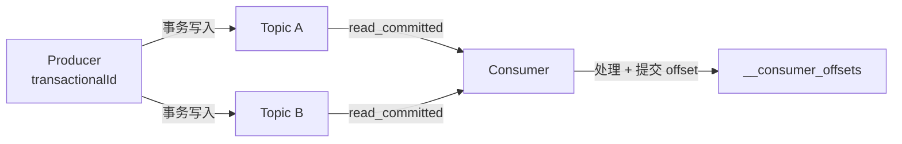

# Kafka Exactly-Once：幂等 Producer + 事务

> 基于 Apache Kafka 3.x + KafkaJS（Node.js）。

## 三种语义

| 语义 | 保证 | 实现 |
|---|---|---|
| At-Most-Once | 最多一次（可能丢） | 先提交 offset，再处理 |
| At-Least-Once | 至少一次（可能重） | 先处理，再提交 offset |
| **Exactly-Once** | **精确一次** | 幂等 Producer + 事务 |

## 幂等 Producer

```javascript
const producer = kafka.producer({
  idempotent: true,         // 开启幂等
  maxInFlightRequests: 5,   // 幂等模式下最多 5 个并发请求
  transactionalId: 'my-tx', // 事务 ID（可选，用于事务）
});

await producer.connect();
await producer.send({
  topic: 'orders',
  messages: [{ key: 'order-1', value: '...' }],
});
```

幂等 Producer 给每条消息加序列号（Sequence Number）。Broker 收到重复消息时自动去重。

**限制：** 只在单个 Producer Session 内有效。重启后序列号重置，不能跨 Session 去重。

## 事务：跨 Topic 原子写入

```javascript
const producer = kafka.producer({
  idempotent: true,
  transactionalId: 'order-processor',
});

await producer.connect();

const transaction = await producer.transaction();
try {
  await transaction.send({ topic: 'orders', messages: [{ key: 'k1', value: 'v1' }] });
  await transaction.send({ topic: 'audit-log', messages: [{ key: 'k2', value: 'v2' }] });
  await transaction.commit();
} catch (e) {
  await transaction.abort();
}
```

两条消息要么同时成功，要么同时失败。

## Consumer 端：isolation.level

```javascript
const consumer = kafka.consumer({
  groupId: 'order-processor',
  // 只读已提交事务的消息
  // KafkaJS 默认是 read_committed
});

await consumer.subscribe({ topic: 'orders' });
await consumer.run({
  eachMessage: async ({ topic, partition, message }) => {
    // 这条消息所在的事务已提交
    await processMessage(message);
    // 手动提交 offset
    await consumer.commitOffsets([
      { topic, partition, offset: (parseInt(message.offset) + 1).toString() },
    ]);
  },
});
```

## Exactly-Once Pipeline



## Exactly-Once 的三个组件

```javascript
// 1. 幂等 Producer（去重）
const producer = kafka.producer({ idempotent: true, transactionalId: 'my-tx' });

// 2. 事务（原子写入多 Topic）
const tx = await producer.transaction();
await tx.send({ topic: 'A', messages: [...] });
await tx.send({ topic: 'B', messages: [...] });
await tx.commit();

// 3. read_committed Consumer（只读已提交）
const consumer = kafka.consumer({ groupId: 'g1' });
// KafkaJS 默认 read_committed
```

## 小结

| 组件 | KafkaJS 配置 |
|---|---|
| Producer | `idempotent: true` + `transactionalId` |
| Consumer | `isolation.level: 'read_committed'`（默认） |
| Broker | `min.insync.replicas=2` + `acks=all` |

Exactly-Once 不是"消息只发一次"——是"消息只被**处理**一次"。
