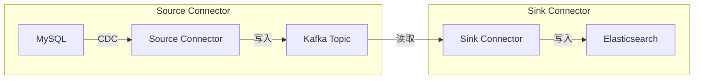

# Kafka Connect：数据集成

> 基于 Apache Kafka 3.x + KafkaJS（Node.js）。

## 一句话

Kafka Connect 是 Kafka 的数据集成框架——用配置文件（JSON）定义"从哪读"和"往哪写"，不需要写代码就能把 Kafka 和数据库、文件系统、搜索引擎连起来。

## 两种模式

| 模式 | 作用 | 部署 |
|---|---|---|
| **Source Connector** | 从外部系统读数据 → 写入 Kafka Topic | 独立进程 / Kafka Connect 集群 |
| **Sink Connector** | 从 Kafka Topic 读数据 → 写入外部系统 | 独立进程 / Kafka Connect 集群 |



## Source Connector 示例：MySQL → Kafka

```json
{
  "name": "mysql-source",
  "config": {
    "connector.class": "io.debezium.connector.mysql.MySqlConnector",
    "database.hostname": "mysql-host",
    "database.port": "3306",
    "database.user": "kafka-connect",
    "database.password": "password",
    "database.server.id": "1",
    "database.server.name": "mydb",
    "database.include.list": "mydb.orders",
    "table.include.list": "mydb.orders",
    "topic.prefix": "cdc."
  }
}
```

## Sink Connector 示例：Kafka → Elasticsearch

```json
{
  "name": "elasticsearch-sink",
  "config": {
    "connector.class": "io.confluent.connect.elasticsearch.ElasticsearchSinkConnector",
    "topics": "orders",
    "connection.url": "http://elasticsearch:9200",
    "type.name": "_doc",
    "key.ignore": "false",
    "schema.ignore": "true"
  }
}
```

## Node.js 管理 Kafka Connect（REST API）

```javascript
const KAFKA_CONNECT_URL = 'http://localhost:8083';

// 创建 Connector
async function createConnector(name, config) {
  const response = await fetch(`${KAFKA_CONNECT_URL}/connectors`, {
    method: 'POST',
    headers: { 'Content-Type': 'application/json' },
    body: JSON.stringify({ name, config }),
  });
  return response.json();
}

// 查看 Connector 状态
async function getConnectorStatus(name) {
  const response = await fetch(`${KAFKA_CONNECT_URL}/connectors/${name}/status`);
  return response.json();
}

// 删除 Connector
async function deleteConnector(name) {
  await fetch(`${KAFKA_CONNECT_URL}/connectors/${name}`, { method: 'DELETE' });
}

// 使用
await createConnector('mysql-source', {
  'connector.class': 'io.debezium.connector.mysql.MySqlConnector',
  'database.hostname': 'mysql-host',
  'database.port': '3306',
  'topic.prefix': 'cdc.',
});

const status = await getConnectorStatus('mysql-source');
console.log(status.connector.state);  // 'RUNNING'
```

## 常用 Connectors

| Connector | 作用 |
|---|---|
| **Debezium** | CDC（Change Data Capture）— MySQL、PostgreSQL、MongoDB |
| **JDBC** | 通用数据库 Source/Sink |
| **Elasticsearch** | Kafka → ES |
| **S3** | Kafka → AWS S3 |
| **HDFS** | Kafka → Hadoop |

## 小结

Kafka Connect = 零代码数据集成。用 JSON 配置文件定义 Source/Sink，Kafka Connect 自动处理并行、容错、offset 管理。
