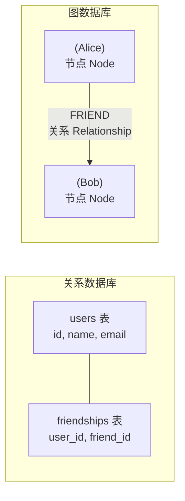
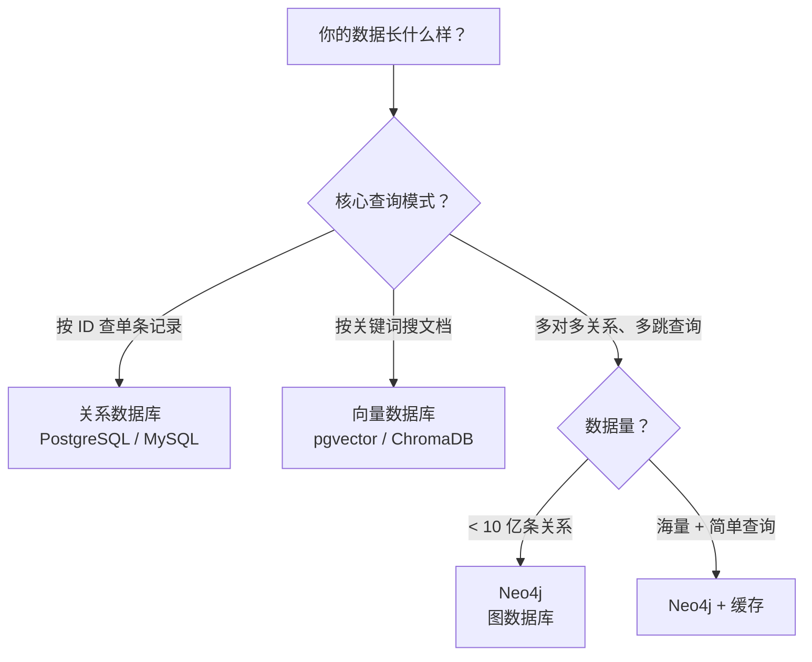

# Neo4j：什么时候应该用图数据库而不是关系数据库

> 基于 Neo4j 5.x + Cypher，Community Edition，GPL v3。

## 一个面试题暴露关系数据库的困境

> "查出我和某个用户之间，通过共同好友形成的最短社交路径。"

在关系数据库里：

```sql
-- 查询"我和 Alice 的共同好友"——已经需要自连接
SELECT f1.friend_id
FROM friendships f1
JOIN friendships f2 ON f1.friend_id = f2.friend_id
WHERE f1.user_id = 'me' AND f2.user_id = 'Alice';

-- 查询"朋友的朋友的朋友"——每多一层，SQL 复杂十倍
SELECT DISTINCT f3.friend_id
FROM friendships f1
JOIN friendships f2 ON f1.friend_id = f2.user_id
JOIN friendships f3 ON f2.friend_id = f3.user_id
WHERE f1.user_id = 'me';
```

两层需要 2 个 JOIN，三层需要 3 个 JOIN，十层需要 10 个 JOIN。关系数据库用表表达图——每多一层关系，查询复杂度指数级增加。这不是 SQL 的错——是关系模型本身不适合表达多跳关系。

Neo4j 里同样的查询：

```cypher
// 查出我和 Alice 之间的最短路径
MATCH path = shortestPath(
  (me:User {name: 'me'})-[:FRIEND*]-(alice:User {name: 'Alice'})
)
RETURN path
```

`*` 表示"零到无穷跳"——不管中间隔了几个人，一句 Cypher 搞定。这不是 Neo4j 的语法更简洁——是图模型天然适合表达节点之间的关系。

## 图数据库的核心概念



| 概念 | 关系数据库 | 图数据库 |
|------|-----------|----------|
| 实体 | 表中的一行（row） | 节点（Node），可以有多个标签 |
| 属性 | 列（column） | 节点的 key-value 对 |
| 关联 | 外键 + JOIN | 关系（Relationship），有类型和方向 |
| 查询 | SQL（表连接） | Cypher（图遍历） |

关键区别：**在关系数据库中，关系是查询时通过 JOIN 临时计算的。在图数据库中，关系是第一公民——和节点一样存储在磁盘上，有独立的类型、属性和方向。**

## 安装

```bash
docker run -d --name neo4j \
  -p 7474:7474 -p 7687:7687 \
  -e NEO4J_AUTH=neo4j/password123 \
  neo4j:5-community
```

- `7474`：HTTP（浏览器访问 `http://localhost:7474`，Neo4j Browser）
- `7687`：Bolt 协议（应用连接用）

Python 驱动：

```bash
pip install neo4j
```

```python
from neo4j import GraphDatabase

driver = GraphDatabase.driver(
    "bolt://localhost:7687",
    auth=("neo4j", "password123")
)

def run_query(query, **params):
    with driver.session() as session:
        return list(session.run(query, **params))
```

## Cypher 快速入门

Cypher 是 Neo4j 的查询语言——设计目标是用**图的方式思考、用图的语法表达**。节点用 `()` ，关系用 `[]`，方向用 `-->`。

### 创建节点

```cypher
// 创建单个节点
CREATE (p:Person {name: 'Alice', age: 30})

// 创建多个节点
CREATE
  (b:Person {name: 'Bob', age: 28}),
  (c:Company {name: 'Acme Corp', industry: 'Tech'})
```

### 创建关系

```cypher
// 先找到节点，再建关系
MATCH (a:Person {name: 'Alice'}), (b:Person {name: 'Bob'})
CREATE (a)-[:FRIEND {since: 2020}]->(b)
//                      ^^^^^^^^^^ 关系可以有属性

MATCH (p:Person {name: 'Alice'}), (c:Company {name: 'Acme Corp'})
CREATE (p)-[:WORKS_AT {role: 'Engineer'}]->(c)
```

### 查询

```cypher
// 查找 Alice 的所有朋友
MATCH (a:Person {name: 'Alice'})-[:FRIEND]->(friend)
RETURN friend.name, friend.age

// 查找 Alice 的朋友的朋友（2 跳）
MATCH (a:Person {name: 'Alice'})-[:FRIEND*2]-(fof)
RETURN DISTINCT fof.name

// 查找在 Tech 公司工作的所有人
MATCH (p:Person)-[:WORKS_AT]->(c:Company {industry: 'Tech'})
RETURN p.name, c.name

// 查找 Alice 到任何 Tech 公司员工的最短路径
MATCH path = shortestPath(
  (a:Person {name: 'Alice'})-[*]-(p:Person)-[:WORKS_AT]->(c:Company {industry: 'Tech'})
)
RETURN path
```

## 实战：构建一个电影知识图谱

从 Neo4j 自带的示例数据集入手——演员、导演、电影之间的关系。

```cypher
// 载入示例数据
:play movie-graph
// 在 Neo4j Browser 中执行这个命令，会自动创建 171 个节点和 253 条关系
```

```cypher
// 1. 查找 Tom Hanks 演过的所有电影
MATCH (p:Person {name: 'Tom Hanks'})-[:ACTED_IN]->(m:Movie)
RETURN m.title, m.released

// 2. 查找同时出演过同一部电影的演员对（co-actors）
MATCH (p1:Person)-[:ACTED_IN]->(m:Movie)<-[:ACTED_IN]-(p2:Person)
WHERE p1.name = 'Tom Hanks' AND p2.name <> 'Tom Hanks'
RETURN p2.name, COUNT(m) AS movies_together
ORDER BY movies_together DESC

// 3. 谁导了 Tom Hanks 演的电影
MATCH (p:Person {name: 'Tom Hanks'})-[:ACTED_IN]->(m:Movie)<-[:DIRECTED]-(d:Person)
RETURN d.name, COUNT(m) AS count
ORDER BY count DESC

// 4. 六度分隔——Tom Hanks 到 Meg Ryan 之间的路径
MATCH path = shortestPath(
  (p1:Person {name: 'Tom Hanks'})-[*..6]-(p2:Person {name: 'Meg Ryan'})
)
RETURN path
```

## 用 Python 构建自己的图

```python
from neo4j import GraphDatabase

class MovieGraph:
    def __init__(self, uri, user, password):
        self.driver = GraphDatabase.driver(uri, auth=(user, password))

    def create_movie(self, title, year, actors, director):
        with self.driver.session() as session:
            session.execute_write(self._create, title, year, actors, director)

    @staticmethod
    def _create(tx, title, year, actors, director):
        # 创建 Movie 节点
        tx.run("MERGE (m:Movie {title: $title}) "
               "SET m.year = $year", title=title, year=year)

        # 创建 Director 和关系
        tx.run("MERGE (d:Person {name: $name})", name=director)
        tx.run("""
            MATCH (d:Person {name: $director}), (m:Movie {title: $title})
            MERGE (d)-[:DIRECTED]->(m)
        """, director=director, title=title)

        # 创建每个 Actor 和关系
        for actor in actors:
            tx.run("MERGE (a:Person {name: $name})", name=actor)
            tx.run("""
                MATCH (a:Person {name: $actor}), (m:Movie {title: $title})
                MERGE (a)-[:ACTED_IN]->(m)
            """, actor=actor, title=title)

    def recommend(self, person_name):
        """推荐电影：找到这个人没看过、但他的 co-actor 看过的电影"""
        with self.driver.session() as session:
            result = session.run("""
                MATCH (p:Person {name: $name})-[:ACTED_IN]->(:Movie)<-[:ACTED_IN]-(co:Person),
                      (co)-[:ACTED_IN]->(rec:Movie)
                WHERE NOT (p)-[:ACTED_IN]->(rec)
                RETURN rec.title, COUNT(*) AS strength
                ORDER BY strength DESC LIMIT 5
            """, name=person_name)
            return [(r["rec.title"], r["strength"]) for r in result]


# 使用
graph = MovieGraph("bolt://localhost:7687", "neo4j", "password123")

graph.create_movie(
    title="Inception",
    year=2010,
    actors=["Leonardo DiCaprio", "Joseph Gordon-Levitt", "Elliot Page"],
    director="Christopher Nolan"
)

# 推荐
print(graph.recommend("Leonardo DiCaprio"))
# → [("The Dark Knight", 3), ("Interstellar", 2), ...]
```

推荐逻辑只用了一句 Cypher——翻译成人话："找到和 Leo 合作过的演员，他们演过但 Leo 没演过的电影，按被推荐次数排序"。用 SQL 写同一条逻辑需要至少 5 层 JOIN。

## 什么时候用 Neo4j



具体场景：

| 场景 | 图数据库的优势 |
|------|---------------|
| 社交网络（朋友的朋友） | O(1) 遍历关系，不需要 JOIN |
| 推荐系统（协作过滤） | 天然支持多跳图遍历 |
| 知识图谱 | 实体-关系-实体 的三元组模型 |
| 反欺诈（资金链路追踪） | 多层嵌套交易路径的实时查询 |
| 供应链追溯 | 多层级的物料→产品→分销关系链 |
| 权限管理 | 组织架构 + 资源层级（RBAC 的图表达） |

**不是所有数据都适合图**——如果你最频繁的查询是"按 ID 查用户"或"按时间范围查订单"，关系数据库仍然是更好的选择。图数据库的价值在**多跳关系查询**——每多一层关系，优势指数级放大。

## 性能和限制

| 指标 | Community Edition | Enterprise Edition |
|------|------------------|-------------------|
| 节点数 | 无限制 | 无限制 |
| 关系数 | 无限制 | 无限制 |
| 集群 | 不支持 | 支持（因果集群） |
| 备份 | 离线 | 在线备份 |
| 细粒度权限 | 不支持 | 支持 |

Community 版本功能上几乎无限制——节点和关系数量没有上限。限制的是运维能力（无法集群、无法在线备份）——所以社区版适合单机部署，企业版用于生产集群。

## 小结

Neo4j 不是"比 PostgreSQL 更好的数据库"——它是为特定类型的问题设计的。关系数据库解决"多行一个实体"的问题，图数据库解决"多实体间的关系"的问题。

三个信号说明你可能需要图数据库：
1. **你的 SQL 查询里有 3 层以上的 JOIN**
2. **你的核心查询是"从 X 出发，找到所有相关的 Y"**（图遍历）
3. **你的 ER 图里关系比实体还多**

出现以上任何一个，把数据导入 Neo4j 试一下——你可能会发现原来需要 10 个 JOIN 的 SQL，在 Cypher 里只需要一行。
