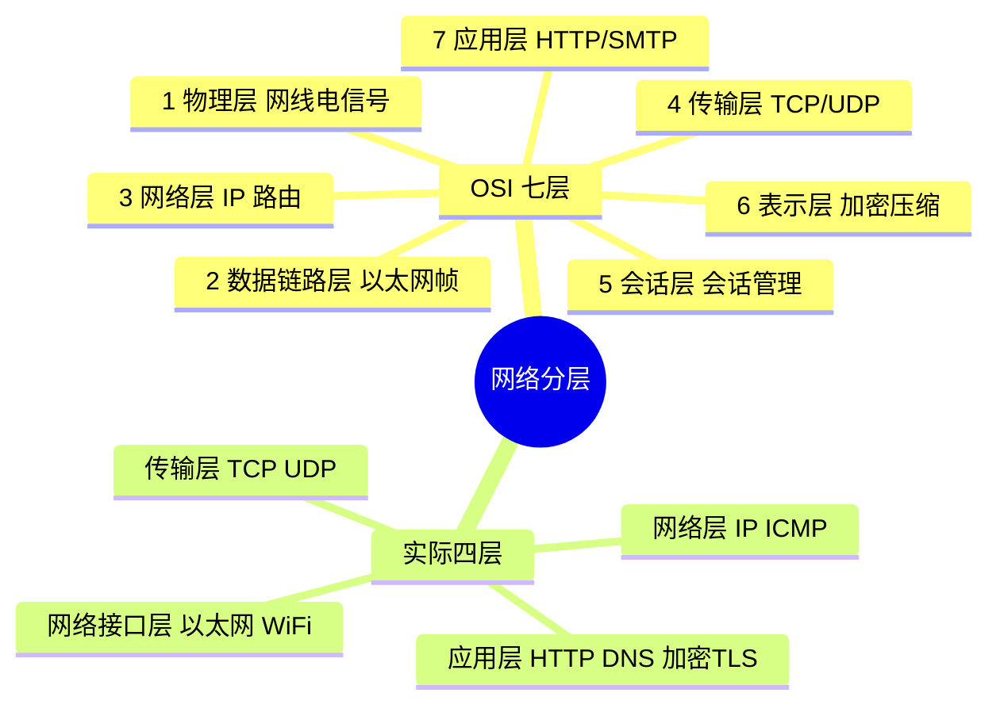
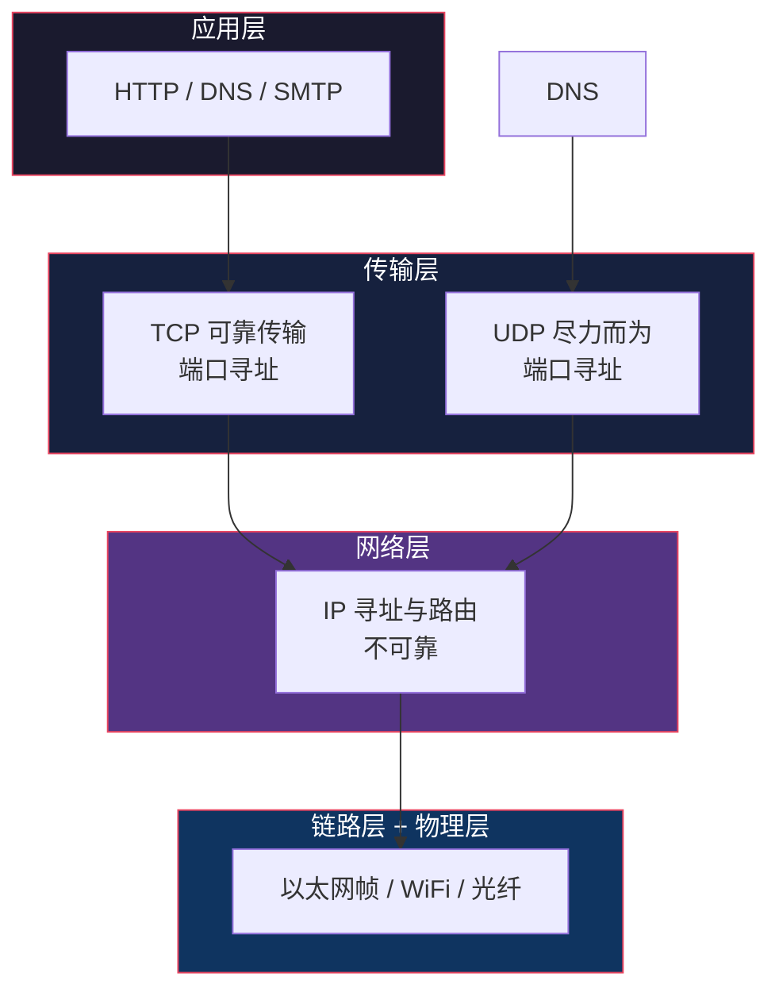
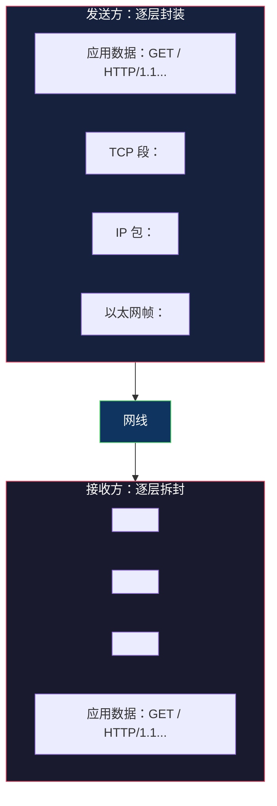
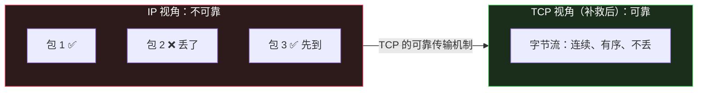

# 网络分层：每一层只解决一个问题

> TCP/IP 网络底层系列第 1 篇。系列总览见 [index.md](index.md)。配套：HTTP 应用层系列见 `tech/http/`。

## 生活比喻：跨国寄一封信

给国外的朋友寄一封信，要经过几道工序，每道工序各司其职：

1. **写信**（应用层）——你想表达的内容
2. **装信封、写地址**（传输层）——给内容加上"给谁"的信息
3. **邮局分拣、定路线**（网络层）——决定走哪条邮路能到对方国家
4. **邮车转运**（链路层）——一段一段地运到下一个邮局

每一层只关心自己的事：写地址的不关心邮车走哪条路，邮车不关心信里写了什么。**分层 = 每层只解决一个问题，层与层之间用标准接口对接。**

## 为什么需要分层

没有分层会怎样？想象网络协议只有一种大而全的格式，后来想加"加密"、想换"传输方式"，只能推翻重来。

分层的四个好处：

| 好处 | 说明 |
|------|------|
| 独立演化 | 换 HTTP/3 只动应用层，不影响物理网线 |
| 关注点分离 | 可靠传输只研究一次（TCP），所有应用复用 |
| 故障定位 | 丢包了知道是第几层的问题 |
| 标准对接 | 各厂商按层实现，互相兼容 |

## OSI 七层 vs 现实四层

教科书讲 OSI 七层模型，但互联网实际跑的是 TCP/IP 四层模型：



**OSI 的 5/6 层（会话、表示）在实际中不存在独立层**——会话管理被应用自己处理（HTTP Cookie），加密被塞进传输层之上（TLS 实际跑在 TCP 上、在应用层之下）。



## 每层协议全家福

| 层 | 职责 | 常见协议 | 你写代码时接触它吗 |
|----|------|---------|-------------------|
| 应用层 | 业务语义 | HTTP、HTTPS、DNS、SMTP、WebSocket、SSH | ✅ 每天 |
| 传输层 | 进程到进程 + 可靠/不可靠 | TCP、UDP、QUIC | ✅ socket 编程 |
| 网络层 | 主机到主机 + 路由 | IP、ICMP、ARP | ⚠️ 理解即可 |
| 链路层 | 一跳一跳的传输 | 以太网、WiFi | ❌ 硬件驱动管 |

## 数据封装：每一层加一个信封

发送数据时，数据从上层往下走，**每一层都给它加上自己的头部（Header）**；接收时反向逐层拆封：



**每一层的 Header 是给对等层看的**——TCP 头是给对方的 TCP 实现看的，IP 头是给路由器看的，应用数据它们都不关心。

## 关键认知：下层不可靠，上层来弥补

这是理解整个网络栈的钥匙：

```
IP 层： 尽力而为（可能丢包、乱序、重复）
        ↑ TCP 在这里补救：重传、排序、去重 → 给上层一个"可靠字节流"
        ↑ UDP 不补救：就用 IP 的原始特性

所以：  写 TCP 程序 = 面对一个可靠的信道（不用管丢包）
        写 UDP 程序 = 面对一个可能丢包的信道（自己处理）
```



## 抓包看看分层（提前预览）

用 tcpdump 抓一个 HTTP 请求，能看到每一层的信封：

```bash
$ curl -s example.com > /dev/null &
$ sudo tcpdump -nn -i en0 'host example.com and port 80' -c 4

# 输出一行的解读（从外到内 = 从链路层到应用层）
12:34:56.789012 IP 192.168.1.5.54321 > 93.184.216.34.80:
    Flags [S], seq 123456789
#         ↑  ↑IP 头：源 IP.端口 > 目的 IP.端口
#                                    ↑ TCP 头：SYN 标志 + 序列号
```

## 与下篇的衔接

分层模型是地图，现在开始沿传输层深入。下一篇进入 TCP 最著名的部分——三次握手建立连接、四次挥手断开连接，并解释每个步骤为什么存在。

## 总结

| 要点 | 结论 |
|------|------|
| 为什么分层 | 每层解决一个问题，独立演化 |
| 几层 | 实际四层：应用/传输/网络/链路 |
| 数据怎么走 | 发送逐层加头，接收逐层拆头 |
| 可靠谁负责 | IP 不可靠，TCP 补救，UDP 不补救 |
| 对你写代码 | TCP 程序面对可靠信道，UDP 程序自己管丢包 |
