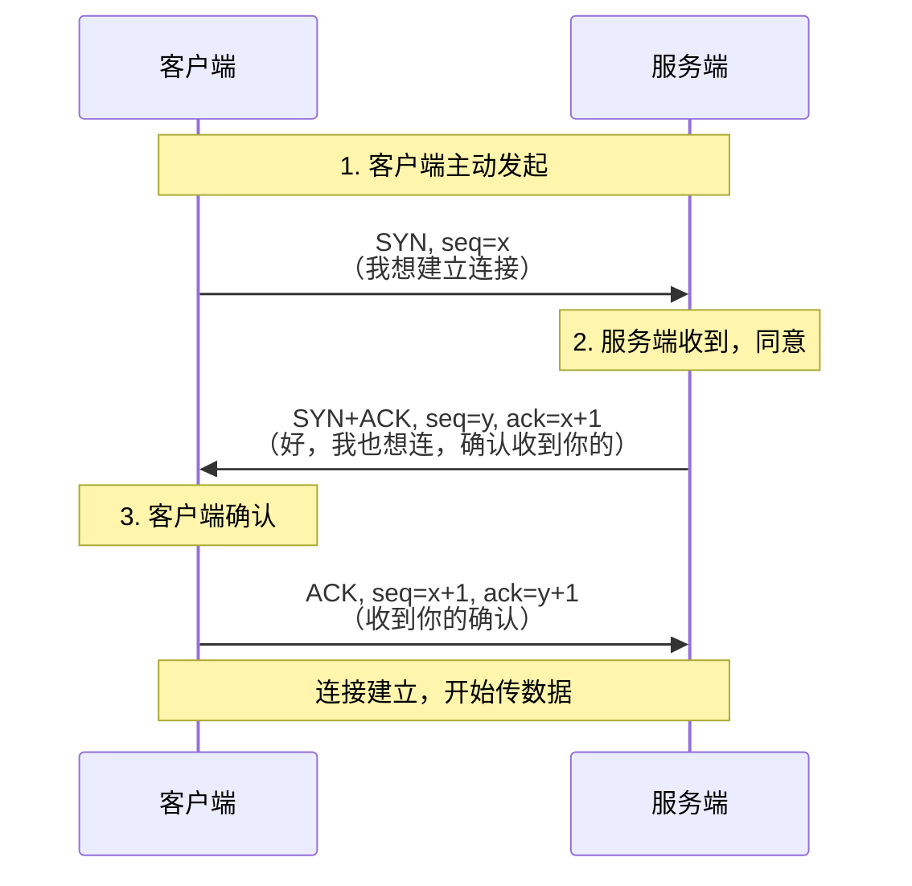
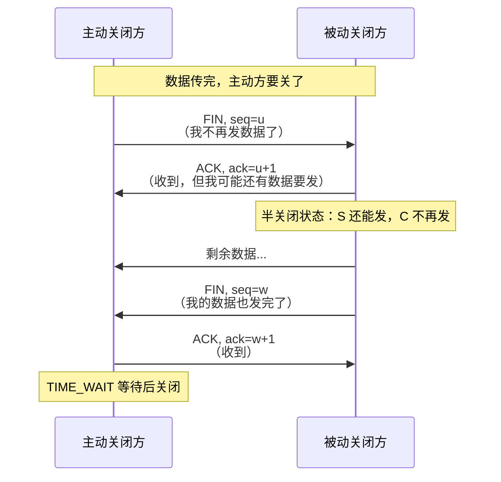
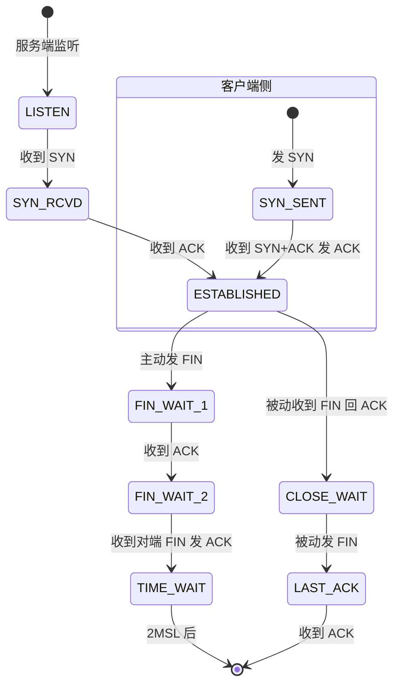
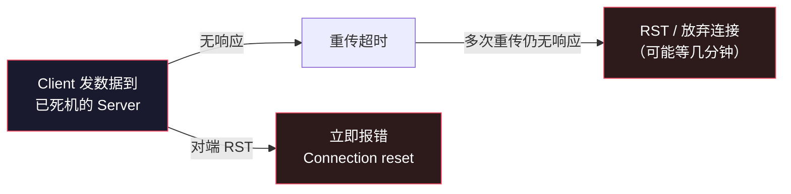

# TCP 三次握手与四次挥手：连接的建立与告别

> TCP/IP 网络底层系列第 2 篇。系列总览见 [index.md](index.md)。

## 生活比喻：打电话

**建立连接（三次握手）** 就像拨电话确认双方在线：

- 你拨号：**"喂？"**（SYN）→ 等待
- 对方接起：**"喂，听到吗？"**（SYN+ACK）→ 对方也在等你确认
- 你确认：**"听到了！"**（ACK）→ 双方开始说话

**断开连接（四次挥手）** 就像挂电话，需要双方都说再见：

- 你说：**"我说完了"**（FIN）→ 你不再发数据
- 对方：**"知道了"**（ACK）→ 但对方可能还有话要说
- 对方说完：**"我也说完了"**（FIN）
- 你：**"知道了"**（ACK）→ 连接关闭

## TCP 头部先认识一下

理解握手之前，先看 TCP 头里四个关键字段：

```
 0                   1                   2                   3
 0 1 2 3 4 5 6 7 8 9 0 1 2 3 4 5 6 7 8 9 0 1 2 3 4 5 6 7 8 9 0 1
+-+-+-+-+-+-+-+-+-+-+-+-+-+-+-+-+-+-+-+-+-+-+-+-+-+-+-+-+-+-+-+-+
|          源端口 (16)          |        目的端口 (16)           |
+-+-+-+-+-+-+-+-+-+-+-+-+-+-+-+-+-+-+-+-+-+-+-+-+-+-+-+-+-+-+-+-+
|                        序列号 seq (32)                         |
+-+-+-+-+-+-+-+-+-+-+-+-+-+-+-+-+-+-+-+-+-+-+-+-+-+-+-+-+-+-+-+-+
|                      确认号 ack (32)                           |
+-+-+-+-+-+-+-+-+-+-+-+-+-+-+-+-+-+-+-+-+-+-+-+-+-+-+-+-+-+-+-+-+
| 偏移 | 保留 |U|A|P|R|S|F|   窗口大小 (16)                       |
+-+-+-+-+-+-+-+-+-+-+-+-+-+-+-+-+-+-+-+-+-+-+-+-+-+-+-+-+-+-+-+-+

标志位：U=URG  A=ACK  P=PSH  R=RST  S=SYN  F=FIN
```

| 字段 | 作用 |
|------|------|
| 源/目的端口 | 找进程（传输层职责） |
| 序列号 seq | 字节流的编号（第 3 篇主角） |
| 确认号 ack | 告诉对方"我期待的下一个字节号" |
| SYN/FIN/ACK/RST | 连接控制标志 |
| 窗口大小 | 流量控制（第 3 篇主角） |

## 三次握手（Three-Way Handshake）



### 为什么是三次，不是两次？

因为**网络可能丢包、延迟、重放**。两次握手有个致命缺陷：客户端发出的 SYN 在网络里滞留，超时后客户端重发 SYN 建立了连接、传完数据关闭。此时**第一个滞留的 SYN 到达服务端**——服务端以为客户端要建立新连接，回复 SYN+ACK 并等待数据，白白占用资源。客户端根本不理会这个幽灵连接。

三次握手让**服务端确认"客户端确实活着且在期待这个连接"**后才分配资源（第三步 ack=x+1 证明客户端收到了服务端的 SYN）。

用大白话：两次握手时服务端无法区分"新请求"和"幽灵重放"；三次握手让发起方证明"我收到了你的回应"。

### 同步序列号

三次握手还有个隐藏职责——**同步双方的初始序列号**：

- 客户端说 "我的起始序号是 x"
- 服务端回 "我的起始序号是 y，并确认你的 x"

没有这一步，双方不知道对方从哪个字节号开始数，可靠传输（第 3 篇）无从谈起。

## 四次挥手（Four-Way Handshake）



### 为什么是四次，不是三次？

因为**关闭是双向的**——每一方都要单独说"我说完了"。被动方收到 FIN 后先回 ACK（我不再收你的数据了），但它自己可能还有数据没发完，所以要等自己的数据发完再发 FIN。两次 ACK 和 FIN 无法合并，就成四次。

### TIME_WAIT：最后的等待为什么是 2MSL

主动关闭方发完最后一个 ACK 后进入 TIME_WAIT，等待 **2MSL**（MSL = 报文最大生存时间，典型 60s，所以常看到 120s）：

| 目的 | 说明 |
|------|------|
| 确保最后的 ACK 到达 | ACK 丢了，对方会重发 FIN，此时还能再回 ACK |
| 让旧连接的报文在网络中消亡 | 防止旧连接残留报文污染新连接（端口复用） |

**代价：** 主动关闭方端口在 2MSL 内不可复用。高并发服务端常见 `Address already in use` 就是 TIME_WAIT 堆积——解决方案是开启 `SO_REUSEADDR`。

## 连接状态机



**排查技能**：`netstat -tnp` 看到大量 `SYN_RCVD` → 可能是 SYN 洪泛或服务端 backlog 满；大量 `CLOSE_WAIT` → 应用收到关闭通知但**忘了调 close()**（代码 bug）；大量 `TIME_WAIT` → 主动关闭太频繁，考虑长连接。

## 异常断开：RST 与半开连接

不是所有连接都优雅关闭：

| 场景 | 表现 |
|------|------|
| 对端进程崩溃 | 内核会替它发 FIN（进程没了，socket 被关闭） |
| 对端**机器**断电/断网 | 没有任何包发出——连接变成"半开"，直到超时 |
| 收到不能处理的包 | 回 RST（Reset），立即重置连接 |
| 端口没有服务在听 | 内核直接回 RST（connect 报 Connection refused） |



**程序员的教训：** 服务器断电时客户端不会立刻知道——所以应用层要有心跳（Kafka 的 session.timeout、WebSocket ping/pong、MySQL 的 pre_ping 都是干这个的）。

## SYN 洪泛（SYN Flood）攻击

攻击者发大量 SYN 但不完成第三次握手——服务端 SYN_RCVD 队列（半连接队列）被塞满，正常用户的连接进不来。

防御手段：**SYN Cookie**——不分配资源，把连接信息加密进 SYN+ACK 的序列号里，第三次握手时校验回来再分配。Linux 默认开启（`net.ipv4.tcp_syncookies`）。

## 抓包实战预览

```bash
# 看三次握手和四次挥手
$ sudo tcpdump -nn -i lo0 'tcp port 8000'
13:00:00.001 IP 127.0.0.1.54321 > 127.0.0.1.8000: Flags [S], seq 1000
13:00:00.001 IP 127.0.0.1.8000 > 127.0.0.1.54321: Flags [S.], seq 2000, ack 1001
13:00:00.001 IP 127.0.0.1.54321 > 127.0.0.1.8000: Flags [.], ack 2001
# ↑ S = SYN，S. = SYN+ACK，. = ACK —— 三次握手

13:00:01.000 IP 127.0.0.1.54321 > 127.0.0.1.8000: Flags [F.], seq 3000, ack 2001
13:00:01.000 IP 127.0.0.1.8000 > 127.0.0.1.54321: Flags [.], ack 3001
13:00:01.001 IP 127.0.0.1.8000 > 127.0.0.1.54321: Flags [F.], seq 2001, ack 3001
13:00:01.001 IP 127.0.0.1.54321 > 127.0.0.1.8000: Flags [.], ack 2002
# ↑ F. = FIN+ACK —— 四次挥手
```

第 7 篇会完整做一次抓包对照实验。

## 与下篇的衔接

握手建立了连接，接下来是 TCP 最硬核的部分——**连接建立后，数据怎么保证不丢、不乱、不重复、不把网络堵死**。第 3 篇进入可靠传输。

## 总结

| 要点 | 结论 |
|------|------|
| 三次握手 | 双向确认 + 同步序列号；两次会中"幽灵连接"招 |
| 四次挥手 | 双向独立关闭；主动方 TIME_WAIT 2MSL |
| 状态机排查 | SYN_RCVD=洪泛/backlog，CLOSE_WAIT=忘 close，TIME_WAIT=频繁短连接 |
| 断电检测 | TCP 不会立刻知道，应用层必须心跳 |
