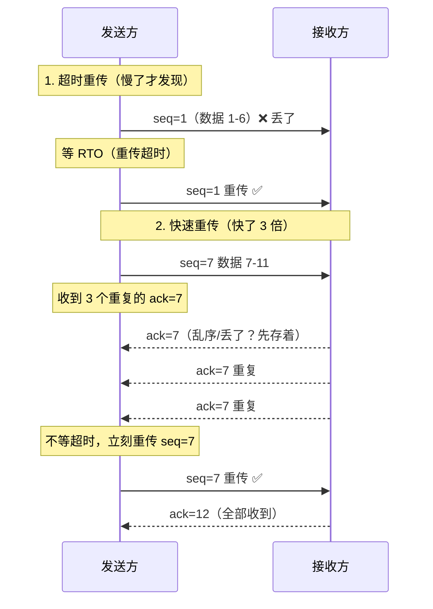

# TCP 可靠传输：不丢、不乱、不堵

> TCP/IP 网络底层系列第 3 篇。系列总览见 [index.md](index.md)。

## 生活比喻：寄一箱书，拆成多个包裹

你要寄一箱书（一个 HTTP 请求），快递公司把它拆成 10 个包裹（TCP 分段）分别寄出。IP 层就像不可靠的货运公司——包裹可能丢、可能先寄的后到。

TCP 的可靠传输就是在收货端做三件事：

1. **不丢**——每个包裹有编号（序列号），少了哪个就让对方重寄（重传）
2. **不乱**——按编号重新排好（排序），重复的扔掉（去重）
3. **不堵**——对方收货太慢就减少发货量（流量控制）；路上堵车就降速（拥塞控制）

## 为什么 IP 不可靠

IP 层只做一件事——尽力把包送到目的地。它不保证：

| IP 层可能发生的 | 原因 |
|---------------|------|
| 丢包 | 路由器缓冲区满，直接丢弃 |
| 乱序 | 多条路径到达，后发的先到 |
| 重复 | 网络重传机制导致副本 |
| 损坏 | 传输错误（靠校验和发现，但只发现不修复） |

TCP 站在 IP 之上，把这一切修补成"可靠的字节流"。

## 序列号：一切的基石

TCP 是**面向字节流**的——它不关心你的应用数据边界，只把数据当成一串字节。序列号标记的是**字节**的位置：

```text
应用数据:   [  H  e  l  l  o     W  o  r  l  d  ]
字节序号:     1  2  3  4  5  6  7  8  9  10 11

分段:
  段 1: 字节 1~6    seq=1
  段 2: 字节 7~11   seq=7
```

**seq = 本段第一个字节的编号。** 接收方靠 seq 排序、去重、发现丢失。

## ACK 与累积确认

接收方收到数据后回 ACK，**ack = 期望收到的下一个字节号**（不是"最后收到的那个"）：

```text
发送方发出: seq=1（字节 1-6）
接收方收到: 回 ack=7（"字节 1-6 都收到了，给我 7 以后的"）

发送方发出: seq=7（字节 7-11）
接收方收到: 回 ack=12（"全收到了"）
```

**累积确认的含义：** ack=N 表示"N 之前的所有字节都收到了"——即使中间有个包丢了，接收方也不会向前确认。

## 超时重传与快速重传

丢包了怎么发现？两个机制配合：



| 机制 | 触发 | 速度 |
|------|------|------|
| 超时重传 | 定时器到期 | 慢（RTO 通常几百 ms 起步） |
| 快速重传 | 收到 **3 个重复 ACK** | 快（一个 RTT 内） |

**3 个重复 ACK 意味着"后续数据都到了，就缺这一段"**——网络没堵，只是这一段丢了，没必要等超时。

## 滑动窗口：流量控制

接收方内存有限，处理不过来时必须让发送方减速。TCP 头里的**窗口大小（Window）**字段就是接收方在喊："我还有这么多缓冲区，你最多再发这些。"

```text
发送方视角的滑动窗口:

         ┌─────────── 窗口（= 接收方通告的剩余空间）───────────┐
         ▼                                                    ▼
[已发送已确认] [已发送未确认        ][可以发送            ][不能发送]
  1    10    11         50      51      60        61     80
  ← 左边界随 ACK 右移 →   ← 右边界随窗口右移 →
```


**零窗口死锁与探测：** 接收方窗口变 0，发送方停止。但接收方后来发的"窗口恢复"通告可能丢了——于是发送方定时发 **窗口探测包**（1 字节），逼接收方重新通告。

**程序员的视角：** 应用读 socket 太慢 → 内核接收缓冲区满 → TCP 窗口缩小 → 对方发送变慢。**这就是"接收端应用是瓶颈时，发送端会跟着慢"的机制根源。**

## 拥塞控制：别把网络堵死

流量控制管的是"接收方能吃多少"，拥塞控制管的是"**网络**能承受多少"——这是发送方自己猜的，因为网络不会主动告诉你它堵了。

### 慢启动（Slow Start）

新连接不知道网络宽不宽，从 **1 个 MSS** 开始试探，每收到一个 ACK 窗口翻倍：

```text
发送窗口（cwnd）:
RTT 1:  1 段  ── 收到 ACK
RTT 2:  2 段  ── 收到 ACK
RTT 3:  4 段  ── 收到 ACK
RTT 4:  8 段  ── 指数增长！
...
直到达到 ssthresh（慢启动阈值）或丢包
```

**为什么叫"慢"启动却是指数增长？** 慢的是起点（1 段），不是速度——指数增长是为了快速探测可用带宽。

### 拥塞避免（Congestion Avoidance）

到达阈值后改为**线性增长**（每个 RTT +1 段），小心翼翼地试探。直到发生丢包：

| 事件 | 经典 TCP 反应 |
|------|--------------|
| 超时重传（网络真堵了） | cwnd 归 1，重新慢启动；ssthresh 减半 |
| 快速重传（只是丢了一段） | cwnd 减半，进入拥塞避免（快速恢复） |

现代 Linux 默认的 CUBIC 算法在"丢包后快速恢复"上做得更好，但思维模型不变：**丢包 = 网络拥堵的信号，因为路由器满了才会丢。**

### 为什么网络不会"爆"

路由器内存有限，超载时只能丢包。TCP 的拥塞控制让**每个发送方都自我克制**——全网流量其实是所有 TCP 连接"协商"出来的平衡点。这就是为什么 TCP 被称为"绅士协议"。

## 现实中你看不到但一直在发生的

| 现象 | 机制 |
|------|------|
| 大文件传输 | 慢启动 → 拥塞避免 → 快速恢复 循环 |
| 视频卡顿、网页慢 | 丢包 → 重传 → cwnd 减半 → 吞吐骤降 |
| 长肥网络（跨洋大带宽） | 带宽延迟积（BDP）巨大，需要窗口缩放选项 |
| 移动网络切基站 | 丢包率上升，TCP 误判拥塞（现在有 L4S/BBR 改善） |

**程序员可感知的信号：** `curl -w "time_total"` 慢、`ss -ti` 里 cwnd 值、抓包看到大量 DUP ACK 和重传——这些都在告诉你网络在丢包，TCP 正在自我修复。

## 与下篇的衔接

TCP 用复杂机制换可靠。但有些场景**不想要这些机制**——视频通话宁可丢一帧也不愿等重传。第 4 篇看 UDP：为什么"不靠谱"反而被实时应用偏爱。

## 总结

| 问题 | TCP 的答案 |
|------|-----------|
| 数据丢了 | 序列号发现缺口 → 超时重传 / 快速重传 |
| 数据乱序 | 接收方按 seq 排序 |
| 数据重复 | 按 seq 去重 |
| 接收方吃不消 | 窗口通告 → 滑动窗口流量控制 |
| 网络吃不消 | cwnd 拥塞控制（慢启动 + 拥塞避免） |
| 丢包信号 | 超时 = 真堵了；3 个重复 ACK = 只是丢了 |
