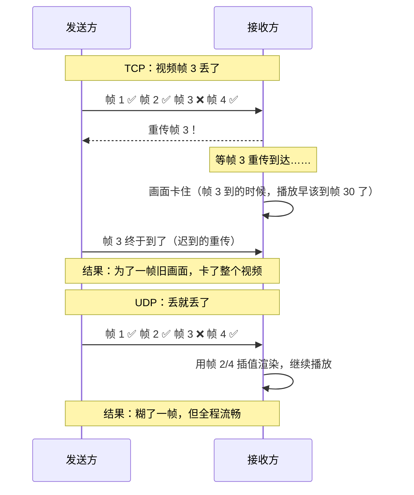
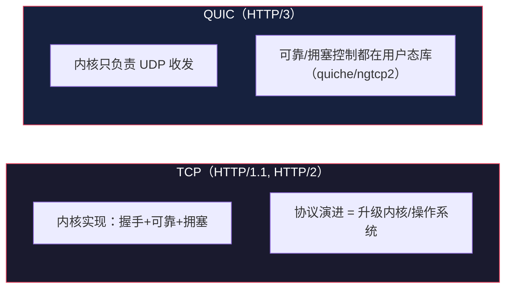

# UDP：为什么"不靠谱"反而被偏爱

> TCP/IP 网络底层系列第 4 篇。系列总览见 [index.md](index.md)。

## 生活比喻：广播 vs 挂号信

- TCP 像**挂号信**：要签收、要回执、丢了重寄——可靠但慢
- UDP 像**广播**：喊一嗓子，谁听到算谁——没人确认你听到了没有，但**快**，而且可以同时喊给所有人

UDP（User Datagram Protocol，用户数据报协议）的哲学：**我不保证送达，但我保证快、保证简单。**

## UDP 头：只有 8 字节

对比一下 TCP 头（至少 20 字节、13 个字段）和 UDP 头（8 字节、4 个字段）：

```
 0                   1                   2                   3
+-+-+-+-+-+-+-+-+-+-+-+-+-+-+-+-+-+-+-+-+-+-+-+-+-+-+-+-+-+-+-+-+
|         源端口 (16)            |         目的端口 (16)         |
+-+-+-+-+-+-+-+-+-+-+-+-+-+-+-+-+-+-+-+-+-+-+-+-+-+-+-+-+-+-+-+-+
|            长度 (16)           |          校验和 (16)          |
+-+-+-+-+-+-+-+-+-+-+-+-+-+-+-+-+-+-+-+-+-+-+-+-+-+-+-+-+-+-+-+-+
```

UDP 只做两件事：**端口寻址 + 可选校验**。没有序列号、没有 ACK、没有窗口、没有连接状态。

## TCP vs UDP：一张表说清

| 维度 | TCP | UDP |
|------|-----|-----|
| 连接 | 面向连接（先握手） | 无连接（直接发） |
| 可靠性 | 可靠（重传/排序/去重） | 尽力而为 |
| 顺序 | 保证有序 | 不保证（可能乱序） |
| 头部 | 20 字节起 | 8 字节 |
| 传输单位 | 字节流（无边界） | 数据报（有边界，一次一包） |
| 流量/拥塞控制 | 有 | 无 |
| 速度 | 慢（握手 + 拥塞控制克制自己） | 快 |
| 典型应用 | HTTP、文件传输、邮件 | 视频、游戏、DNS、日志 |

## 为什么实时应用选 UDP

**TCP 的可靠性机制在实时场景是毒药：**



**实时通信的铁律：旧数据比丢数据更糟。** 视频通话里，一帧迟到 500ms 的旧画面没有意义——观众早就该看到后面的内容了。UDP 不重传，每个包都是"此刻最新"，这正是实时场景要的。

## UDP 的经典地盘

| 应用 | 为什么用 UDP | 细节 |
|------|-------------|------|
| DNS | 一个请求一个响应，丢了重发即可 | 查询走 UDP:53，超时重发 |
| 视频/语音通话 | 延迟敏感，丢帧可忍 | WebRTC 基于 UDP |
| 在线游戏 | 玩家位置每帧更新，旧位置没意义 | 丢包=瞬移，重传=更糟 |
| 直播 | 实时性优先 | 迟到帧直接丢 |
| 日志/监控 | 海量小包，丢了不心疼 | statsd 默认 UDP |
| 隧道/VPN | 低延迟传输 | WireGuard 用 UDP |

**注意 DNS：** 它"用 UDP 但自己补了可靠性"——查询超时就重发。这揭示了通用模式：**应用按需在 UDP 之上自建可靠性**，而不是为所有场景背上 TCP 的全套机制。

## UDP 之上的可靠：三个层次

### 1. 应用层自己重试（DNS 模式）

```python
import socket

def dns_query(name: str, timeout: float = 2.0) -> bytes:
    s = socket.socket(socket.AF_INET, socket.SOCK_DGRAM)
    s.settimeout(timeout)
    query = build_dns_packet(name)
    for attempt in range(3):          # 最多重试 3 次
        s.sendto(query, ('8.8.8.8', 53))
        try:
            return s.recvfrom(512)[0]  # 收到即成功
        except socket.timeout:
            continue                   # 超时重发
    raise TimeoutError("DNS 无响应")
```

### 2. 可靠 UDP 库（RUDP 家族）

在 UDP 之上实现 ACK/重传/排序：

| 库/协议 | 场景 |
|---------|------|
| KCP | 游戏网络（快于 TCP 的可靠传输） |
| QUIC | 新一代 HTTP/3 传输（见下） |
| WebRTC 的 SCTP | 浏览器数据通道 |

### 3. QUIC：吸取两者精华的"第三代传输协议"

HTTP/3 的底层不是 TCP 而是 QUIC（基于 UDP）。它把 TCP 的可靠机制搬到了**用户态**：



QUIC 解决 TCP 的三个老大难：

| TCP 的问题 | QUIC 的解法 |
|-----------|------------|
| 握手 1.5 RTT（TLS 叠加后 2-3 RTT） | 连接 + TLS 一次握手完成（0-RTT 可复现） |
| 队头阻塞：一个包丢了，后续都等 | 多路复用互不阻塞（每个 stream 独立可靠） |
| 协议演进要改内核 | 用户态实现，随应用升级 |
| 连接 = 四元组，切网就断 | 连接 ID 标识，WiFi↔4G 不中断 |

**学习启示：** TCP 的可靠机制（seq/ACK/重传/拥塞）并没有过时——QUIC 把它们原样搬到了 UDP 上，只是让它们可升级、可多路复用。理解第 3 篇的机制，就理解了 QUIC 的核心。

## UDP 的坑

| 坑 | 现象 | 对策 |
|----|------|------|
| 丢包无感 | 应用收到不完整数据 | 自建序号/校验 |
| 大包被切/丢弃 | 超过 MTU（~1500B）的 UDP 包可能被路由器丢弃 | 控制在 ~1400B 内或应用层分片 |
| 无拥塞控制 | 发送方全速发，把自己和网络打垮 | 应用层限速 |
| 无边界保护 | 接收缓冲区满了直接丢 | 加大缓冲区或流量整形 |

## 与下篇的衔接

应用层的会话（TCP 找进程）、可靠传输都有了，但还缺一块：**用户输入网址后，浏览器怎么知道服务器 IP？** 第 5 篇讲 DNS——互联网的电话簿。

## 总结

| 要点 | 结论 |
|------|------|
| UDP 是什么 | 无连接、8 字节头、尽力而为的数据报 |
| 为什么存在 | 实时场景里，重传旧数据比丢数据更糟 |
| 谁在用 | DNS、视频、游戏、日志、WireGuard |
| 要可靠怎么办 | 应用自己重试，或上 QUIC/KCP |
| 最大的坑 | 无拥塞控制，发送方要自律 |
