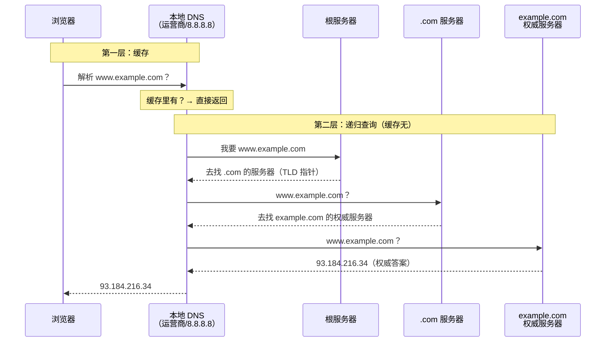
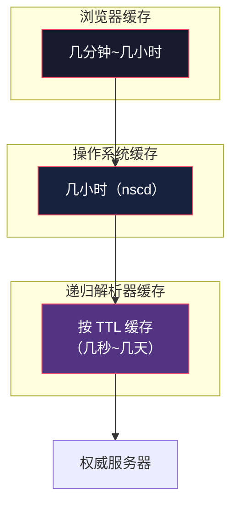

# DNS：互联网的电话簿

> TCP/IP 网络底层系列第 5 篇。系列总览见 [index.md](index.md)。

## 生活比喻：通讯录转接

你只记得朋友的昵称（`example.com`），但要打电话必须知道号码（IP `93.184.216.34`）。于是你查通讯录（DNS 服务器）——但通讯录不是一本，而是**层层转接**：

本地小本子查不到 → 问楼管（本地 DNS）→ 楼管问区号台（根服务器）→ 区号台告诉你去哪个城市的分局（顶级域）→ 分局告诉你找谁（权威服务器）→ 终于拿到号码。

DNS（Domain Name System）= **把人类可读的域名翻译成机器可读的 IP 的分布式电话簿**。

## 一次完整的域名解析

输入 `www.example.com` 后，浏览器背后发生了这些：



### 两类服务器，各司其职

| 角色 | 职责 | 例子 |
|------|------|------|
| **递归解析器**（Recursive） | 替客户端跑腿，逐级问下去，**负责缓存** | 运营商 DNS、8.8.8.8、114.114.114.114 |
| **权威服务器**（Authoritative） | 对自己管辖的域名有最终发言权 | `ns1.cloudflare.com`（example.com 的 NS） |

还有金字塔顶的三类：

| 层级 | 职责 | 数量 |
|------|------|------|
| 根服务器 | 告诉你去哪个顶级域服务器 | 13 个逻辑根（任播后全球上千节点） |
| TLD 服务器 | 管辖 .com/.org/.cn 等 | 每个顶级域若干台 |
| 权威服务器 | 具体域名的最终答案 | 每个域名至少 2 台（冗余） |

**一个域名怎么找到自己的权威服务器？** 靠 NS 记录——`.com` 服务器存着 "example.com 的 NS 是 ns1.cloudflare.com"，权威服务器之间靠这个指针链起来。

## 缓存：DNS 快的关键

没有缓存的 DNS 会慢到不可用——每次访问都走 5 次查询。缓存分三层：



**TTL（Time To Live）** 是 DNS 记录的"保鲜期"——权威服务器说"这条记录 300 秒内有效"，所有缓存节点到期前不再询问。**这就是为什么改域名解析要等"生效"**——等的是全网缓存的 TTL 到期。

## 记录类型

| 类型 | 含义 | 例子 |
|------|------|------|
| A | 域名 → IPv4 | `example.com → 93.184.216.34` |
| AAAA | 域名 → IPv6 | `example.com → 2606:2800:...` |
| CNAME | 域名 → 另一个域名（别名） | `www.example.com → example.com` |
| MX | 邮件服务器 | 发信时查 |
| NS | 权威服务器 | 谁说了算 |
| TXT | 任意文本 | SPF 反垃圾邮件、域名验证 |

```bash
# 实际查一下（dig 是 DNS 调试神器）
$ dig example.com A +short
93.184.216.34

$ dig example.com NS +short
a.iana-servers.net.
b.iana-servers.net.

$ dig www.github.com CNAME +short
github.com.          # www 是别名，真正的主机是裸域
```

## 常见命令速查

```bash
dig example.com            # 查 A 记录（详细输出）
dig +short example.com     # 只要结果
dig example.com MX         # 查邮件记录
dig @8.8.8.8 example.com   # 指定 DNS 服务器
dig example.com ANY        # 查所有类型

nslookup example.com       # 老牌命令，交互式
host example.com           # 极简输出

# 排查"为什么解析不对"
dig example.com +trace     # 从根服务器逐级追踪
dig example.com +short @114.114.114.114  # 对比不同 DNS 的结果
```

**排障黄金组合：** 浏览器打不开域名但 IP 能打开 → 用 `dig +trace` 找解析链路断在哪；用 `dig @8.8.8.8` vs `dig @运营商 DNS` 对比，判断是本地缓存还是权威服务器的问题。

## 谁在跑递归解析器

| 服务 | 特点 |
|------|------|
| 运营商默认 | 就近、快，但可能污染/缓存异常 |
| 8.8.8.8 / 8.8.4.4 | Google，全球一致 |
| 1.1.1.1 | Cloudflare，隐私优先 |
| 114.114.114.114 | 国内常用 |
| 自建（Unbound/CoreDNS） | 企业内网、K8s 集群标配 |

**Kubernetes 里的 DNS**（CoreDNS）是每个 Pod 解析服务名的必经之路——`service-name.namespace.svc.cluster.local` 就是一条内部 DNS 记录，服务发现（见 System Design 微服务篇）在 K8s 里就是靠 DNS 实现的。

## DNS 与 CDN：GSLB 的关键一跳

CDN（System Design 第 3 篇讲过 GSLB）的核心手段就是**权威 DNS 按用户位置返回不同 IP**：

```text
同一域名 img.example.com，权威服务器按请求来源：
  上海用户 → 返回上海节点 1.2.3.4（延迟 ~10ms）
  北京用户 → 返回北京节点 5.6.7.8（延迟 ~10ms）
  美国用户 → 返回美国节点 9.10.11.12

实现：GeoDNS / 智能 DNS——权威服务器看你从哪来
```

**为什么 CDN 需要"全球节点"却不用多个域名？** 因为域名只有一个，CDN 靠权威 DNS 在**最后一次解析**时返回离你最近的节点。这也是为什么给域名换 CDN 要改 NS 记录——把权威权交给 CDN 的智能 DNS。

## DNS 安全的坑

| 威胁 | 说明 | 防护 |
|------|------|------|
| DNS 劫持/污染 | 递归解析器被篡改，返回假 IP | DNSSEC、DoH/DoT |
| 中间人窃听 | 明文 DNS 查询可被看到 | DoH（DNS over HTTPS） |
| 缓存投毒 | 给解析器塞假记录 | DNSSEC 签名验证 |

浏览器逐渐默认开启 DoH——DNS 查询加密走 HTTPS，运营商再也看不到你查了什么域名。`dig` 也有 `+https` 模式直接走 DoH。

## 与下篇的衔接

拿到 IP（`93.184.216.34`）后，数据包要上路了。但 IP 地址怎么分层、子网掩码是什么、家里只有一个公网 IP 怎么让所有设备上网——第 6 篇 IP 与寻址。

## 总结

| 要点 | 结论 |
|------|------|
| DNS 是什么 | 域名 → IP 的分布式电话簿 |
| 查询路径 | 浏览器缓存 → 本地缓存 → 递归解析器逐级问 → 权威服务器 |
| 快在哪 | 三层缓存 + TTL 保鲜期 |
| 记录类型 | A（IPv4）/AAAA（IPv6）/CNAME（别名）/MX（邮件）/NS（权威） |
| 排障工具 | dig +trace 看链路，@指定服务器对比 |
| CDN 的秘密 | 权威 DNS 按来源 IP 返回不同节点地址 |
