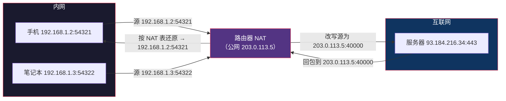
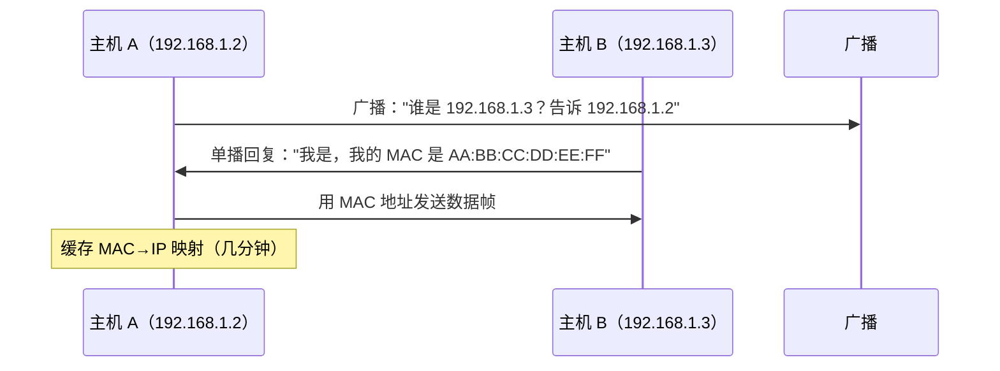
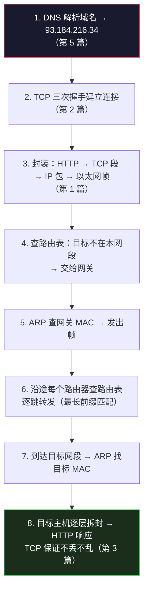

# IP 与寻址：数据包如何找到目的地

> TCP/IP 网络底层系列第 6 篇。系列总览见 [index.md](index.md)。

## 生活比喻：门牌号与快递分拣

IP 地址像门牌号——`浙江省杭州市西湖区XX路1号` 由省→市→区→街道逐级缩小范围。快递分拣员不看全地址，只看"这一站该往哪个方向转"——路由器也一样，只根据**网络号**决定下一跳，不关心主机号。

IP 层的核心问题只有一个：**一个数据包，怎么从源主机走到目的主机。** 答案分两步：路由（往哪个方向走）和 MAC 寻址（同一段路内怎么精确投递）。

## IP 地址：网络号 + 主机号

IPv4 地址 32 位（4 个字节），写成点分十进制：`192.168.1.100`。它由两部分组成：

```text
IPv4:  192.168.1.100 / 24
       └────┬─────┘ └┬┘
        网络号      主机号
        （前缀）    （剩余位）

/24 = 前 24 位是网络号，后 8 位是主机号
→ 这个网络有 2^8 - 2 = 254 个可用主机（去掉全 0 网络地址和全 1 广播地址）
```

**子网掩码**是网络号的另一种写法：`255.255.255.0` = 前 24 位是 1（网络号），后 8 位是 0（主机号）。

### 常用网段速查

| 网段 | 主机数 | 典型场景 |
|------|--------|---------|
| /8（10.0.0.0） | 1677 万 | 大型内网 |
| /16（172.16.0.0） | 65534 | 中大型内网 |
| /24（192.168.x.0） | 254 | 家庭/小型内网 |
| /32 | 1 | 单个主机（回环 127.0.0.1） |

## 私有地址与公网地址

IPv4 只有 43 亿个地址，不够全世界用。于是划分出**私有地址段**（RFC 1918），内网随便用，公网不路由它们：

| 私有段 | 常见 |
|--------|------|
| 10.0.0.0/8 | 企业 |
| 172.16.0.0/12 | 企业 |
| 192.168.0.0/16 | 家庭路由器 |

家里每个设备是 `192.168.x.x`（私有），路由器出口只有一个公网 IP——靠 **NAT** 撑起全家上网。

## NAT：一个公网 IP 养活全家



**NAT（网络地址转换）原理：** 路由器维护一张映射表 `(内网IP:端口) ↔ (公网IP:端口)`，把内网包的源地址改写成自己的公网地址，回包再按表还原。

**副作用——内网设备没有公网地址，外面主动连不进来。** 这就是内网穿透（已有 [内网穿透系列](tech/dev-tools/tunneling/index.md)）要解决的根本问题：NAT 只允许"由内向外"的连接。

## 路由：数据包的分拣系统

路由器不知道全世界的地图，它只查**路由表**——"目标网络 X 往接口 Y 走"：

```text
$ route -n   # 或 ip route

目标网络          网关            接口
0.0.0.0/0        192.168.1.1     eth0    ← 默认路由：不知道的统统走网关
192.168.1.0/24   0.0.0.0         eth0    ← 直连网段，直接送
172.16.0.0/12    10.0.0.2        eth1    ← 去内网其他段走这台
```


**逐跳转发（Hop-by-Hop）**：每个路由器只决定"下一跳"，不知道完整路径。路由协议（BGP/OSPF）负责让全网路由表收敛到正确状态。

**最长前缀匹配：** 路由表有多条记录时，选**匹配位数最多**的那条——`8.8.8.0/24` 比 `0.0.0.0/0` 更精确，优先。这就是为什么默认路由永远兜底。

## ARP：同一段路内的最后一跳

IP 找到了目标网段，但**同一以太网内传输靠的是 MAC 地址**，不是 IP。怎么把 IP 翻译成 MAC？ARP（地址解析协议）：



**抓包时看到大量 ARP 请求是正常的**——新设备入网、缓存过期都会触发。MAC 只在本网段有意义，出网段的数据交给网关的 MAC，由网关继续转发。

## IPv6：地址不够的终极解

| 维度 | IPv4 | IPv6 |
|------|------|------|
| 地址长度 | 32 位（43 亿） | 128 位（3.4×10³⁸） |
| 写法 | 192.168.1.1 | 2400:3200::1 |
| 广播 | 有（广播风暴） | 无，改用组播 |
| NAT | 必须 | 不需要（地址够用） |
| 自动配置 | DHCP | SLAAC 无状态自动配置 |

**为什么 IPv6 喊了 20 年还没完全普及？** 因为 NAT + 私有地址让 IPv4 撑到了现在，切换成本巨大。但物联网、云服务已在加速迁移——云厂商默认双栈，`dig AAAA` 能看到越来越多的 IPv6 记录。

## 数据包的完整旅程

综合前面所有知识，一次 `curl https://example.com` 的完整旅程：



## 排障工具箱

```bash
# 看本机网络配置
ifconfig / ip addr        # IP、掩码、MAC
ip route                  # 路由表

# 连通性测试（逐层）
ping 192.168.1.1          # 网关通不通（ICMP）
ping 8.8.8.8              # 外网通不通（不经 DNS）
ping example.com          # DNS 是否正常
traceroute example.com    # 每一跳在哪丢（路由链路）
mtr example.com           # traceroute 加强版（持续统计）

# 端口与连接
nc -zv 93.184.216.34 443  # 端口是否通
lsof -i :8080             # 谁在占用端口
```

**排障顺序铁律：先低层后高层**——ping 网关 → ping 外网 IP → ping 域名 → nc 端口 → curl。哪一步断了，问题就在那一层及以下。

## 与下篇的衔接

理论到这里齐了。第 7 篇是收官实战：用 Python socket 写一个真实的客户端/服务端，配合 tcpdump/Wireshark 把三次握手、重传、挥手全部"看"一遍——纸上得来终觉浅。

## 总结

| 要点 | 结论 |
|------|------|
| IP = 网络号 + 主机号 | /24 前缀划分子网，掩码是前缀的另一写法 |
| 私有地址 + NAT | 一个公网 IP 养活全家；代价是外面连不进来 |
| 路由 | 逐跳转发 + 最长前缀匹配，路由器只决定下一跳 |
| ARP | 同网段内 IP → MAC，出网段交给网关 |
| IPv6 | 128 位地址，消灭 NAT，逐步普及 |
| 排障 | 从低到高：网关 → 外网 IP → DNS → 端口 |
