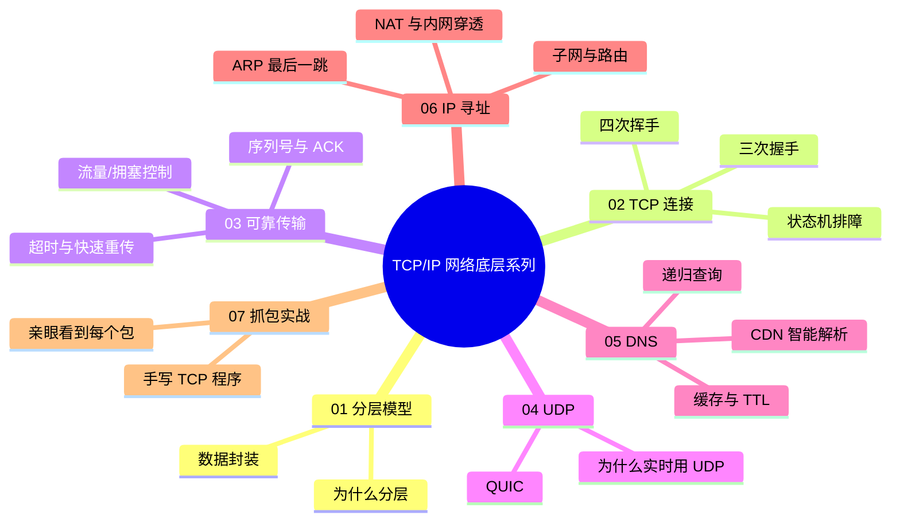

# Socket 编程实战：用抓包验证 TCP 理论

> TCP/IP 网络底层系列第 7 篇（收官）。系列总览见 [index.md](index.md)。

## 实战目标

前 6 篇全是理论，这一篇动手验证。用 Python 写一个最小 TCP 服务端和客户端，然后用 tcpdump/Wireshark 亲眼看到：

1. **三次握手**的三个包（SYN → SYN+ACK → ACK）
2. **数据分段与 ACK**的往返
3. **四次挥手**与 TIME_WAIT
4. **人为制造丢包**，观察快速重传

## 环境准备

```bash
# macOS 自带 Python3；tcpdump 需要 sudo
python3 --version
sudo tcpdump --version

# 抓包需要 root，全程用 sudo 跑 tcpdump
```

## 第一步：最小 TCP 服务端与客户端

### 服务端（server.py）

```python
import socket

HOST, PORT = '127.0.0.1', 8000

server = socket.socket(socket.AF_INET, socket.SOCK_STREAM)  # TCP socket
server.setsockopt(socket.SOL_SOCKET, socket.SO_REUSEADDR, 1)  # 允许快速重启
server.bind((HOST, PORT))
server.listen(5)  # backlog：等待队列长度
print(f'监听 {HOST}:{PORT}')

while True:
    conn, addr = server.accept()  # 三次握手完成后返回
    print(f'客户端连入: {addr}')
    with conn:
        while True:
            data = conn.recv(1024)  # 读数据
            if not data:            # 对方 FIN，recv 返回 b''
                break
            print(f'收到: {data!r}')
            conn.sendall(b'pong: ' + data)  # 回数据
    print(f'客户端断开: {addr}')
```

### 客户端（client.py）

```python
import socket

HOST, PORT = '127.0.0.1', 8000

client = socket.socket(socket.AF_INET, socket.SOCK_STREAM)
client.connect((HOST, PORT))  # 触发三次握手
print('连接建立')

client.sendall(b'hello tcp')        # 发数据
resp = client.recv(1024)            # 收响应
print(f'收到: {resp!r}')

client.close()                      # 触发四次挥手
print('连接关闭')
```

## 第二步：抓三次握手

终端 1 启动服务端，终端 2 启动 tcpdump，终端 3 跑客户端：

```bash
# 终端 1
python3 server.py

# 终端 2（先开抓包）
sudo tcpdump -nn -i lo0 'tcp port 8000' -vv

# 终端 3
python3 client.py
```

抓到的输出（回环口 lo0，延迟为 0）：

```text
IP 127.0.0.1.52503 > 127.0.0.1.8000: Flags [S], seq 3221493144
    ← ① 客户端 SYN（seq 是随机初始序号）
IP 127.0.0.1.8000 > 127.0.0.1.52503: Flags [S.], seq 1740820220, ack 3221493145
    ← ② 服务端 SYN+ACK（自己的 seq，ack = 客户端 seq+1）
IP 127.0.0.1.52503 > 127.0.0.1.8000: Flags [.], ack 1740820221
    ← ③ 客户端 ACK（ack = 服务端 seq+1）
```

**对照第 2 篇的状态机逐行验证**——每个包的 seq/ack 都符合 `ack = 对方 seq + 1` 的规律。

## 第三步：看数据传输

客户端继续跑（sendall + recv），抓包会看到：

```text
IP 127.0.0.1.52503 > 127.0.0.1.8000: Flags [P.], seq 3221493145:3221493154, ack 1740820221
    ← 数据：seq 从 3221493145 到 3154，共 9 字节（"hello tcp"）
       P = PSH（数据推送），len = 9
IP 127.0.0.1.8000 > 127.0.0.1.52503: Flags [.], ack 3221493154
    ← 服务端确认：ack = 客户端最后字节 +1
IP 127.0.0.1.8000 > 127.0.0.1.52503: Flags [P.], seq 1740820221:1740820236, ack 3221493154
    ← 服务端回 "pong: hello tcp"（15 字节）
IP 127.0.0.1.52503 > 127.0.0.1.8000: Flags [.], ack 1740820236
    ← 客户端确认
```

**关键观察：`seq X:Y` 表示这包携带字节 X 到 Y-1，`len = Y-X`。** ACK 包不带数据时没有 seq 区间，只有 `ack`。

## 第四步：看四次挥手与 TIME_WAIT

客户端 `close()` 后：

```text
IP 127.0.0.1.52503 > 127.0.0.1.8000: Flags [F.], seq 3221493154, ack 1740820236
    ← 客户端 FIN（不再发数据）
IP 127.0.0.1.8000 > 127.0.0.1.52503: Flags [.], ack 3221493155
    ← 服务端 ACK
IP 127.0.0.1.8000 > 127.0.0.1.52503: Flags [F.], seq 1740820236, ack 3221493155
    ← 服务端 FIN（它也没数据了）——注意服务端脚本里 recv 到空数据立刻退出 with，触发 FIN
IP 127.0.0.1.52503 > 127.0.0.1.8000: Flags [.], ack 1740820237
    ← 客户端 ACK → 进入 TIME_WAIT（2MSL，约 60s）
```

用 `netstat` 现场验证 TIME_WAIT：

```bash
# 立刻查（客户端退出后 60 秒内）
$ netstat -tn | grep 8000
tcp4  0  0  127.0.0.1.52503  127.0.0.1.8000  TIME_WAIT
```

**测试 SO_REUSEADDR 的意义：** 把服务端脚本里那行注释掉，Ctrl+C 后立刻重启服务端——会报 `Address already in use`（服务端是主动关闭方时同样进 TIME_WAIT）。加上 `SO_REUSEADDR` 后重启无压力。

## 第五步：人为制造丢包，观察快速重传

模拟真实网络丢包——用 tc（Linux）或 pfctl（macOS）给回环口加丢包率：

```bash
# macOS 用 pf 模拟（需要 root，用完记得清掉）
# 更简单的方式：写一个会丢包的"假网络"测试太复杂，
# 替代方案：用 Linux 的 netem（容器里跑最方便）
docker run -it --rm --cap-add NET_ADMIN ubuntu bash
# 容器里：
apt update && apt install -y iproute2 iputils-ping
tc qdisc add dev lo root netem loss 20%    # 回环口 20% 丢包
```

然后发大量数据触发重传：

```bash
# 容器里跑一个高速发送的客户端（python3 或 nc）
python3 -c "
import socket
s = socket.socket()
s.connect(('127.0.0.1', 8000))
s.sendall(b'x' * 100_000)   # 10 万字节，必然触发重传
s.close()
"
```

```bash
# 容器外 tcpdump 观察（注意容器 IP）
sudo tcpdump -nn -i lo0 'tcp port 8000' | grep -E 'Flags'
```

**能看到的现象：**

```text
IP ...: Flags [P.], seq 1:1448, ack ...
IP ...: Flags [P.], seq 1449:2897, ack ...
... （中间某段丢了）
IP ...: Flags [.], ack 2897            ← 接收方重复确认缺口
IP ...: Flags [.], ack 2897            ← 第 2 个重复
IP ...: Flags [.], ack 2897            ← 第 3 个重复！
IP ...: Flags [P.], seq 2897:4345      ← 不等超时，快速重传！
```

**对照第 3 篇：** 看到 `ack` 连续重复 3 次相同值，紧接着发送方立刻重传缺失段——快速重传的现场证据。

## 扩展实验：用 Wireshark 看得更清

命令行不够直观时，用 Wireshark 的图形界面：

```bash
# 先抓包存文件，再用 Wireshark 打开
sudo tcpdump -nn -i lo0 'tcp port 8000' -w /tmp/tcp-demo.pcap
# 跑客户端若干次后 Ctrl+C 停止抓包
open /tmp/tcp-demo.pcap   # 自动用 Wireshark 打开（需已安装）
```

Wireshark 里值得看的：

| 视图 | 看什么 |
|------|--------|
| 彩色标记 | 黑色=错误/重传，红色=TCP 问题 |
| 统计 → 流量图（Flow Graph） | 把三次握手/挥手画成时序图，一目了然 |
| 专家信息（Exert Info） | 自动标注重传、DUP ACK、乱序 |
| 点开每个包 | 逐层 Header：以太网 → IP → TCP（对照第 1 篇的封装图） |

## 常见问题排查对照

实验中最可能遇到的问题，正好把理论串起来：

| 现象 | 原因（结合理论） |
|------|-----------------|
| `Connection refused` | 端口没服务在听——内核回 RST（第 2 篇） |
| `Address already in use` | TIME_WAIT 中端口未释放——SO_REUSEADDR 解决（第 2 篇） |
| recv 返回 `b''` | 对方 FIN——对端关闭了写方向（第 2 篇） |
| send 后对方没收到 | 对方 recv 太慢/缓冲区满——窗口收缩（第 3 篇） |
| 大量重传、吞吐暴跌 | 网络丢包——拥塞控制 cwnd 减半（第 3 篇） |
| connect 卡住很久才报错 | 目标不可达且丢弃（防火墙）——等 SYN 重传超时（第 3 篇） |

## 系列总结



## 推荐工具清单

| 工具 | 用途 | 对应文章 |
|------|------|---------|
| `tcpdump` | 命令行抓包 | 全部 |
| Wireshark | 图形化分析（流量图/专家信息） | 07 |
| `dig` / `nslookup` | DNS 排障 | 05 |
| `traceroute` / `mtr` | 路由链路分析 | 06 |
| `netstat` / `ss` | 连接状态（TIME_WAIT/CLOSE_WAIT） | 02 |
| `nc` | 端口连通性测试 | 06 |

纸上得来终觉浅——把这 7 篇的理论配合抓包看一遍，网络就从"背面试题"变成了"可调试的系统"。
