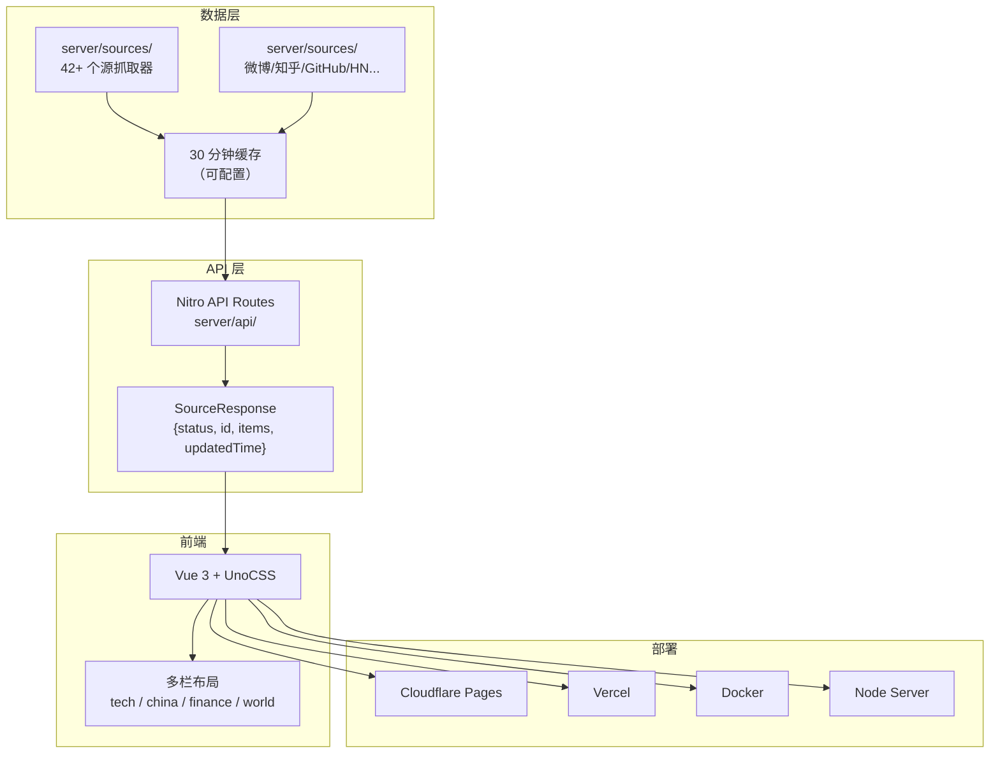
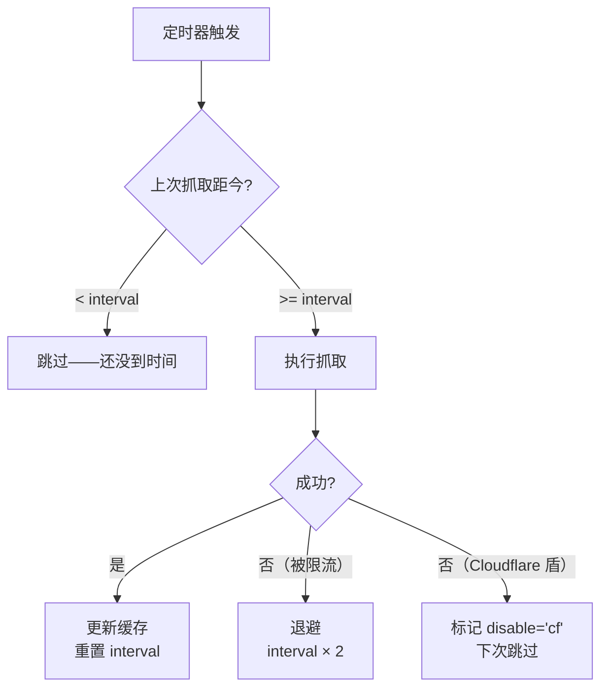
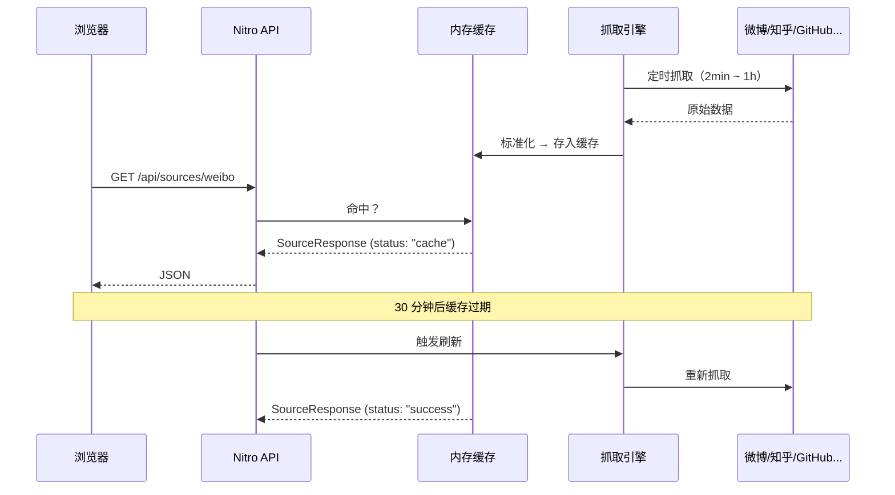

# NewsNow：一个 20K Star 的新闻聚合器是怎么工作的

> 基于 NewsNow v0.0.40，MIT 协议，TypeScript + Nitro + Vue。

## 一句话定义

NewsNow 是一个开源的实时新闻聚合器——从 42+ 个源抓取热点，用干净的 UI 展示，支持自部署。它是 TrendRadar 的数据上游（TrendRadar 调用它的 API 拿热搜数据）。

20.7K Star，5.8K Fork，40 个 release——一个个人项目做到这个量级，值得拆开看看它的设计。

## 架构总览



技术栈很薄——Vite + Nitro + Vue + UnoCSS，没有 Redux、没有 ORM、没有微服务。一个 monorepo 搞定前后端，部署到 Cloudflare Pages 零成本运行。

## 抓取引擎：42 个源的调度策略

这是 NewsNow 最核心的模块。`server/sources/` 下每个源一个抓取器，`shared/sources.json` 定义源的元数据。

### 源的定义

```typescript
// 每个源一个配置对象
{
  "weibo": {
    "name": "微博",
    "column": "china",
    "home": "https://weibo.com",
    "color": "red",
    "interval": 120000,        // 2 分钟抓一次（热搜变化快）
    "type": "hottest"
  },
  "github": {
    "name": "GitHub",
    "column": "tech",
    "home": "https://github.com/trending",
    "color": "gray",
    "interval": 3600000,       // 1 小时抓一次（趋势变化慢）
    "type": "hottest",
    "sub": {
      "trending-today": { "title": "Today" }
    }
  },
  "hackernews": {
    "name": "Hacker News",
    "column": "tech",
    "interval": 600000         // 10 分钟
  }
}
```

关键字段：

| 字段 | 作用 | 例子 |
|------|------|------|
| `interval` | 抓取间隔（毫秒） | 微博 2 分钟、GitHub 1 小时 |
| `type` | `"hottest"` 热搜/ `"realtime"` 实时 | 影响排序和展示 |
| `column` | 所属栏目 | `tech` / `china` / `finance` / `world` |
| `sub` | 子源（一个平台多个榜单） | GitHub 有 Trending、B 站有热搜/视频/排行 |
| `redirect` | 别名指向 | `v2ex` → `v2ex-share` |
| `disable` | `"cf"` 表示被 Cloudflare 盾挡住 | 自动跳过 |

### 自适应抓取间隔



微博 2 分钟一次是因为热搜每分钟都在变。Solidot 1 小时一次是因为它一天就更新几条。不是所有源一视同仁——**按源的更新频率决定抓取频率**，避免无效请求和被 IP 封禁。

### 42 个源的分布

| 栏目 | 数量 | 代表 |
|------|------|------|
| tech | 14 | V2EX、GitHub、Hacker News、Product Hunt、36氪、IT之家、Solidot、掘金、少数派 |
| china | 16 | 微博、知乎、抖音、百度、B站、今日头条、贴吧、澎湃、凤凰、豆瓣、快手 |
| finance | 9 | 华尔街见闻、财联社、雪球、金十数据、格隆汇、法布财经 |
| world | 5 | 联合早报、卫星通讯社、参考消息、靠谱新闻、Steam |

## 数据模型：轻量但够用

```typescript
// shared/types.ts

interface NewsItem {
  id: string | number;          // 唯一标识
  title: string;                // 标题
  url: string;                  // 链接
  mobileUrl?: string;           // 移动端链接
  pubDate?: number | string;    // 发布时间
  extra?: {                     // 可选元数据
    hover?: string;             // 悬停提示
    info?: string | false;      // 附加信息
    diff?: number;              // 排名变化（↑3 / ↓2）
    icon?: string | { url: string; scale: number };
  };
}

interface SourceResponse {
  status: "success" | "cache";  // 是新鲜数据还是缓存
  id: SourceID;                 // 源标识
  updatedTime: number | string; // 数据更新时间
  items: NewsItem[];            // 新闻列表
}
```

类型系统做得很克制——`NewsItem` 没有塞几十个字段，`extra` 是可选的扩展点。**强制字段只有 `id`、`title`、`url`**——因为所有源至少能提供这三样。`mobileUrl`、`pubDate`、`extra` 有就填，没有不影响。

## API 设计：两层缓存策略

NewsNow 的 API 不是"客户端请求 → 服务端实时抓取"。抓取和 API 是**解耦**的：



两层含义：

1. **抓取层独立运行**——不管有没有人访问，定时器都在跑。用户打开页面时数据已经在缓存里了
2. **缓存 30 分钟**——同一个源在 30 分钟内多次请求只返回缓存结果。登录用户可以强制刷新（绕过缓存）

API 响应里 `status: "cache"` vs `status: "success"` 让前端知道这是新数据还是缓存——前端可以用不同的 UI 提示。

## 前端的四栏布局

```typescript
// 栏目配置
columns: {
  tech:    { name: "科技", sources: ["v2ex", "github", "hackernews", "36kr", ...] },
  china:   { name: "国内", sources: ["weibo", "zhihu", "baidu", "douyin", ...] },
  finance: { name: "财经", sources: ["wallstreetcn", "cls", "xueqiu", ...] },
  world:   { name: "国际", sources: ["zaobao", "hackernews", "producthunt", ...] }
}
```

每个栏目是一个可滚动的列，里面的每个源是一张卡片——显示源名称、颜色标识、新闻列表。用户可以拖拽重新排列栏目顺序，偏好存到 localStorage。

### 源的重定向和子源

GitHub 这个源有子源：

```json
"github": {
  "name": "GitHub",
  "column": "tech",
  "sub": {
    "trending-today": { "title": "Today" }
  }
}
```

运行时解析成两个独立源：`github` 和 `github-trending-today`。前端展示为一张卡片、两个 Tab。

`v2ex` 则是重定向——指向 `v2ex-share`。爬 `v2ex` 实际爬的是 `v2ex-share`（创意分享区），因为那里内容质量更高。重定向让 URL 保持语义清晰的同时后端可以灵活调整。

## 部署：四个选项，零成本起步

```bash
# Cloudflare Pages（推荐——免费额度够用）
pnpm run deploy:cloudflare

# Vercel
pnpm run deploy:vercel

# Docker
docker compose up

# 裸 Node
pnpm install && pnpm run build && node .output/server/index.mjs
```

数据库默认用 Cloudflare D1（免费额度 5GB），也可换成 db0 支持的任何后端。OAuth 用 GitHub（免费），JWT 密钥自己生成。

**一个有意思的细节**：Cloudflare 部署时，抓取请求可能被目标站点（中国网站）判定为海外 IP 而拒绝。NewsNow 的 `disable: "cf"` 标记就是处理这个场景——标记后自动跳过该源的抓取，不报错。

## 三个值得注意的设计

### 1. 抓取器不是微服务——是函数

每个源的抓取逻辑就是一个 TypeScript 文件，放在 `server/sources/` 下。没有消息队列、没有任务调度框架、没有 worker 池。Nitro 的定时任务机制直接调这些函数。

架构的复杂度不在于用了什么中间件——在于**42 个源各自不同的 HTML 结构和反爬策略**。这一点上，NewsNow 的选择是把复杂度留在每个源的抓取逻辑里，而不是引入一个通用的"爬虫框架"。

### 2. 子源和重定向——配置层的抽象

```json
// 子源：同一个平台的不同榜单
"bilibili": { "sub": { "hot-search": "热搜", "hot-video": "热门视频", "ranking": "排行榜" } }

// 重定向：保留语义清晰的 URL
"v2ex": { "redirect": "v2ex-share" }
```

这两个机制减少了源的重复定义。"B 站热搜"和"B 站热门视频"共享同一个 `name: "哔哩哔哩"` 和 `color`——只改 `title`。重定向让 URL 保持 `/sources/v2ex` 而不是 `/sources/v2ex-share`。

### 3. `extra` 的开放设计

`NewsItem.extra` 是一个 `object?`——不强类型、不设限。不同源有不同维度的元数据：
- 微博有 `diff`（排名升降）
- GitHub 有 `icon`（语言颜色）
- 抖音有 `info`（播放量）

如果每种元数据都定义成字段，`NewsItem` 会膨胀到 20+ 个字段。`extra` 给了每个源自由定义元数据的空间，同时保持核心接口稳定。

## 和 TrendRadar 的关系

NewsNow 和 TrendRadar 是上下游关系：

```
NewsNow（抓取 + 展示）  →  TrendRadar（过滤 + 分析 + 推送）
   "所有热点"                  "你关心的热点"
```

TrendRadar 的 `DataFetcher` 调 NewsNow 的 API 拿原始热搜数据，然后用自己的关键词/AI 引擎过滤。两者定位不同：

| | NewsNow | TrendRadar |
|------|---------|-----------|
| 做什么 | 聚合所有热点，展示给所有人 | 过滤个性化热点，推送到你 |
| 用户交互 | 打开网页刷 | 被动收消息 |
| 核心技术 | 42 源抓取 + 缓存策略 | 关键词 DSL + AI 分类 + 9 通道推送 |
| 典型场景 | "今天有什么新闻" | "今天有什么我关心的新闻" |

## 小结

NewsNow 是一个设计得很克制的项目——没有为"未来可能需要"的假设场景加复杂度。它的架构选择是务实的：

- **抓取器是函数，不是服务**——42 个源不需要 42 个 worker
- **缓存 30 分钟，不是实时**——新闻不需要秒级刷新
- **`extra` 是开放字段，不是强类型**——给不同源灵活空间
- **`disable: "cf"` 标记而不是报错**——承认有些源就是抓不到

这 20K Star 不是因为在技术上有多惊艳——是因为它精准解决了一个真实需求（聚合阅读），并且用最少的代码做到了。
