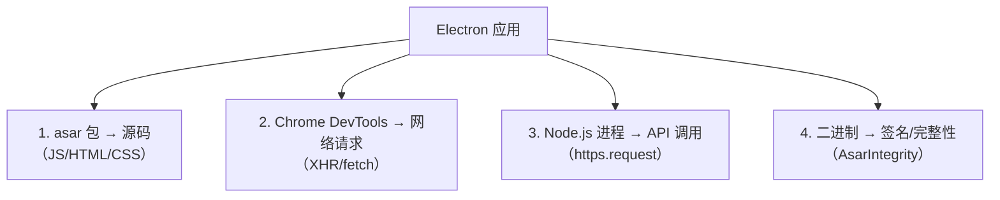
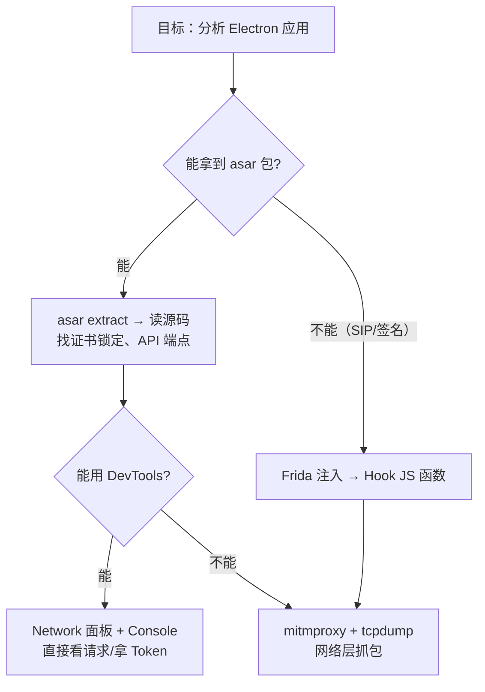

# Electron 应用逆向基础

> 基于 Electron 4.x ~ 30+，macOS。

## Electron 应用的可能入口

Electron 应用本质上是一个 Chrome 浏览器套一个 Node.js 进程——用户看到的 UI 是 Chromium 渲染的，背后的业务逻辑是 Node.js 跑的。要分析它，可以从这几个层面入手：



## 1. 拆解 asar 包——拿到源码

Electron 把应用的 JS/HTML/CSS 打包成一个 `.asar` 文件。它本质上是一个 tar 格式的归档，加了 JSON 索引以支持随机读取——不是加密，只是打包。

```bash
# 安装 asar 命令行工具
npm install -g @electron/asar

# 解包
npx @electron/asar extract app.asar /tmp/app-source

# 查看包内文件列表（不解包）
npx @electron/asar list app.asar
```

解包后就能看到完整的应用源码：

```
/tmp/app-source/
├── main.js          # 主进程入口
├── preload.js       # 预加载脚本
├── renderer/        # 渲染进程（前端代码）
│   ├── index.html
│   ├── app.js
│   └── ...
├── node_modules/    # 打包的依赖
└── package.json
```

关键文件：
- **`main.js`** — 主进程逻辑，创建 BrowserWindow、注册协议、设置证书验证。**证书锁定代码最可能在这里**。
- **`preload.js`** — 在渲染进程加载前执行的脚本，能访问 Node.js API
- **`renderer/app.js`** — 前端业务逻辑（webpack 打包后可能非常大且难读）

### 重新打包

```bash
npx @electron/asar pack /tmp/app-source /tmp/app-modified.asar
```

但替换原应用的 `.asar` 文件会遇到两个障碍：

## 2. AsarIntegrity — 文件完整性校验

Electron 支持在 `Info.plist` 中记录 `.asar` 文件的哈希值，启动时校验。

```bash
# 查看应用的完整性配置
plutil -p /Applications/SomeApp.app/Contents/Info.plist | grep -i asar
```

如果有 `AsarIntegrity` 字段，说明应用启用了完整性校验。替换 `app.asar` 后启动，应用会直接崩溃——校验失败。

绕过方式：
- **修改 Info.plist**，删除 `AsarIntegrity` 字段。但这会导致应用签名失效
- **重新签名整个 .app 包**：`codesign --force --deep --sign - /Applications/SomeApp.app`
- **如果应用自己有运行时校验**（比较哈希），那就需要 Hook 那个校验逻辑——又回到了 Frida

## 3. macOS SIP 的保护

即使用了 `codesign` 重新签名，macOS SIP 还可能在 `/Applications` 目录阻止文件替换。最简单的办法是把修改后的 `.app` 拷贝到 `~/Applications/` 或桌面运行，这些路径不受 SIP 保护。

## 4. Chrome DevTools Protocol — 连进 Electron 的 Chrome 内核

Electron 的渲染进程内置了 Chrome DevTools。如果应用在启动时带了调试 flag，可以直接连进去：

```bash
# 检查应用是否开启了远程调试端口
lsof -i :9222 -i :9229 | grep LISTEN
```

如果应用启动了 Electron 时带了 `--remote-debugging-port` 参数，就能用 Chrome 浏览器访问 `chrome://inspect` 或 `localhost:9222`，直接看到 DevTools。

但大部分生产发布的应用不会开这个端口。这时候可以**修改应用启动参数**——编辑 `.app` 包内的 `Contents/MacOS/` 下的启动脚本，或者创建一个带调试参数的 wrapper：

```bash
cat > /tmp/someapp-debug.sh << 'EOF'
#!/bin/bash
"/Applications/SomeApp.app/Contents/MacOS/SomeApp" \
  --remote-debugging-port=9222 \
  --inspect=9229
EOF
chmod +x /tmp/someapp-debug.sh

/tmp/someapp-debug.sh &
# 然后浏览器访问 http://localhost:9222
```

### DevTools 能做什么

连接成功后，你就有了一个标准的前端调试环境：

- **Console** — 执行任意 JS，调用 `fetch()` 发请求
- **Network** — 查看所有 XHR/fetch 请求的请求/响应
- **Sources** — 查看和断点调试前端代码
- **Application → Local Storage** — 查看 `localStorage` 和 `sessionStorage`

SomeApp 的 JWT token 就是通过 `localStorage` 拿到的——在 DevTools 里执行：

```javascript
// 遍历所有 localStorage key
for (let i = 0; i < localStorage.length; i++) {
  const key = localStorage.key(i);
  console.log(key, localStorage.getItem(key).substring(0, 100));
}
```

## 5. 环境变量——部分生效，部分不生效

Electron 应用的 Node.js 层可以读取环境变量：

```bash
# 跳过 TLS 证书验证（对 Node.js 层生效）
export NODE_TLS_REJECT_UNAUTHORIZED=0

# 指定额外的 CA 证书
export NODE_EXTRA_CA_CERTS=~/.mitmproxy/mitmproxy-ca-cert.pem

# SSL 密钥日志（Electron 4.x / Chrome 69 不支持！）
export SSLKEYLOGFILE=/tmp/sslkeys.log
```

注意 `SSLKEYLOGFILE` 在低版本 Electron（基于 Chrome 69）**不支持**——这个功能在 Chrome 48 才加入，但 Electron 4.x 的 BoringSSL 版本太老。换成 Electron 30+（Chrome 120+）就可以了。

## 6. 本地存储——LevelDB 里的数据

Electron 应用通常把数据存在：

```
~/Library/Application Support/<AppName>/
├── Local Storage/leveldb/     # localStorage
├── Session Storage/           # sessionStorage
├── Cookies
├── IndexedDB/
└── Cache/
```

`Local Storage/leveldb/` 是 Chrome 的 LevelDB 实现——`.ldb` 文件是二进制格式，不能用文本编辑器直接看。但可以用 Python 的 `plyvel` 库读取，或者——更简单的——**用另一个 Electron 应用打开同一份数据**（通过 DevTools → Application）。

如果应用使用了自定义的二进制存储格式（像某些应用的 `global.cache`），那就需要具体分析它的序列化格式——这通常需要 Frida Hook 文件读写函数来拦截。

## 逆向的完整工具箱



## 小结

Electron 不是一个黑盒——它是一个浏览器加一个 Node.js 进程。这六篇文章串起来，对闭源 Electron 应用的分析路径是：

1. **asar extract** — 能解开最好，源码在手天下我有
2. **DevTools** — `--remote-debugging-port` 连进去，Network + Console + Storage
3. **tcpdump** — 搞不清楚连了哪些服务器，先抓 TCP SYN 包
4. **mitmproxy** — 对着已知目标地址做 HTTPS 中间人抓包
5. **Frida** — 证书锁定或 asar 解不开时，进进程 Hook
6. **环境变量 + 系统工具** — 关 TLS 验证、改代理、装证书

不是每一步都需要，但每一步的能力都得有——因为你永远不知道目标应用下了哪种防御。
