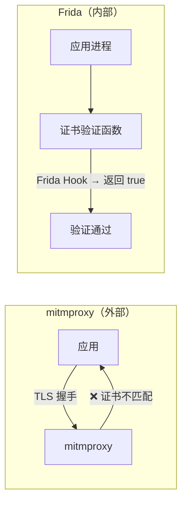
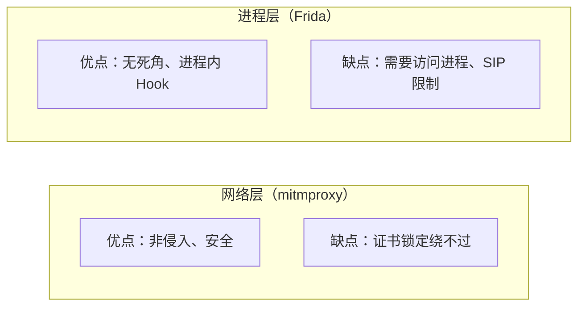

# Frida — 动态插桩入门

> 基于 Frida 17.x，macOS，Python 3.9+。

## mitmproxy 解决不了的问题

上一篇用 mitmproxy 抓 HTTPS 流量，但遇到了**证书锁定**——应用检查服务器证书的指纹，mitmproxy 的假证书指纹不匹配，连接被拒绝。

mitmproxy 站在应用"外面"（网络层，TLS 握手阶段）。证书锁定要绕过去，得从应用"里面"动手——在它调用证书验证函数的时候，直接返回"验证通过"。这就是 Frida 做的事：**把你的代码注入到目标进程内部，Hook 它的函数调用，改变它的行为**。



## 安装

```bash
pip3 install frida frida-tools
```

验证：

```bash
frida --version
```

```
17.11.0
```

如果你的 Mac 是 Apple Silicon（M 系列芯片），可能会遇到签名问题：

```bash
codesign --force --sign - $(python3 -c "import frida; print(frida.__path__[0])")/_frida.abi3.so
```

## Frida 的两种工作模式

| 模式 | 原理 | 何时用 |
|------|------|--------|
| **Attach** | 附加到已运行的进程 | 目标进程已经启动，拿到 PID 就能 Hook |
| **Spawn** | 启动进程并立即注入 | 需要在进程启动时就 Hook（比如 Hook 构造函数） |
| **Gadget** | 把 Frida 的动态库注入到目标应用中 | 进程由 Electron 等框架管理，无法直接 attach |

### Attach 模式

```bash
# 找到目标进程 PID
pgrep -f SmartX
# 12345

# attach 并加载 Hook 脚本
frida -p 12345 -l hook.js
```

最简单，但有两个前提：Frida 能访问目标进程（没有 SIP 保护），目标进程不是 fork 出来的子进程。

### Spawn 模式

```bash
# Frida 帮你启动应用，从第一行代码开始掌控
frida -f com.example.app -l hook.js
```

### Gadget 模式

目标进程不让你 attach（macOS SIP 保护、子进程隔离），就把 Frida 的动态库强制加载进去：

```bash
# 下载 Gadget 动态库
curl -sL "https://github.com/frida/frida/releases/download/17.11.0/frida-gadget-17.11.0-macos-universal.dylib.xz" | xz -d > /tmp/frida-gadget.dylib
codesign --force --sign - /tmp/frida-gadget.dylib

# 配置文件——告诉 Gadget 加载哪个 Hook 脚本
cat > /tmp/frida-gadget.dylib.config << 'EOF'
{
  "interaction": {
    "type": "script",
    "path": "/tmp/frida-hook.js",
    "on_change": "reload"
  }
}
EOF

# 注入
DYLD_INSERT_LIBRARIES=/tmp/frida-gadget.dylib /path/to/target/app
```

Gadget 模式的关键是让目标进程加载 `frida-gadget.dylib`。`DYLD_INSERT_LIBRARIES` 是 macOS 的环境变量，动态链接器在加载程序时会优先加载列表中的库——Gadget 库一旦加载，就会读配置文件、执行你指定的 JS 脚本。

**但**，Electron 应用的主进程启动子进程时通常不继承 `DYLD_INSERT_LIBRARIES`——这是我在 SmartX 上没成功的原因之一。

## 写第一个 Hook 脚本

Frida 的 Hook 脚本用 JavaScript 写的——运行在目标进程的地址空间内，能访问目标进程的堆、栈、全局变量。

### 基础：Hook 一个已知函数

```javascript
// hook_example.js
// Hook libc 的 open 函数——拦截所有文件打开操作

var openPtr = Module.findExportByName(null, 'open');
var open = new NativeFunction(openPtr, 'int', ['pointer', 'int']);

Interceptor.attach(openPtr, {
  onEnter: function(args) {
    // args[0] 是第一个参数——文件路径指针
    var path = Memory.readUtf8String(args[0]);
    console.log('[open] ' + path);
  },
  onLeave: function(retval) {
    console.log('[open] → fd=' + retval);
  }
});
```

`Interceptor.attach` 是 Frida 最核心的 API——在目标函数入口（`onEnter`）和出口（`onLeave`）放置钩子。你可以在 `onEnter` 里读参数、改参数，在 `onLeave` 里读返回值、改返回值。

### Hook Node.js 的 https.request

SmartX 是基于 Electron 的，底层是 Node.js。要捕获它的 HTTPS 请求，Hook Node.js 的 `https.request` 是最直接的入口：

```javascript
// hook_https.js
var LOG = '/tmp/frida-hook.log';

function log(msg) {
  try {
    var fs = require('fs');
    fs.appendFileSync(LOG, new Date().toISOString() + ' ' + msg + '\n');
  } catch(e) {}
}

try {
  var https = require('https');
  var http = require('http');

  [['HTTPS', https], ['HTTP', http]].forEach(function(pair) {
    var label = pair[0];
    var mod = pair[1];
    var orig = mod.request;

    mod.request = function(opts) {
      var url = (opts.hostname || opts.host || '') + (opts.path || '/');
      log(label + '.request ' + (opts.method || 'GET') + ' https://' + url);

      // 如果有请求体，也记录下来
      var req = orig.apply(this, arguments);
      var oWrite = req.write;
      var body = '';

      req.write = function(chunk) {
        if (chunk) body += chunk.toString().substring(0, 5000);
        return oWrite.apply(this, arguments);
      };

      req.end = function(chunk) {
        if (chunk) body += chunk.toString().substring(0, 5000);
        if (body) log('  BODY: ' + body);
        return origEnd.apply(this, arguments);
      };
      var origEnd = req.end;

      return req;
    };
  });

  log('Hook: https/http.request OK');
} catch(e) {
  log('Hook failed: ' + e.message);
}
```

保存后，用 Frida 加载：

```bash
frida -n SmartX -l hook_https.js
# 或
frida -p $(pgrep SmartX) -l hook_https.js
```

SmartX 每次发 HTTPS 请求，Frida 就往 `/tmp/frida-hook.log` 里写一行。这和浏览器 DevTools 的 Network 面板本质上做了同一件事——只是你做在一个闭源的桌面应用里。

### 同时 Hook 浏览器里的 XHR 和 fetch

Electron 应用可能走 Node.js 发请求（主进程），也可能走浏览器端的 XHR/fetch（渲染进程）。两边都 Hook：

```javascript
// 追加到 hook_https.js 后面

try {
  if (typeof XMLHttpRequest !== 'undefined') {
    var oOpen = XMLHttpRequest.prototype.open;
    var oSend = XMLHttpRequest.prototype.send;

    XMLHttpRequest.prototype.open = function(method, url) {
      this._frida = { method: method, url: url };
      return oOpen.apply(this, arguments);
    };

    XMLHttpRequest.prototype.send = function(body) {
      log('XHR ' + this._frida.method + ' ' + this._frida.url);
      if (body) log('  XHR BODY: ' + String(body).substring(0, 5000));
      return oSend.apply(this, arguments);
    };

    log('Hook: XHR OK');
  }

  if (typeof window !== 'undefined' && window.fetch) {
    var origFetch = window.fetch;
    window.fetch = function(input, init) {
      var url = typeof input === 'string' ? input : input.url;
      log('fetch ' + (init && init.method || 'GET') + ' ' + url);
      if (init && init.body) log('  FETCH BODY: ' + String(init.body).substring(0, 5000));
      return origFetch.apply(this, arguments);
    };
    log('Hook: fetch OK');
  }
} catch(e) {
  log('Hook failed: ' + e.message);
}
```

## macOS SIP 的限制

Attach 模式在普通进程上工作正常，但在受 SIP（System Integrity Protection）保护的进程上会失败：

```bash
frida -p 12345 -l hook.js
# Failed to attach: unable to access process (SIP)
```

SIP 是 macOS 从 El Capitan 开始引入的系统保护机制，阻止非 Apple 签名的进程 attach 到系统进程。Electron 如果是通过 `.app` 包启动的，可能受到 SIP 的部分限制。

绕过方式：
- **Gadget 模式**（上述 DYLD_INSERT_LIBRARIES 方式）——但受限于 Electron 子进程不继承环境变量
- **关闭 SIP**（不推荐）——`csrutil disable` 需要重启到 Recovery 模式

实际上，Electron 的子进程隔离（不继承 DYLD_INSERT_LIBRARIES）比 SIP 更常见。这种情况下 Gadget 模式也无效——需要直接修改应用的启动脚本或 Info.plist，把 Gadget 路径写进去。

## 实战：用 Frida 绕过一个简单的证书验证

假设目标应用用 Node.js 的 `tls.connect` 发请求，并自己做了证书指纹校验：

```javascript
// bypass_pinning.js
// Hook tls.TLSSocket.prototype.emit——拦截证书错误事件

var tls = require('tls');

// 方法一：把 rejectUnauthorized 改成 false
var origConnect = tls.connect;
tls.connect = function(options) {
  if (typeof options === 'object') {
    options.rejectUnauthorized = false;
  }
  return origConnect.apply(this, arguments);
};

// 方法二：监听并吞掉证书错误事件
// 在 process 对象上拦截 'uncaughtException'，过滤掉证书相关错误
process.on('uncaughtException', function(err) {
  if (err.code === 'ERR_TLS_CERT_ALTNAME_INVALID' ||
      err.code === 'CERT_HAS_EXPIRED' ||
      err.code === 'UNABLE_TO_VERIFY_LEAF_SIGNATURE') {
    console.log('[Frida] 吞掉证书错误: ' + err.code);
    return;
  }
  throw err;
});

console.log('[Frida] 证书验证已绕过');
```

这个脚本在生产级的证书锁定面前不够——真正的锁定通常是在应用代码里用 `https.Agent` 的 `checkServerIdentity` 回调实现的，需要针对具体应用找到那个回调函数。但原理是一样的：**找到做验证的地方 → Hook 它 → 让它返回 true**。

## Frida 的调试技巧

### 列出进程中已加载的模块

```bash
frida -p 12345
# 进入 Frida 交互模式
[Local::PID::12345]-> Process.enumerateModules();
```

输出类似：

```json
[
  {"name": "SmartX", "base": "0x100000000", "size": 123456},
  {"name": "libSystem.B.dylib", "base": "0x7fff68000000", ...},
  ...
]
```

### 搜索模块中导出的函数

```javascript
var exports = Module.enumerateExports('libSystem.B.dylib');
exports.forEach(function(e) {
  if (e.name.indexOf('ssl') !== -1) {
    console.log(e.name + ' @ ' + e.address);
  }
});
```

### 枚举已加载的 Node.js 模块

```javascript
var module = Process.findModuleByName('Electron Framework');
console.log('Base: ' + module.base + ', Size: ' + module.size);
```

## 小结

Frida 和 mitmproxy 是对同一问题（分析闭源应用行为）的两种解法：



Frida 的核心就两个概念：
- **Interceptor.attach** — 在函数出入口放钩子，读/改参数和返回值
- **替换函数引用** — `mod.request = function(...)` ，用自己的实现覆盖原函数

下一篇：**macOS 网络与安全工具链**——`networksetup`、`pfctl`、`launchctl`、`codesign`、SIP 和 Keychain。
