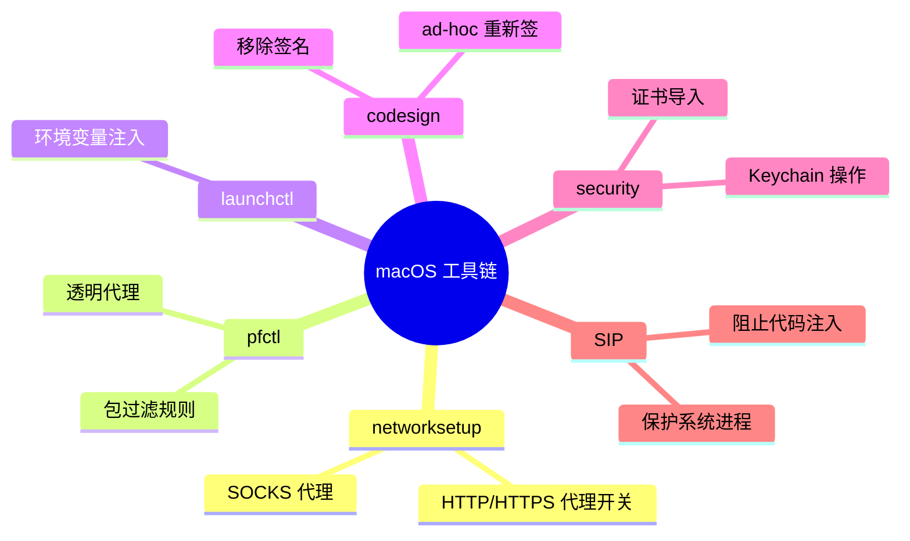

# macOS 网络与安全工具链

> 基于 macOS 14.x，bash/zsh。

## 为什么要懂这些

mitmproxy 和 Frida 是抓包的主力。但在它们之间，有一堆 macOS 系统层的操作把流量引到代理、把证书装进系统、把库注入进程——这些操作靠的是 macOS 自带的命令行工具。这篇文章把它们串一遍。

## networksetup — 管理系统代理

macOS 的网络配置有两种方式：GUI（系统设置 → 网络 → 代理）和命令行。命令行就用 `networksetup`。

### 查看当前网络服务

```bash
networksetup -listallnetworkservices
```

```
Wi-Fi
Thunderbolt Bridge
```

大部分 Mac 只有一个 `Wi-Fi` 服务。后面所有命令都用这个名字。

### 设置和关闭 HTTP/HTTPS 代理

```bash
# 设置 Web 代理（HTTP）
networksetup -setwebproxy Wi-Fi 127.0.0.1 8080

# 设置安全 Web 代理（HTTPS）
networksetup -setsecurewebproxy Wi-Fi 127.0.0.1 8080

# 查看当前代理设置
networksetup -getwebproxy Wi-Fi
networksetup -getsecurewebproxy Wi-Fi
```

输出：

```
Enabled: Yes
Server: 127.0.0.1
Port: 8080
Authenticated Proxy Enabled: 0
```

### 关闭代理

```bash
networksetup -setwebproxystate Wi-Fi off
networksetup -setsecurewebproxystate Wi-Fi off
```

忘记关代理的后果：所有 HTTP/HTTPS 请求都往 127.0.0.1:8080 发 → 找不到 mitmproxy → 断网。症状是浏览器打不开任何网页，但 ping 是通的（ICMP 不走代理）。

### 其他有用操作

```bash
# 设置 SOCKS 代理（SSH 隧道常用）
networksetup -setsocksfirewallproxy Wi-Fi 127.0.0.1 1080

# 设置白名单——哪些地址不走代理
networksetup -setproxybypassdomains Wi-Fi localhost 127.0.0.1 *.local

# 列出 Wi-Fi 网的完整配置
networksetup -getinfo Wi-Fi
```

## pfctl — 透明代理与端口转发

`pf`（Packet Filter）是 macOS 内置的防火墙。可以做透明代理——不设系统代理、应用无感知地把流量转到指定端口。

### 透明代理配置

```bash
# 创建 pf 规则文件
cat > /tmp/pf-redirect.conf << 'EOF'
# 把所有发往 203.0.113.1:443 的 TCP 流量重定向到本机 8080 端口
rdr pass inet proto tcp from any to 203.0.113.1 port 443 -> 127.0.0.1 port 8080
EOF

# 加载规则（需要 sudo）
sudo pfctl -f /tmp/pf-redirect.conf
sudo pfctl -e   # 启用 pf
```

原理：在操作系统网络栈层面篡改目标地址——应用以为自己往 `203.0.113.1:443` 发请求，实际上被 `pf` 劫持到了 `127.0.0.1:8080`。

### 查看和关闭

```bash
sudo pfctl -s rules   # 查看当前规则
sudo pfctl -s state   # 查看当前连接状态
sudo pfctl -d         # 停用 pf
```

透明代理在应用做了证书锁定时依然无效——因为连接仍然是 TLS 加密的，mitmproxy 的证书不匹配照样被拒。它的作用是在应用不设代理的情况下把流量引到 mitmproxy，但解密问题还是得靠 Frida 解决。

## launchctl — 环境变量注入

修改环境变量是控制进程行为最轻量的方式。`launchctl setenv` 把环境变量注入到所有由 `launchd` 启动的进程：

```bash
# 设置——对所有新启动的 GUI 应用生效
launchctl setenv SSLKEYLOGFILE /tmp/sslkeys.log
launchctl setenv NODE_TLS_REJECT_UNAUTHORIZED 0

# 查看已设置的环境变量
launchctl getenv SSLKEYLOGFILE

# 删除
launchctl unsetenv SSLKEYLOGFILE
```

限制：

- Electron 4.x（Chrome 69）不支持 `SSLKEYLOGFILE`，这个变量在 Chrome 48+ 才加入
- Electron 子进程可能不继承父进程的环境变量
- 已经启动的进程不受影响——必须重启应用

## codesign — 代码签名

每次装 mitmproxy 证书、编译 Frida 脚本、修改动态库，都会遇到签名问题。macOS 的 Gatekeeper 要求所有可执行代码有有效签名。

### 查看签名信息

```bash
codesign -dvvv /Applications/SomeApp.app
```

```
Executable=/Applications/SomeApp.app/Contents/MacOS/SomeApp
Identifier=com.example.someapp
Format=app bundle with Mach-O thin (arm64)
CodeDirectory flags=Runtime(10000) - library-validation
```

`flags=Runtime` 说明这个应用启用了 Hardened Runtime，限制更多——`DYLD_INSERT_LIBRARIES` 对它无效。

### 移除签名

```bash
codesign --remove-signature /path/to/binary
```

### 重新签名（ad-hoc）

```bash
# --force: 强制覆盖已有签名
# --sign -: ad-hoc 签名（不是用开发者证书，只是让系统放行）
codesign --force --sign - /tmp/frida-gadget.dylib
```

### 对 .app 包重新签名

```bash
# --deep: 递归签名所有内嵌 bundle
codesign --force --deep --sign - /Applications/Modified.app
```

注意：重新签名会改掉原应用的签名指纹。如果应用自身有完整性校验（如 AsarIntegrity），修改会直接导致应用崩溃。

## security — Keychain 和证书操作

`security` 是 macOS Keychain 的命令行接口。证书导入、信任设置、密码管理都靠它。

### 添加证书到系统信任库

```bash
# 把 mitmproxy 的 CA 证书加入系统级信任（需要 sudo）
sudo security add-trusted-cert -d -r trustRoot \
  -k /Library/Keychains/System.keychain \
  ~/.mitmproxy/mitmproxy-ca-cert.pem
```

参数：
| 参数 | 含义 |
|------|------|
| `-d` | 添加到 admin cert store |
| `-r trustRoot` | 信任为根 CA |
| `-k` | 指定 Keychain（系统级 vs 用户级） |

### 查看已信任的证书

```bash
security find-certificate -a -c "mitmproxy"
```

### 删除证书

```bash
security delete-certificate -c "mitmproxy"
```

### 查询 Keychain 密码

```bash
# 查找所有通用密码
security find-generic-password -a "username" -s "service.name" -w
```

## SIP — 系统完整性保护

SIP（System Integrity Protection）从 macOS El Capitan 开始引入。它做了几件事：

- **禁止修改系统文件**：即使 `sudo rm /usr/bin/xxx` 也会被拒绝
- **禁止向系统进程注入代码**：`DYLD_INSERT_LIBRARIES` 对 SIP 保护的进程无效
- **禁止调试系统进程**：`frida attach` 被拒绝的原因

### 查看 SIP 状态

```bash
csrutil status
```

```
System Integrity Protection status: enabled.
```

### 关闭 SIP

需要重启到 Recovery 模式（Apple Silicon：长按电源键 → 选项 → 进入恢复），然后在终端：

```bash
csrutil disable
reboot
```

**不建议在日常机器上关 SIP**。如果只是为了抓包，Gadget 模式或 ad-hoc 签名通常够用了。

## 小结



这些工具单用都不够强大，但串起来就能搭一条完整的流量拦截链路：`launchctl` 设环境变量 → `networksetup` 开代理 → mitmproxy 收流量 → `security` 装证书解 TLS → Frida Hook 绕过证书锁定。
