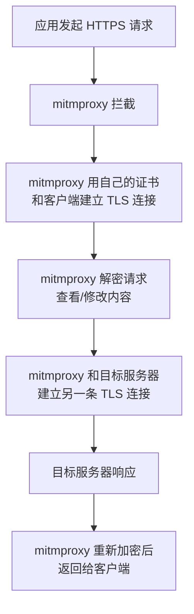

# mitmproxy — HTTPS 中间人代理实战

> 基于 mitmproxy 10.x，Python 3.9+。

## 什么时候需要 mitmproxy

调试 API 时，最直接的方式是看代码里怎么发请求的——但如果代码不是你写的呢？当你面对一个闭源的桌面应用（Electron、原生 macOS 应用），想搞清楚它和服务端之间到底传了什么数据，mitmproxy 是最直接的工具。

它的工作方式很简单：你的应用 → mitmproxy（代理）→ 目标服务器。mitmproxy 站在中间，所有流量都经过它，能被查看、修改、重放。


## 安装

```bash
pip3 install mitmproxy
```

验证：

```bash
mitmdump --version
```

```
Mitmproxy: 10.x.x
Python:    3.9.x
OpenSSL:   OpenSSL 3.x.x
Platform:  macOS-14.x-arm64
```

## 三种启动方式

mitmproxy 提供了三个入口，对应三种场景：

| 命令 | 界面 | 适用场景 |
|------|------|----------|
| `mitmproxy` | 终端 TUI（类似 htop） | 在服务器上边看边操作 |
| `mitmdump` | 纯命令行，输出到终端/文件 | **脚本化、自动化、保存流量** |
| `mitmweb` | Web UI（浏览器打开） | 图形化查看、搜索、筛选 |

日常调试最常用 `mitmweb`，自动化脚本用 `mitmdump`。

## 启动代理

```bash
# 最简单的方式——启动后在浏览器打开 localhost:8081
mitmweb -p 8080

# 或者纯命令行模式，保存所有流量到文件
mitmdump -p 8080 -w /tmp/capture.flow
```

参数说明：

| 参数 | 作用 |
|------|------|
| `-p 8080` | 代理监听端口（默认 8080） |
| `-w file.flow` | 保存流量到文件，可事后回放分析 |
| `--ssl-insecure` | 不验证上游证书（对付自签名证书的服务器） |
| `-s script.py` | 加载 Python 脚本处理请求/响应 |

## 设置系统代理

mitmproxy 启动后只是监听了端口——系统流量还不会经过它。得告诉 macOS 把 HTTP/HTTPS 流量转发到代理：

```bash
# 开启代理
networksetup -setwebproxy Wi-Fi localhost 8080
networksetup -setsecurewebproxy Wi-Fi localhost 8080

# 关闭代理（用完记得关，否则断网）
networksetup -setwebproxystate Wi-Fi off
networksetup -setsecurewebproxystate Wi-Fi off
```

设置后，浏览器和大部分应用的 HTTP/HTTPS 流量都会经过 mitmproxy。

## HTTPS 的关键：CA 证书

HTTP 流量是明文的——mitmproxy 直接就能看到内容。但绝大多数现代应用用的是 **HTTPS**——加密的。要让 mitmproxy 看到加密内容，它必须**解密 → 查看 → 重新加密**。这需要客户端信任 mitmproxy 的 CA 证书。

### 安装 mitmproxy 的 CA 证书到系统

```bash
# 1. 找到证书
ls ~/.mitmproxy/mitmproxy-ca-cert.pem

# 2. 转成 macOS Keychain 可导入的 DER 格式
openssl x509 -in ~/.mitmproxy/mitmproxy-ca-cert.pem \
  -outform DER -out ~/Desktop/mitmproxy-ca-cert.der

# 3. 双击桌面上的 .der 文件 → Keychain Access 打开
open ~/Desktop/mitmproxy-ca-cert.der
```

Keychain Access 打开后：
1. 找到 `mitmproxy` 证书（通常在"登录"钥匙串）
2. 双击 → 展开「信任」→ 「使用此证书时」选 **始终信任**
3. 关闭对话框，输入系统密码确认

这时浏览器访问 HTTPS 站点，mitmproxy 就能看到明文了。

### 原理



**mitmproxy 做了两次 TLS 握手**：一次和客户端（用 mitmproxy 的假证书），一次和服务器（用服务器的真证书）。客户端需要信任 mitmproxy 的 CA 证书，否则 TLS 握手失败。

### 命令行安装证书（不用 GUI）

```bash
# 添加证书到系统信任库
sudo security add-trusted-cert -d -r trustRoot \
  -k /Library/Keychains/System.keychain \
  ~/.mitmproxy/mitmproxy-ca-cert.pem
```

## 分析保存的流量

`mitmdump -w` 保存的 `.flow` 文件包含了完整的请求/响应对。事后再分析：

```python
# read_flows.py — 读取并打印所有请求 URL
import sys
sys.path.insert(0, '/path/to/mitmproxy/site-packages')
from mitmproxy import io

with open('/tmp/capture.flow', 'rb') as f:
    for flow in io.FlowReader(f).stream():
        req = flow.request
        print(f"{req.method} {req.url}")
        if req.content:
            print(f"  Body: {req.content[:500]}...")
```

不会写 Python 的话，直接用 `mitmweb` 打开 `.flow` 文件：

```bash
mitmweb -r /tmp/capture.flow
# 浏览器打开 localhost:8081 → 图形化浏览每条请求/响应
```

## 用脚本实时处理流量

`-s` 参数加载一个 Python 脚本，能实时修改请求和响应：

```python
# log_requests.py — 把每个请求的 URL 打印到控制台
from mitmproxy import http

def request(flow: http.HTTPFlow):
    print(f"{flow.request.method} {flow.request.url}")
```

```bash
mitmdump -p 8080 -s log_requests.py
```

更多用法——修改请求头、替换响应内容、模拟慢网络——这些是 mitmproxy 作为"可编程代理"的核心能力，但日常抓包分析的话，`mitmweb` + `-w` 保存再回看已经够用了。

## 证书锁定（Certificate Pinning）——mitmproxy 的边界

有些应用会**证书锁定**——不仅验证证书是否由受信任的 CA 签发，还检查证书的指纹（公钥的 hash）是否和代码里硬编码的一致。

mitmproxy 用自己的证书替代了服务器证书，指纹必然不匹配——应用拒绝建立连接。这就是我在 目标应用 上遇到的情况：`目标域名` 的流量 mitmproxy 看不到，但 `其他辅助域名` 的能看到——因为前者做了证书锁定，后者没做。

mitmproxy 本身没法绕过证书锁定。需要上 Frida 这类动态插桩工具在应用进程内 Hook 证书验证逻辑——那是下一篇文章的内容。

## 恢复环境

用完代理别忘了关：

```bash
# 关系统代理
networksetup -setwebproxystate Wi-Fi off
networksetup -setsecurewebproxystate Wi-Fi off

# 杀 mitmproxy 进程
kill $(pgrep -f mitm) 2>/dev/null
```

忘记关代理的结果：所有 HTTP/HTTPS 流量走 127.0.0.1:8080 → 找不到 mitmproxy → 断网。症状是浏览器打不开任何网页。如果你碰上了——先检查代理设置。

## 小结

mitmproxy 是调试闭源应用 HTTP/HTTPS 流量的第一选择。核心步骤就三步：

1. **启动代理** — `mitmweb -p 8080` 或 `mitmdump -w capture.flow`
2. **装证书** — 让系统信任 mitmproxy 的 CA，才能解密 HTTPS
3. **设代理** — `networksetup` 把系统流量指向代理

它的边界是**证书锁定**——mitmproxy 解不开被应用锁定的 HTTPS 流量。下一篇讲 Frida：从进程内部 Hook 掉证书验证。
