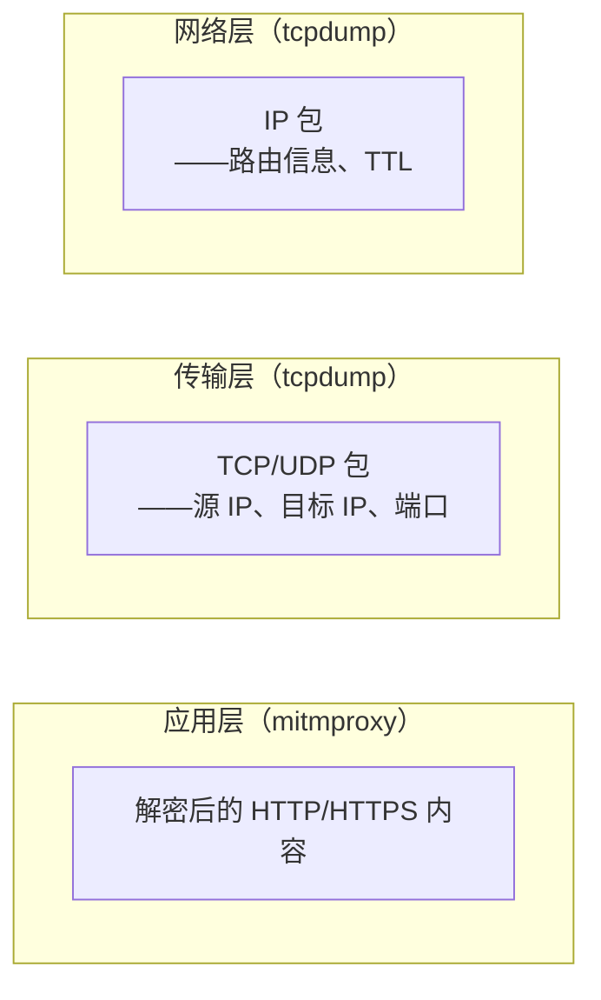
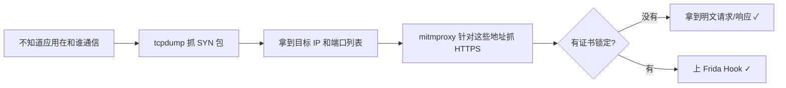

# tcpdump + Wireshark 网络抓包

> 基于 tcpdump 4.99.x，Wireshark 4.x，macOS。

## mitmproxy 搞不定的时候

mitmproxy 需要应用走代理、接受它的证书。但有些流量根本不走代理——UDP、ICMP、或者应用直接绕过系统代理设置。这时候你连"对方在跟哪个 IP 通信"都不知道。

tcpdump 在更底层工作——不依赖代理、不依赖证书，直接看网卡上的原始数据包。代价是你拿到的是二进制 packet stream，需要逐层解析。Wireshark 做这个解析工作。



## 基本用法

```bash
# 抓 Wi-Fi 网卡上的所有流量，输出到终端
sudo tcpdump -i en0

# 指定网卡
sudo tcpdump -i any   # 所有网卡
sudo tcpdump -i en0   # 无线网卡
sudo tcpdump -i lo0   # 回环接口（localhost）
```

没有 `sudo` 不行——抓包需要读取网卡的原始数据，权限不够。

## 过滤：别让输出淹死你

不加过滤的 tcpdump 每秒打几百行——根本没法看。过滤分两种：**捕获过滤**（BPF，抓包时过滤）和**显示过滤**（Wireshark，事后过滤）。

### BPF 捕获过滤

```bash
# 只看特定主机
sudo tcpdump -i en0 host 119.3.82.146

# 只看特定端口
sudo tcpdump -i en0 port 443

# 组合条件
sudo tcpdump -i en0 host 119.3.82.146 and port 443

# 排除某主机
sudo tcpdump -i en0 not host 192.168.1.1

# 只看 TCP 握手包（SYN）
sudo tcpdump -i en0 'tcp[tcpflags] & tcp-syn != 0'

# 按网段过滤
sudo tcpdump -i en0 net 119.3.82.0/24
```

### 保存到文件（pcap）

```bash
# -w: 保存二进制 pcap 文件
# -s 0: 抓完整包（不截断）
sudo tcpdump -i en0 -s 0 -w /tmp/capture.pcap host 119.3.82.146
```

`-s 0` 很重要——tcpdump 默认只抓每个包的前 96 字节（看 header 够用，看 body 不够）。`-s 0` 抓完整包，虽然文件大一点，但不会遗漏数据。

### 附加选项

```bash
# -n: 不解析主机名（快，避免 DNS 查询噪音）
# -X: 显示包内容的十六进制 + ASCII
# -A: 显示包内容的纯 ASCII
sudo tcpdump -i en0 -n -X host 119.3.82.146
```

输出示例：

```
14:32:01.234567 IP 192.168.1.10.54321 > 119.3.82.146.443: Flags [P.], seq ...
    0x0000:  4500 012c 8a3c 4000 4006 7b8e c0a8 010a  E..,.<.@.@.{.....
    0x0010:  7703 5292 d431 01bb 3f8e 2c45 6b2d 184d  w.R..1..?.,Ek-.M
    ...
```

能看到原始数据，但肉眼分析 TLS 加密内容是不可能的——需要先解密。

## 实战：定位应用在和哪些服务器通信

```bash
# 1. 后台启动抓包
sudo tcpdump -i en0 -s 0 -w /tmp/smartx-talk.pcap 'tcp[tcpflags] & tcp-syn != 0' &

# 2. 操作应用——点几个按钮、触发几个请求

# 3. 停止抓包
sudo kill $(pgrep tcpdump)
```

SYN 包是 TCP 三次握手的第一个包——只抓 SYN 等于只记录"连接到了谁"，不抓后面的数据。这适合快速搞清楚应用在跟哪些服务器通信。

### 分析抓到的地址

```bash
# 从 pcap 中提取所有目标 IP
tcpdump -r /tmp/smartx-talk.pcap -n | awk '{print $5}' | cut -d. -f1-4 | sort -u
```

输出类似：

```
119.3.82.146.443
47.96.123.45.443
192.168.1.1.53
```

然后反查这些 IP 是谁：

```bash
whois 119.3.82.146 | grep -i "descr\|netname"
```

## Wireshark：可视化分析

Wireshark 是 tcpdump 的 GUI 搭档。tcpdump 负责抓，Wireshark 负责分析。

```bash
# macOS 安装
brew install --cask wireshark
```

打开 Wireshark，拖入 `.pcap` 文件，你会看到三层信息：

```
┌──────────────────────────────┐
│  包列表（时间、来源、目标、协议）  │
│  → 点击某一行                   │
├──────────────────────────────┤
│  包详情（分层解析）              │
│  Frame → Ethernet → IP → TCP  │
│  → 展开 TLS 层（加密内容不可见）  │
├──────────────────────────────┤
│  原始十六进制                   │
└──────────────────────────────┘
```

### 常用 Wireshark 显示过滤

| 过滤表达式 | 含义 |
|-----------|------|
| `http` | 只看 HTTP 流量 |
| `tls` | 只看 TLS 握手 |
| `ip.addr == 119.3.82.146` | 只看某个 IP |
| `tcp.port == 443` | 只看 HTTPS |
| `dns` | 只看 DNS 查询 |
| `tcp.stream eq 0` | 追踪某一条 TCP 连接的全部包 |
| `frame contains "error"` | 包内容中包含某字符串 |

### 设置 TLS 解密

如果拿到了 SSLKEYLOGFILE（Chrome/Firefox 可以导出，但 Electron 4.x 不行），可以在 Wireshark 里配置解密：

`Preferences → Protocols → TLS → (Pre)-Master-Secret log filename` → 指定 keylog 文件路径。

设置后，Wireshark 会自动解密 TLS 流量——你能看到明文的 HTTP 请求/响应。前提是应用端支持导出 keylog，这对低版本 Electron 不适用（Chrome 69 没这个功能）。

## tcpdump vs mitmproxy

| | tcpdump | mitmproxy |
|------|---------|-----------|
| 层级 | 网络层（IP 包） | 应用层（HTTP/HTTPS） |
| 可见内容 | IP、端口、包大小、TLS 握手信息 | 完整 HTTP 请求/响应（明码） |
| 需要代理 | 不需要 | 需要 |
| 需要证书 | 不需要 | HTTPS 需要 |
| 能解 TLS | 不能（除非有 keylog） | 能（用自己的证书） |

它们不是竞争关系——是互补的。先用 tcpdump 搞清楚"应用连了哪些 IP 和端口"，再用 mitmproxy 对着这些地址做深度分析。

## 小结



tcpdump 最大的价值不是看包内容——是**搞清楚目标的网络面**。你连对方在和哪些 IP 通信都不知道，mitmproxy 就不知道该抓什么。

下一篇：**Electron 应用逆向基础**——拆解 `.asar` 包、理解 AsarIntegrity、连接 Chrome DevTools。
