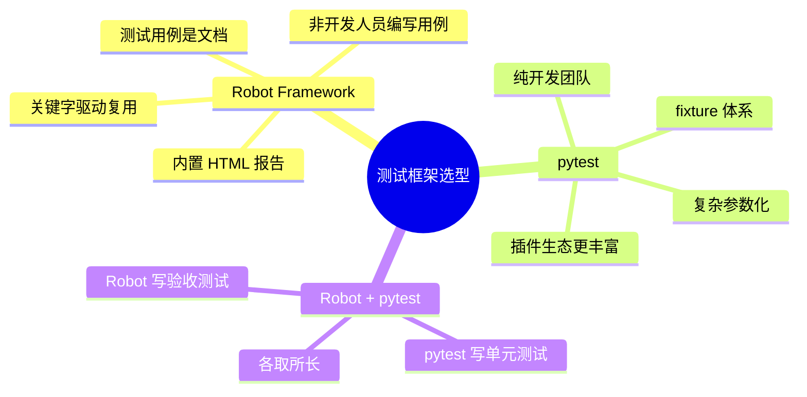

# Robot Framework 实战指南：从安装到写出一套可维护的测试

> 基于 Robot Framework 7.4.2（2026 年 3 月），Python 3.8+。

## 为什么选择 Robot Framework

大部分测试框架要求你用代码写测试——pytest 用 Python，JUnit 用 Java，Jest 用 JavaScript。这对开发团队没问题，但如果你需要**测试人员、产品经理、甚至业务方**也能读、能写测试用例，代码化的测试就是一道墙。

Robot Framework 解决的就是这个问题：用接近自然语言的纯文本语法写测试，同时底层是一套完整的执行和报告系统。

```robotframework
*** Test Cases ***
用户登录成功
    打开登录页面
    输入用户名    admin
    输入密码      123456
    点击登录按钮
    页面应显示    欢迎回来
```

这不像是写给机器执行的脚本——更像是一份中文操作手册。但因为语法结构是严格的，Robot 可以精确解析它、执行它、生成每一步的 pass/fail 报告。

## 安装

```bash
pip install robotframework
```

验证：

```bash
robot --version
```

```
Robot Framework 7.4.2 (Python 3.12.0 on darwin)
```

## 基础语法：四个核心 Section

一个 `.robot` 文件由四种 Section 组成：

```robotframework
*** Settings ***            # 配置：导入库、资源文件、定义标签
Library    Collections

*** Variables ***           # 定义变量
${GREETING}    Hello
@{FRUITS}      苹果  香蕉  橘子
&{USER}        name=张三  age=30

*** Test Cases ***          # 测试用例
第一个测试
    Log    ${GREETING}, World!
    Log    第一项是: ${FRUITS}[0]
    Should Be Equal    ${USER}[name]    张三

*** Keywords ***            # 自定义关键字（可复用步骤）
打个招呼
    [Arguments]    ${name}
    Log    你好, ${name}!
```

### 三种变量

| 语法 | 类型 | 示例 |
|------|------|------|
| `${var}` | 标量（单个值） | `${name}` = 张三 |
| `@{list}` | 列表 | `@{items}` = 苹果, 香蕉, 橘子 |
| `&{dict}` | 字典 | `&{user}` = name=张三, age=30 |

标量可以引用列表项和字典值：

```robotframework
${first}    ${FRUITS}[0]        # 苹果
${name}     ${USER}[name]       # 张三
```

## 内置关键字：不用装任何库就能用的 50+ 个命令

Robot Framework 自带 `BuiltIn` 库，包含日志、断言、流程控制等基础操作。

### 日志和输出

```robotframework
*** Test Cases ***
日志和输出
    Log    这是一条普通日志
    Log To Console    这条输出到控制台
    Log Many    变量A    ${VAR_A}    变量B    ${VAR_B}
```

### 断言

```robotframework
*** Test Cases ***
各种断言
    Should Be Equal    ${result}    expected
    Should Be True     ${count} > 0
    Should Contain     ${message}    成功
    Should Not Be Empty    ${list}
    Should Match Regexp    ${text}    \\d{4}-\\d{2}-\\d{2}
```

### 流程控制（Robot Framework 5.0+）

```robotframework
*** Test Cases ***
条件分支
    IF    ${score} >= 90
        Log    优秀
    ELSE IF    ${score} >= 60
        Log    及格
    ELSE
        Log    不及格
    END

    FOR    ${i}    IN RANGE    1    6
        Log    第 ${i} 次
    END

    WHILE    ${retries} > 0
        ${result}=    尝试连接
        IF    ${result}
            BREAK
        END
        ${retries}=    Evaluate    ${retries} - 1
    END
```

### 集合操作（`Collections` 库，需导入）

```robotframework
*** Settings ***
Library    Collections

*** Test Cases ***
列表操作
    @{items}=    Create List    a    b    c
    Append To List    ${items}    d
    Length Should Be    ${items}    4
    List Should Contain Value    ${items}    c

字典操作
    &{user}=    Create Dictionary    name=张三    role=admin
    Dictionary Should Contain Key    ${user}    role
    ${name}=    Get From Dictionary    ${user}    name
```

## 自定义关键字：封装可复用的步骤

测试里那些反复出现的步骤——登录、造数据、清理环境——不该在每个测试用例里复制粘贴。抽成关键字：

```robotframework
*** Keywords ***
以管理员身份登录
    [Arguments]    ${username}=admin    ${password}=123456
    打开登录页面
    输入用户名    ${username}
    输入密码      ${password}
    点击登录按钮
    页面应显示    欢迎回来

用完后清理
    关闭浏览器
    清理测试数据
```

然后在测试用例里直接用：

```robotframework
*** Test Cases ***
管理员可以查看用户列表
    [Setup]     以管理员身份登录
    点击导航栏    用户管理
    页面应显示    用户列表
    [Teardown]  用完后清理
```

**Setup 和 Teardown** 是 Robot 的内置机制——Setup 在测试前执行，Teardown 在测试后执行（无论测试通过还是失败，Teardown 都会跑）。

## 资源文件：跨文件共享关键字和变量

当关键字越来越多，一个文件撑不住了。把公共部分抽到 **resource 文件**：

```robotframework
# resources/common.resource
*** Settings ***
Library    Collections
Library    String

*** Variables ***
${BASE_URL}          http://localhost:8000/api
${DEFAULT_TIMEOUT}   10s

*** Keywords ***
生成随机邮箱
    ${rand}=    Generate Random String    8    [LOWER]
    RETURN    ${rand}@test.com

获取当前时间戳
    ${ts}=    Get Time    epoch
    RETURN    ${ts}
```

在测试文件中引用：

```robotframework
*** Settings ***
Resource    resources/common.resource

*** Test Cases ***
测试中使用资源文件
    ${email}=    生成随机邮箱
    Log    随机邮箱: ${email}
```

**Library 和 Resource 的区别**：

| | Library | Resource |
|------|---------|----------|
| 是什么 | Python 模块 | `.resource` 或 `.robot` 文件 |
| 提供 | Python 函数作为关键字 | Robot 语法写的关键字和变量 |
| 导入 | `Library MyLibrary` | `Resource path/to/file.resource` |

## 实战一：API 测试

安装 Requests 库的 Robot 封装：

```bash
pip install robotframework-requests
```

写一个测试文件：

```robotframework
# tests/api_tests.robot
*** Settings ***
Library    RequestsLibrary
Library    Collections

*** Variables ***
${BASE_URL}    http://localhost:8000/api

*** Test Cases ***
获取用户列表应返回200且不为空
    ${resp}=    GET    ${BASE_URL}/users
    Status Should Be    200
    ${body}=    Set Variable    ${resp.json()}
    Should Be True    len(${body}) > 0

创建用户并验证返回数据
    [Setup]    获取初始用户数量
    ${headers}=    Create Dictionary    Content-Type=application/json
    ${payload}=    Create Dictionary    name=张三    email=zhangsan@test.com
    ${resp}=    POST    ${BASE_URL}/users    json=${payload}    headers=${headers}
    Status Should Be    201
    Dictionary Should Contain Key    ${resp.json()}    id
    Should Be Equal    ${resp.json()['name']}    张三
    [Teardown]    清理测试用户    ${resp.json()['id']}

*** Keywords ***
获取初始用户数量
    ${resp}=    GET    ${BASE_URL}/users
    Status Should Be    200
    Set Suite Variable    ${INITIAL_COUNT}    len(${resp.json()})

清理测试用户
    [Arguments]    ${user_id}
    ${resp}=    DELETE    ${BASE_URL}/users/${user_id}
    Status Should Be    204
```

执行：

```bash
robot tests/
```

```
==============================================================================
Api Tests
==============================================================================
获取用户列表应返回200且不为空                                         | PASS |
------------------------------------------------------------------------------
创建用户并验证返回数据                                                 | PASS |
------------------------------------------------------------------------------
Api Tests                                                            | PASS |
2 tests, 2 passed, 0 failed
==============================================================================
Output:  /path/to/output.xml
Log:     /path/to/log.html
Report:  /path/to/report.html
```

### 理解输出文件

| 文件 | 内容 |
|------|------|
| `output.xml` | 原始结果数据（机器可读） |
| `log.html` | **调试日志**——每一步的输入输出、耗时、请求/响应详情 |
| `report.html` | **汇总报告**——通过/失败统计、标签分布、时间线 |

打开 `log.html`，你能看到每个关键字调用的完整信息——API 测试里能看到 HTTP 请求的 headers、body、响应状态码、响应体。比 pytest 的终端输出直观得多，而且可以搜、可以筛选。

## 实战二：Web UI 测试

Robot 在 Web 自动化领域用得最广泛。最早用 `SeleniumLibrary`，现在推荐 `Browser` 库（基于 Playwright）：

```bash
pip install robotframework-browser
rfbrowser init    # 安装 Playwright 浏览器
```

```robotframework
*** Settings ***
Library    Browser

*** Variables ***
${URL}    http://localhost:3000

*** Test Cases ***
首页可以正常加载
    New Page    ${URL}
    Get Title    ==    我的博客
    Get Text    h1    ==    欢迎

用户可以创建文章
    New Page    ${URL}/new
    Type Text    input[name="title"]    新文章的标题
    Type Text    textarea[name="body"]   这是文章正文
    Click        button[type="submit"]
    Get Text    .toast    contains    发布成功

搜索功能
    New Page    ${URL}
    Type Text    input[placeholder="搜索..."]    React
    Click        button >> text=搜索
    Get Element Count    .card    >    0
```

`Browser` 库基于 Playwright，比 Selenium 快得多——而且内置自动等待，不需要手动 `sleep`。

## 标签：分类、筛选、按需执行

给测试加标签，按场景选择性执行：

```robotframework
*** Settings ***
Default Tags    regression

*** Test Cases ***
快速登录验证
    [Tags]    smoke    login
    ...

完整的用户流程
    [Tags]    e2e    critical
    ...
```

执行时按标签筛选：

```bash
robot --include smoke     tests/          # 只跑冒烟测试
robot --exclude e2e       tests/          # 跳过端到端测试
robot --include critical  tests/          # 只跑标记为 critical 的用例
```

这在 CI 里特别有用——PR 提交时跑 smoke，合并后跑 regression，夜间跑 e2e。

## 命令行参数速查

```bash
robot                          # 执行当前目录所有 .robot 文件
robot -d results/ tests/      # 指定输出目录
robot -v BASE_URL:https://staging.example.com/api   # 覆盖变量
robot -L DEBUG tests/          # 调试日志级别
robot --dryrun tests/          # 只解析不执行（检查语法）
robot --rerunfailed output.xml tests/  # 只重跑上次失败的用例
```

## 和 pytest 怎么选



Robot Framework 不替代 pytest。单元测试还是用 pytest 更好——写起来快、参数化灵活。Robot 适合放在**集成测试、端到端测试、验收测试**那一层——那些需要被非开发人员阅读的用例。

## 小结

Robot Framework 的核心价值不是「比 pytest 更强大」，而是**让不写代码的人也能参与测试**。它的语法足够简单（就是空格分隔的关键字 + 参数），但类型系统（标量、列表、字典）、流程控制（IF/FOR/WHILE）、资源文件复用机制——这些又让它能支撑真实项目的复杂度。

几个记住的点：
- **变量用 `${var}`**，列表用 `@{list}`，字典用 `&{dict}`
- **关键字 = 可复用的步骤**——抽到 resource 文件里
- **标签**帮你按场景执行——CI 里 `--include smoke`，夜间 `--include e2e`
- **log.html 是你的 debug 工具**——每一步的输入输出、HTTP 请求/响应全在里面
