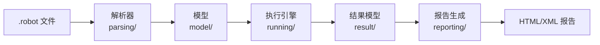
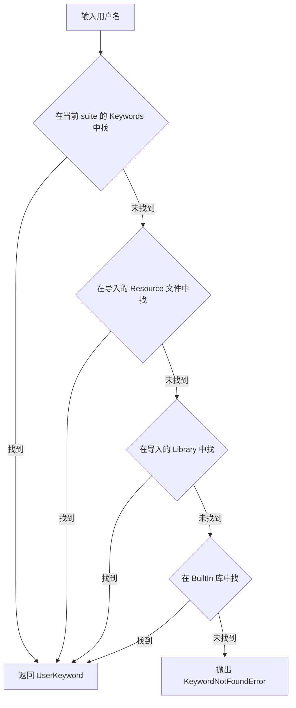
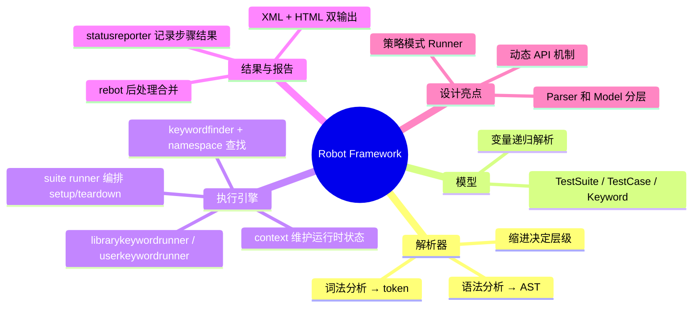

# Robot Framework 源码阅读：一个测试框架是怎么把自然语言变成可执行代码的

> 基于 Robot Framework 7.4.2（2026 年 3 月），Python 3.8+，Apache 2.0 协议。

## 为什么读 Robot Framework

大部分测试框架要么绑死在一种语言（pytest、JUnit），要么要求你用代码写测试。Robot Framework 走了另一条路——用纯文本定义测试用例，任何人都能读、能写。它的语法长这样：

```robotframework
*** Test Cases ***
用户登录成功
    [Setup]    打开登录页面
    输入用户名    admin
    输入密码      123456
    点击登录按钮
    页面应显示    欢迎回来, admin
    [Teardown]  关闭浏览器
```

这不像代码，更像一份中文操作手册。但它背后有一套完整的编译、执行、报告系统在运转。这篇文章拆开来看这套系统是怎么设计的。

## 总体架构：一条 Pipeline



六个阶段，每个阶段有明确的输入输出。设计上很干净——解析不依赖执行，执行不依赖报告。任何一个阶段都可以独立测试和替换。

## 第一层：解析器（`src/robot/parsing/`）

Robot Framework 的 `.robot` 文件不是自由格式。它由几个特定 Section 组成：

| Section | 作用 |
|---------|------|
| `*** Settings ***` | 导入库、资源文件、定义 suite 级别的 setup/teardown |
| `*** Variables ***` | 定义变量 |
| `*** Test Cases ***` | 测试用例 |
| `*** Keywords ***` | 用户自定义关键字 |
| `*** Comments ***` | 注释（整段跳过） |

解析器的职责是把这些文本变成 AST（抽象语法树）。核心入口在 `parser.py`，调用链是：

```
parser.py → Lexer (切分词) → tokenizer.py (词法分析)
         → Parser (构建 AST) → parser.py → 生成 model/ 层的对象
```

解析过程分两步：

**1. 词法分析**：把文本切成 token。Robot Framework 的 token 粒度比一般语言的 token 粗——一行数据就是一个 token，不拆分到单个词。比如 `输入密码 123456` 是一个 `KEYWORD` token，而不是 `输入密码` + `123456` 两个 token。

**2. 语法分析**：根据 Section 类型和缩进构建 AST。Robot Framework 用**缩进**决定层级关系，和 Python 一样。

值得注意的设计决策：解析器不负责验证关键字是否存在、变量是否定义——这些留给执行阶段。解析器的唯一职责是「把文本转成结构正确的 AST」。这是编译器设计里的经典原则：**每个阶段只做一件事**。

## 第二层：模型（`src/robot/model/`）

解析器产出的 AST 节点还比较薄——基本上就是 token 的树形组织。模型层在这之上包了一层语义：

```python
# 模型层的关键类型
TestSuite    # 一个测试套件（可嵌套）
  ├── TestCase      # 一个测试用例
  │     ├── Keyword      # 用例中的一步（关键字调用）
  │     └── ...
  ├── Keyword      # 用户自定义关键字
  │     ├── Keyword      # 关键字体内的步骤
  │     └── ...
  └── Import       # 导入的库/资源
```

模型对象不只有数据——它们有行为。每个节点知道如何把自己加入执行队列。这是**访问者模式**的变体：模型节点接受一个访问者（runner），让访问者在树上遍历并执行操作。

模型层做的另一件关键事是**变量解析**（`variables/` 目录）。Robot Framework 的变量有三种语法：

```robotframework
${scalar}       # 标量——单个值
@{list}          # 列表
&{dict}          # 字典
```

变量可以在执行时嵌套引用：`${user_${index}}` 先解析内层的 `${index}`，再解析外层的 `${user_5}`。这是一个递归解析过程，在 `variables/variables.py` 里实现。

## 第三层：执行引擎（`src/robot/running/`）

这是整个框架最核心的部分。拆成三个子问题：

### 1. 关键字怎么被找到

当执行到 `输入用户名 admin` 这一步时，Robot 需要找到叫 `输入用户名` 的 keyword。查找逻辑在 `keywordfinder.py` → `namespace.py`：



查找顺序有设计意图：**用户自定义优先于内置**。允许你用同名 keyword 覆盖库提供的行为——这是开放-封闭原则的一个朴素体现。

### 2. 两种 Runner：库关键字和用户关键字

找到关键字后，执行路径分叉：

| 关键字类型 | Runner | 行为 |
|-----------|--------|------|
| 库关键字（Python 方法） | `librarykeywordrunner.py` | 调用 Python 函数，转换参数和返回值 |
| 用户关键字（Robot 语法写的） | `userkeywordrunner.py` | 递归展开关键字体内的步骤 |

这种**策略模式**的运用让两种完全不同执行逻辑的关键字对外暴露统一接口：`run()` 方法。执行引擎不关心你是什么类型——只调 `run()`。

### 3. 执行上下文

`context.py` 维护执行期间的运行时状态：

- 当前变量表（variable table）——所有 `${var}` 的值
- 当前测试的 PASS/FAIL 状态
- timeout 计时器
- 输出捕获（stdout/stderr 重定向到日志）

每个 `TestCase` 执行时创建一个新的 `context`，suite 级别的变量往下传播但不会被子测试污染。

### 4. Suite Runner 的编排逻辑

`suiterunner.py` 是执行引擎的总指挥：

```
suite.run()
  ├── resolve imports（加载 Library、Resource）
  ├── suite setup
  ├── for each test case:
  │     ├── test setup
  │     ├── bodyrunner.run(test.steps)
  │     │     └── for each step:
  │     │           ├── keywordfinder.find(step.name)
  │     │           ├── runner.run(keyword, args, context)
  │     │           └── statusreporter.report(result)
  │     └── test teardown（无论 pass/fail 都执行）
  └── suite teardown
```

注意 teardown 在失败时也会执行——这是测试框架的基本契约。Robot 在 `bodyrunner.py` 里用 try/finally 保证了这一点。

## 第四层：结果与报告（`src/robot/result/` + `src/robot/reporting/`）

执行过程中，`statusreporter.py` 记录了每一步的结果。执行完成后，所有的 pass/fail/error/skip 状态形成一棵结果树：

```
Suite Result
  ├── Test Result 1 (PASS)
  │     ├── Keyword Result (PASS)
  │     ├── Keyword Result (PASS)
  │     └── ...
  ├── Test Result 2 (FAIL)
  │     ├── Keyword Result (PASS)
  │     ├── Keyword Result (FAIL)  ← 错误信息和堆栈在这
  │     └── ...
  └── ...
```

结果模型是对执行过程的**完整记录**——不只有结果，还有耗时、日志、截图路径。这套数据可以直接序列化为 XML（`output.xml`），然后 `rebot` 工具把 XML 转成 HTML 报告。

`reporting/` 模块用的是 Jinja2 模板 + HTML/CSS/JS。生成的报告自带搜索、筛选、统计图表——不需要外部服务，一个 HTML 文件就搞定了。

## 两个让我印象深刻的设计

### 1. Library 的动态 API 机制

大多数测试框架要求你在写测试之前就 import 好所有库。Robot Framework 支持**运行时发现**——库可以实现一个 `get_keyword_names` 方法，Robot 在执行时调用它来获取可用关键字列表。

```python
class DynamicLibrary:
    def get_keyword_names(self):
        return ['do_thing_a', 'do_thing_b']
    
    def run_keyword(self, name, args):
        # 根据 name 分发到不同逻辑
        ...
```

这为「关键字名称在运行时才知道」的场景开了后门。实现这个机制的代码在 `dynamicmethods.py`——很薄的一层，做的事情就是检查库有没有这些特殊方法，有就用，没有就跳过。

### 2. Parser 和 Model 的分离

Robot Framework 的解析器和模型是两层不同的抽象：

- Parser 层：关心**语法**（缩进对不对、Section 有没有写对）
- Model 层：关心**语义**（这个 Keyword 定义在哪、参数够不够）

这种分层让框架可以在不改解析器的情况下扩展模型——比如引入 IF/ELSE 语法时，只需要在模型层加一个 `If` 节点类型，解析器改一行。这在 Robot Framework 6.x 到 7.x 的演进中反复被验证有效。

## 实战：用 Robot Framework 做 API 测试

```robotframework
*** Settings ***
Library    RequestsLibrary

*** Variables ***
${BASE_URL}    http://localhost:8000/api

*** Test Cases ***
获取用户列表应返回200
    ${resp}=    GET    ${BASE_URL}/users
    Status Should Be    200
    Should Be True    len(${resp.json()}) > 0

创建用户后能查到该用户
    ${body}=    Create Dictionary    name=张三    email=zhangsan@example.com
    ${resp}=    POST    ${BASE_URL}/users    json=${body}
    Status Should Be    201
    ${user_id}=    Set Variable    ${resp.json()['id']}
    # 验证能查到
    ${resp}=    GET    ${BASE_URL}/users/${user_id}
    Status Should Be    200
    Should Be Equal    ${resp.json()['name']}    张三
```

执行：

```bash
pip install robotframework robotframework-requests
robot api-tests.robot
```

终端输出：

```
==============================================================================
Api Tests
==============================================================================
获取用户列表应返回200                                                | PASS |
------------------------------------------------------------------------------
创建用户后能查到该用户                                                | PASS |
------------------------------------------------------------------------------
Api Tests                                                            | PASS |
2 tests, 2 passed, 0 failed
==============================================================================
Output:  output.xml
Log:     log.html
Report:  report.html
```

生成的 `log.html` 里能看到每一步的请求/响应详情，包括 headers、body、耗时。这在 debug 一个失败的 API 测试时比 pytest 的终端输出直观得多。

## 小结



Robot Framework 的内核不大——核心代码不到 5 万行 Python。但它的架构完整度很高：解析、模型、执行、报告四大模块边界清晰，各自可测。做测试框架的人应该读一遍它的源码——不是为了学怎么写测试，是为了学**怎么把一种 DSL 从文本变成可执行的行为树**。
