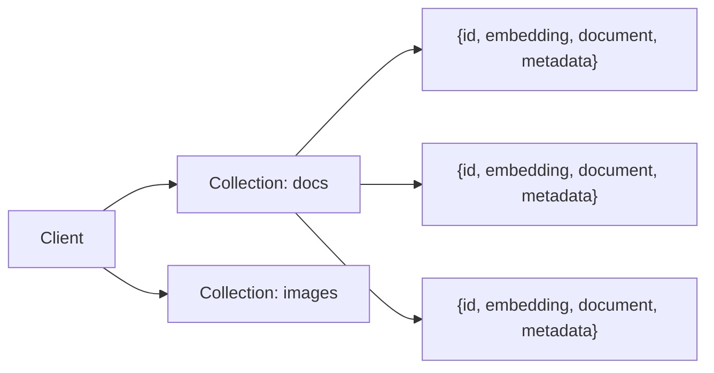

# ChromaDB：最轻量的 AI 原生向量数据库

> 基于 ChromaDB 0.5.x，Python 3.10+，Apache 2.0。

## 一句话定位

ChromaDB 是面向 AI 应用开发者的向量数据库——不需要集群、不需要配置服务器、`pip install` 就能用。它是 Python 优先的，API 设计接近 `dict` 和 `list`，学习成本几乎为零。

## 为什么选 ChromaDB

| 特征 | 说明 |
|------|------|
| 零配置 | `pip install chromadb` 即可，不依赖 Docker |
| Python 原生 | 客户端和服务端都是纯 Python，可嵌入你的应用 |
| 两种模式 | 内存模式（临时实验）或持久化模式（磁盘存储） |
| 内置 embedding | 自带 OpenAI / HuggingFace 等 embedding 函数，不需要自己调 API |
| 元数据过滤 | 存储时可以附带 metadata，查询时按条件过滤 |

**不适合**：十亿级向量、需要分布式集群、需要毫秒级延迟保证。这些场景选 Milvus 或 Qdrant。

## 安装与启动

```bash
pip install chromadb
```

```python
import chromadb

# 内存模式——进程退出数据消失
client = chromadb.Client()

# 持久化模式——数据存磁盘
client = chromadb.PersistentClient(path="./my_vector_db")
```

没有服务端——`PersistentClient` 直接在本地目录创建 SQLite3 文件存元数据，向量数据存在 Parquet 文件里。整个数据库就是一个文件夹。

## 核心概念



三个概念：

- **Client**：数据库连接
- **Collection**：一组向量文档的集合——相当于关系数据库的表
- **Document**：一条记录，包含 id、embedding（向量）、document（原文）、metadata（标签/来源等）

## 基本操作

### 创建 Collection 并写入数据

```python
import chromadb

client = chromadb.PersistentClient(path="./kb_db")

# 创建 Collection——用内置的 OpenAI embedding 函数
collection = client.create_collection(
    name="my_knowledge",
    embedding_function=chromadb.utils.embedding_functions.OpenAIEmbeddingFunction(
        api_key="sk-...",
        model_name="text-embedding-3-small"
    )
)

# 写入文档——embedding 自动生成
collection.add(
    documents=[
        "Python 的 GIL 让多线程不能并行执行计算密集型任务",
        "asyncio 通过事件循环实现单线程并发",
        "multiprocessing 启动独立进程绕过 GIL",
        "Docker 通过 namespace 和 cgroup 实现容器隔离",
        "K8s 的声明式 API 让运维从命令式转向期望状态管理",
    ],
    metadatas=[
        {"topic": "python", "type": "concept"},
        {"topic": "python", "type": "concept"},
        {"topic": "python", "type": "concept"},
        {"topic": "docker", "type": "tool"},
        {"topic": "k8s", "type": "tool"},
    ],
    ids=["py-1", "py-2", "py-3", "dk-1", "k8s-1"],
)
```

`documents` 列表传给 embedding 函数 → 自动生成 1536 维向量 → 存入 Collection。你不需要手动调 OpenAI API。

### 查询

```python
# 语义搜索——最常用的查询
results = collection.query(
    query_texts=["Python 的多线程为什么慢"],
    n_results=2,
)

for i, doc in enumerate(results["documents"][0]):
    dist = results["distances"][0][i]
    meta = results["metadatas"][0][i]
    print(f"[{meta['topic']}] {doc}  (距离: {dist:.3f})")
```

输出：

```
[python] Python 的 GIL 让多线程不能并行执行计算密集型任务  (距离: 0.234)
[python] asyncio 通过事件循环实现单线程并发  (距离: 0.478)
```

语义搜索不匹配关键词——匹配的是**含义**。查询里没有"GIL"这个词，但 ChromaDB 找到了讲 GIL 的文档。

### 元数据过滤

```python
# 在 Docker 相关文档里搜索
results = collection.query(
    query_texts=["容器怎么隔离的"],
    n_results=2,
    where={"topic": "docker"},  # 只查 docker 类型的
)
print(results["documents"])
# → [['Docker 通过 namespace 和 cgroup 实现容器隔离']]
```

### 更新和删除

```python
# 更新
collection.update(
    ids=["py-1"],
    documents=["Python 的 GIL（全局解释器锁）导致 CPython 多线程无法并行"],
)

# 删除
collection.delete(ids=["py-3"])

# 按元数据批量删除
collection.delete(where={"type": "tool"})
```

## 实战：构建文档问答的知识库

```python
import chromadb

client = chromadb.PersistentClient(path="./doc_qa")
collection = client.get_or_create_collection(
    name="articles",
    embedding_function=chromadb.utils.embedding_functions.OpenAIEmbeddingFunction(
        api_key="sk-...",
        model_name="text-embedding-3-small"
    )
)

# === 1. 把文章切片后写入 ===
articles = [
    {"title": "Python 并发编程", "content": "GIL 是 CPython 的全局解释器锁...", "topic": "python"},
    {"title": "Docker 入门", "content": "Docker 使用 namespace 进行资源隔离...", "topic": "docker"},
    {"title": "React Hooks", "content": "useEffect 是处理副作用的 Hook...", "topic": "react"},
]

for i, article in enumerate(articles):
    collection.add(
        documents=[article["content"]],
        metadatas=[{"title": article["title"], "topic": article["topic"]}],
        ids=[f"article-{i}"],
    )

# === 2. 用户提问 → 检索最相关的文章 ===
user_question = "Python 的多线程为什么不能充分利用 CPU"

results = collection.query(
    query_texts=[user_question],
    n_results=1,
)

context = results["documents"][0][0]
source = results["metadatas"][0][0]["title"]

# === 3. 把检索结果作为上下文传给 LLM ===
prompt = f"""根据以下文档回答问题。如果文档中没有相关信息，说"不知道"。

文档来源：{source}
文档内容：{context}

问题：{user_question}"""

# 把 prompt 发给 LLM（OpenAI / Claude / DeepSeek）
# response = llm.chat(prompt)
print(prompt)
```

这就是 RAG（检索增强生成）的最简实现——**ChromaDB 做检索，LLM 做生成**。整个过程 30 行代码。

## 自定义 Embedding 函数

不想依赖 OpenAI API？用本地模型：

```python
from chromadb.utils import embedding_functions

# 方案 1：HuggingFace 本地模型（不需要 API key）
hf_ef = embedding_functions.HuggingFaceEmbeddingFunction(
    api_key="",  # 本地模型不需要
    model_name="sentence-transformers/all-MiniLM-L6-v2"  # 384 维，小而快
)

# 方案 2：Ollama（本地大模型）
ollama_ef = embedding_functions.OllamaEmbeddingFunction(
    url="http://localhost:11434/api/embeddings",
    model_name="nomic-embed-text"
)

collection = client.create_collection(
    name="local_kb",
    embedding_function=hf_ef  # 用本地 embedding
)
```

## 性能参考

| 场景 | 数据量 | QPS | 延迟 |
|------|--------|-----|------|
| 本地 SQLite + 小模型 | 10 万条 | ~50 | ~10ms |
| 本地 SQLite + OpenAI API | 10 万条 | ~20 | ~200ms（含 API 调用） |
| 内存模式 + 小模型 | 1 万条 | ~200 | ~3ms |

数据超过 50 万条时，本地 SQLite 的查询延迟会超过 100ms——这时候该考虑 Milvus 或 Qdrant 了。

## 小结

ChromaDB 的定位很明确：**开发阶段和中小规模应用的首选**。不需要运维数据库、不需要学新查询语言、`pip install` 就能开始。它抽象掉了 embedding 的细节——你传文本，它自动向量化。

三个不适合 ChromaDB 的信号：
- 单 Collection 超过 50 万条 → 查询变慢
- 需要多副本、高可用 → ChromaDB 没有集群能力
- 需要毫秒级延迟保证 → 近似检索的精度受限于索引算法

出现以上任何一种，下一篇讲的 Milvus 就是下一步。
