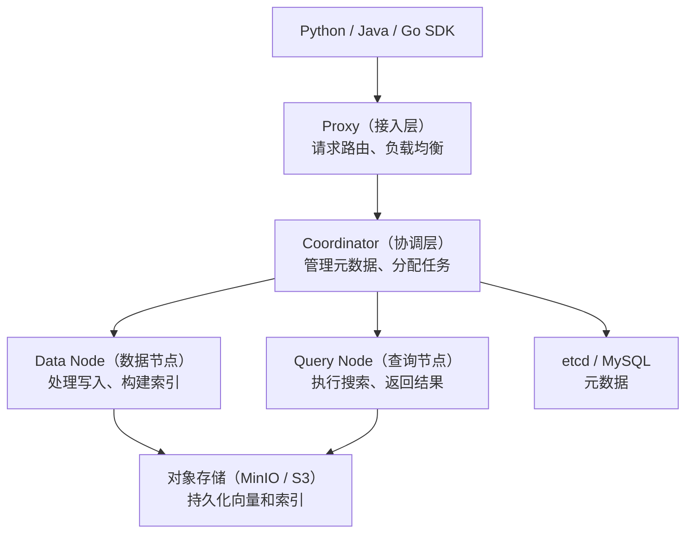

# Milvus：为十亿级向量设计的分布式引擎

> 基于 Milvus 2.5.x，Python SDK，Apache 2.0。

## 一句话定位

Milvus 是 CNCF 毕业的向量数据库——为**十亿级向量、毫秒级查询、分布式高可用**设计的。如果 ChromaDB 是你的本地开发环境，Milvus 就是生产集群。

## ChromaDB 的终点，Milvus 的起点


三者的分界线大致是数据规模：

| 数据量 | 推荐 |
|--------|------|
| < 50 万 | ChromaDB（零运维） |
| 50 万 ~ 千万 | Milvus (Standalone) 或 pgvector |
| 千万 ~ 十亿 | Milvus (Cluster) |
| 已有 PostgreSQL | pgvector |

## 架构：存算分离

Milvus 的核心设计是**存算分离**——四个组件各司其职：



- **Proxy**：无状态接入层，可以水平扩展
- **Coordinator**：大脑——管理集群拓扑、分配写入/查询任务
- **Data Node**：写入通道——数据先写消息队列，Data Node 消费后建立索引
- **Query Node**：查询通道——从对象存储加载索引到内存，执行搜索
- **对象存储**：MinIO（开发）或 S3（生产）——真正的数据存储

关键设计：**Query Node 把索引加载到内存，不是磁盘**——这是毫秒级查询的保证。代价是内存需求大——1 亿条 768 维向量 + IVF_FLAT 索引约需 50GB 内存。

## 安装

```bash
# Standalone 模式——单机 Docker
curl -sfL https://raw.githubusercontent.com/milvus-io/milvus/master/scripts/standalone_embed.sh -o standalone_embed.sh
bash standalone_embed.sh start
```

```bash
pip install pymilvus
```

验证：

```python
from pymilvus import connections
connections.connect(host="localhost", port="19530")
print("连接成功")  # → 连接成功
```

## 核心概念

```python
from pymilvus import (
    connections, Collection, FieldSchema,
    CollectionSchema, DataType, utility
)

connections.connect(host="localhost", port="19530")

# 1. 定义 Schema——Milvus 需要显式定义字段类型
fields = [
    FieldSchema(name="id", dtype=DataType.INT64, is_primary=True, auto_id=True),
    FieldSchema(name="title", dtype=DataType.VARCHAR, max_length=512),
    FieldSchema(name="vector", dtype=DataType.FLOAT_VECTOR, dim=1536),
    FieldSchema(name="topic", dtype=DataType.VARCHAR, max_length=64),
]

schema = CollectionSchema(fields, description="我的文档库")

# 2. 创建 Collection
collection = Collection(name="articles", schema=schema)

# 3. 创建索引——Milvus 在索引之前不能查询
index_params = {
    "metric_type": "COSINE",   # 相似度计算方式
    "index_type": "IVF_FLAT",  # 索引类型
    "params": {"nlist": 128},  # 聚类数——越大越准，越慢
}
collection.create_index(field_name="vector", index_params=index_params)

# 4. 加载到内存——查询前必须加载
collection.load()
```

### ChromaDB vs Milvus 的概念对比

| ChromaDB | Milvus | 说明 |
|----------|--------|------|
| `add()` | `insert()` | Milvus 需要显式指定字段名 |
| 自动 embedding | **需要自己生成向量** | Milvus 不做 embedding——你得先调 API 拿到向量再写入 |
| 自动索引 | `create_index()` + `load()` | Milvus 需要显式创建索引和加载到内存 |
| `query()` | `search()` | Milvus 返回距离和实体，不返回原始文档 |

## 数据写入和查询

```python
from openai import OpenAI

# Step 1：自己生成 embedding（Milvus 不做这个）
client = OpenAI()
def embed(texts):
    resp = client.embeddings.create(model="text-embedding-3-small", input=texts)
    return [d.embedding for d in resp.data]

# Step 2：写入
documents = [
    {"title": "Python GIL 详解", "topic": "python", "text": "GIL 是..."},
    {"title": "asyncio 入门", "topic": "python", "text": "事件循环是..."},
    {"title": "Docker 原理", "topic": "docker", "text": "namespace 是..."},
    {"title": "K8s 声明式", "topic": "k8s", "text": "Kubernetes 的..."},
]

titles = [d["title"] for d in documents]
texts = [d["text"] for d in documents]
vectors = embed(texts)
topics = [d["topic"] for d in documents]

# insert 需要按列传入
collection.insert([titles, vectors, topics])

# 数据先写进消息队列 → Data Node 异步建索引
# flush 强制落盘（生产环境不需要频繁调）
collection.flush()

# Step 3：查询
question = "Python 多线程为什么慢"
query_vec = embed([question])[0]

results = collection.search(
    data=[query_vec],           # 查询向量
    anns_field="vector",       # 在哪个向量字段上搜索
    param={"nprobe": 16},      # 搜索的聚类数——越大越准越慢
    limit=3,                   # 返回前 3 个
    output_fields=["title", "topic"],  # 返回哪些标量字段
)

for hit in results[0]:
    print(f"[{hit.entity.get('topic')}] {hit.entity.get('title')} "
          f"(距离: {hit.distance:.3f})")
```

输出：

```
[python] Python GIL 详解 (距离: 0.967)
[python] asyncio 入门 (距离: 0.821)
[docker] Docker 原理 (距离: 0.623)
```

## 索引类型选择

Milvus 支持十几种索引，没有"最好的"——只有"最适合你的场景"的：

| 索引 | 原理 | 适合场景 | 内存占用 |
|------|------|----------|----------|
| IVF_FLAT | K-means 聚类 → 只搜最近几个聚类 | 精度要求高、百万级 | 中 |
| IVF_SQ8 | IVF + 量化压缩（8 倍） | 内存有限、千万级 | 低 |
| IVF_PQ | 乘积量化（更高压缩比） | 内存紧张、亿级 | 极低 |
| HNSW | 图索引——跳表式的邻居搜索 | 极致查询速度、内存充足 | 高 |
| DiskANN | 磁盘上的图索引 | 亿级以上、内存不够 | 低（磁盘） |

```python
# 实际选择示例
def choose_index(total_vectors, ram_gb):
    if total_vectors > 100_000_000 and ram_gb < 64:
        return "DiskANN"        # 十亿级 + 内存不够 → 磁盘索引
    elif total_vectors > 10_000_000 and ram_gb < 32:
        return "IVF_PQ"         # 千万级 + 内存紧张 → 乘积量化
    elif ram_gb < 16:
        return "IVF_SQ8"        # 内存有限 → 量化压缩
    else:
        return "HNSW"           # 内存充足 → 图索引（最快）
```

## 三个查询参数怎么调

```python
results = collection.search(
    data=[query_vec],
    anns_field="vector",
    param={
        "nprobe": 16,      # 搜索的聚类数
        "ef": 128,          # HNSW 的搜索宽度
    },
    limit=10,
)
```

| 参数 | 索引类型 | 调大 | 调小 |
|------|----------|------|------|
| `nprobe` | IVF 系列 | 更精确、更慢 | 更快、稍不准 |
| `ef` | HNSW | 更精确、更慢 | 更快、稍不准 |
| `limit` | 全部 | 返回更多结果 | 返回更少 |

经验值：`nprobe` 设为 `nlist` 的 1/8 到 1/4。`nlist` 默认 1024 → `nprobe` 推荐 32-256。

## 分区——按时间或类型物理隔离

```python
# 按月份创建分区——查询时只搜最近的月份，大幅减少扫描量
collection.create_partition("2026-06")
collection.create_partition("2026-07")

# 写入时指定分区
collection.insert([titles, vectors, topics], partition_name="2026-06")

# 查询时只搜指定分区
results = collection.search(
    data=[query_vec],
    anns_field="vector",
    param={"nprobe": 16},
    limit=10,
    partition_names=["2026-06"],   # 只搜 6 月数据
)
```

## 小结

Milvus 的复杂度来自它的能力——存算分离、多索引类型、分区、多副本。这些东西在 10 万条向量时是负担，在 1 亿条向量时是必需品。

三条选型建议：
- **小于 50 万条或原型阶段**：ChromaDB——Milvus 的运维负担不值得
- **50 万 ~ 千万条**：Milvus Standalone 就够了——单机 Docker 部署
- **千万条以上或需要高可用**：Milvus Cluster + 对象存储 + etcd

下一篇：pgvector——如果你已经有了 PostgreSQL，不需要再跑一个新数据库。
