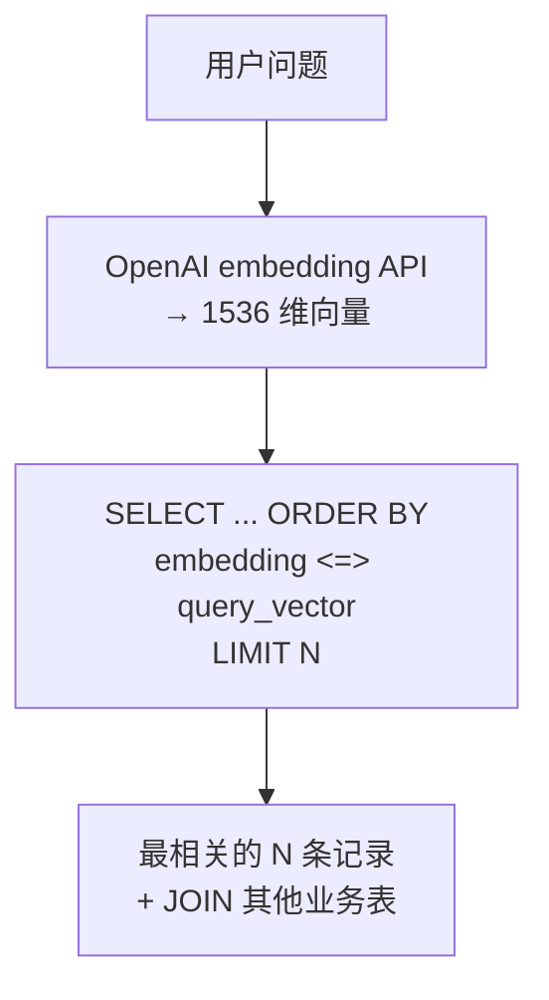
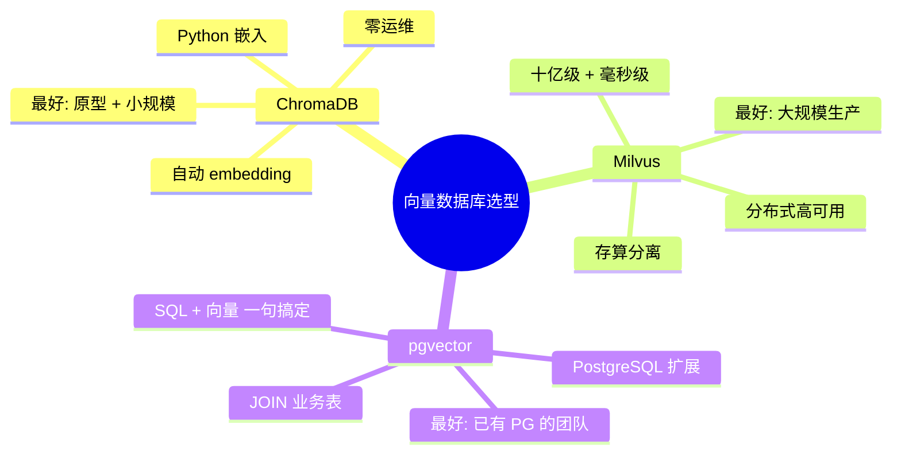

# pgvector：在 PostgreSQL 里做向量检索

> 基于 pgvector 0.7.x，PostgreSQL 15+，PostgreSQL License。

## 一句话定位

pgvector 是 PostgreSQL 的一个扩展——**在你的现有数据库里加一个字段类型 `vector`，就能做向量检索**。不需要起新服务、不需要同步数据、不需要学新查询语言。

## 为什么选 pgvector

对于 90% 的团队，向量数据库不应该是新增的基础设施——只是现有数据库的一个新功能。

| 场景 | 推荐 |
|------|------|
| 已有 PostgreSQL | pgvector |
| 需要 JOIN 向量检索结果和业务表 | pgvector（SQL 天然支持） |
| 团队只会 SQL | pgvector |
| 数据在 PostgreSQL 里，不想同步到另一个数据库 | pgvector |
| 千万级以上纯向量检索、不需要 JOIN | Milvus |

## 安装

```sql
-- 在已有 PostgreSQL 中启用扩展（需要 superuser）
CREATE EXTENSION vector;
```

Docker 快速体验：

```bash
docker run -d --name pgvector \
  -e POSTGRES_PASSWORD=postgres \
  -p 5432:5432 \
  pgvector/pgvector:pg17
```

```python
pip install psycopg2-binary
```

## 建表和写入

```sql
-- 创建一个带 vector 字段的表
CREATE TABLE documents (
    id SERIAL PRIMARY KEY,
    title TEXT,
    content TEXT,
    topic TEXT,
    embedding vector(1536)  -- OpenAI text-embedding-3-small 是 1536 维
);
```

```python
import psycopg2
from openai import OpenAI

conn = psycopg2.connect("dbname=postgres user=postgres password=postgres")
client = OpenAI()

def embed(texts):
    resp = client.embeddings.create(model="text-embedding-3-small", input=texts)
    return [d.embedding for d in resp.data]

articles = [
    ("Python GIL 详解", "GIL 是 CPython 的全局解释器锁...", "python"),
    ("asyncio 入门", "事件循环是 asyncio 的核心...", "python"),
    ("Docker 原理", "namespace 和 cgroup 是容器的基石...", "docker"),
    ("K8s 声明式", "Kubernetes 使用声明式 API...", "k8s"),
]

for title, content, topic in articles:
    vec = embed([content])[0]
    cur = conn.cursor()
    cur.execute(
        "INSERT INTO documents (title, content, topic, embedding) VALUES (%s, %s, %s, %s)",
        (title, content, topic, vec)
    )

conn.commit()
```

## 向量检索

```python
question = "Python 的多线程为什么不能并行"
query_vec = embed([question])[0]

cur = conn.cursor()
cur.execute("""
    SELECT title, topic, content,
           1 - (embedding <=> %s::vector) AS similarity
    FROM documents
    ORDER BY embedding <=> %s::vector
    LIMIT 3
""", (query_vec, query_vec))

for row in cur.fetchall():
    print(f"[{row[1]}] {row[0]}  (相似度: {row[3]:.3f})")
```



关键语法：

| 操作符 | 含义 | 场景 |
|--------|------|------|
| `<=>` | 余弦距离（cosine distance） | 语义搜索（常用） |
| `<->` | L2 距离（欧几里得距离） | 坐标距离 |
| `<#>` | 内积（负值，越大越相似） | 需要方向敏感 |

三种距离的选择：

```sql
-- 余弦距离——比较方向，不关心向量长度。语义搜索首选
ORDER BY embedding <=> '[...]'::vector

-- L2 距离——比较绝对位置。适合坐标、图像特征
ORDER BY embedding <-> '[...]'::vector

-- 内积——已归一化的向量。点积越大 = 越相似
ORDER BY embedding <#> '[...]'::vector   -- ⚠️ 返回负值，默认升序
ORDER BY embedding <#> '[...]'::vector DESC  -- 降序 = 相似度从高到低
```

90% 的场景用 `<=>`（余弦距离）就够了。

## 混合搜索：向量 + SQL 条件过滤

这是 pgvector 相比专用向量数据库最大的优势——**向量搜索和 SQL 过滤在同一句里完成**：

```python
# ChromaDB 里做这个需要先搜再手动过滤
# Milvus 里需要标量过滤 + 向量搜索两步
# pgvector 里就是一句 SQL

question = "Docker 容器怎么实现的"
query_vec = embed([question])[0]

cur.execute("""
    SELECT title, content,
           1 - (embedding <=> %s::vector) AS similarity
    FROM documents
    WHERE topic = 'docker'             -- SQL 条件过滤
      AND embedding <=> %s::vector < 0.3  -- 向量距离过滤
    ORDER BY embedding <=> %s::vector
    LIMIT 5
""", (query_vec, query_vec, query_vec))
```

更实际的例子——**和用户表 JOIN**：

```sql
-- 搜索"对 Python 有兴趣的用户创作的文章"
SELECT d.title, d.content,
       1 - (d.embedding <=> %s::vector) AS similarity,
       u.username, u.email
FROM documents d
JOIN users u ON d.author_id = u.id
WHERE d.topic = 'python'
  AND u.tags @> ARRAY['python', 'developer']
ORDER BY d.embedding <=> %s::vector
LIMIT 10;
```

这就是专用向量数据库做不到的——**向量搜索和关系数据在同一事务里、用同一个连接、写同样的 SQL**。

## 索引：IVFFlat vs HNSW

```sql
-- 先建索引，再查（一万条以下不重要，五万条开始必需）

-- IVFFlat 索引——需要先建 lists
CREATE INDEX ON documents USING ivfflat (embedding vector_cosine_ops)
    WITH (lists = 100);

-- HNSW 索引——内存占用更大，查询更快
CREATE INDEX ON documents USING hnsw (embedding vector_cosine_ops)
    WITH (m = 16, ef_construction = 200);
```

| | IVFFlat | HNSW |
|------|---------|------|
| 原理 | K-means 聚类，只搜最近几个聚类 | 图索引，逐层跳表查找 |
| 构建速度 | 快 | 慢 |
| 查询速度 | 中等 | **快** |
| 内存占用 | 较低 | **高**（图结构全在内存） |
| 适合 | 内存有限、数据集定期重建 | 内存充足、追求查询速度 |

```sql
-- 调 HNSW 参数
CREATE INDEX ON documents USING hnsw (embedding vector_cosine_ops)
    WITH (m = 32, ef_construction = 300);
-- m: 每个节点的最大连接数（默认 16，越大越准越慢）
-- ef_construction: 构建时的搜索宽度（默认 64，越大索引质量越高）
```

**注意**：pgvector 的索引创建需要全量扫描——100 万条数据可能跑几分钟。生产环境建议在低峰期建索引。

## 查询时的参数调整

```sql
-- 调整 HNSW 的搜索宽度——和 Milvus 的 ef 概念一样
SET hnsw.ef_search = 100;  -- 默认 40，调大更准更慢

-- 然后查
SELECT * FROM documents
ORDER BY embedding <=> '[...]'::vector
LIMIT 10;
```

## 实战：用 pgvector 构建混合搜索引擎

```python
import psycopg2

class HybridSearch:
    """结合全文搜索（关键词）和向量搜索（语义）的混合检索"""

    def __init__(self, conn):
        self.conn = conn

    def search(self, query: str, topic: str = None, top_k: int = 10):
        query_vec = embed([query])[0]
        cur = self.conn.cursor()

        sql = """
            SELECT title, content, topic,
                   -- 混合分数：向量相似度 70% + 全文搜索 30%
                   (1 - embedding <=> %s::vector) * 0.7 +
                   ts_rank(to_tsvector('chinese', content),
                           plainto_tsquery('chinese', %s)) * 0.3
                   AS hybrid_score
            FROM documents
            WHERE 1=1
        """
        params = [query_vec, query]

        if topic:
            sql += " AND topic = %s"
            params.append(topic)

        sql += " ORDER BY hybrid_score DESC LIMIT %s"
        params.append(top_k)

        cur.execute(sql, params)
        return cur.fetchall()

# 使用
searcher = HybridSearch(conn)
results = searcher.search("容器技术是怎么实现隔离的", topic="docker")
for row in results:
    print(f"[{row[2]}] {row[0]} (分数: {row[3]:.3f})")
```

混合搜索的意义：**向量搜索给你语义匹配，全文搜索给你关键词精确命中**。两者的分数加权求和，比单独用任一方法都更准。

## 性能

| 数据量 | 有无索引 | 查询延迟 |
|--------|----------|----------|
| 1 万 | 无 | ~5ms |
| 5 万 | IVFFlat | ~15ms |
| 10 万 | IVFFlat | ~25ms |
| 10 万 | HNSW | ~5ms |
| 100 万 | HNSW | ~10ms |
| 1000 万 | HNSW + 分区 | ~30ms |

pgvector 在 100 万以内的表现和 Milvus 接近——大部分应用不需要 Milvus。1000 万以上，Milvus 的存算分离和分布式架构开始体现优势。

## 小结

三款向量数据库代表三种理念：



选型口诀：**原型用 ChromaDB，生产有 PG 用 pgvector，没 PG 且数据量大用 Milvus**。
