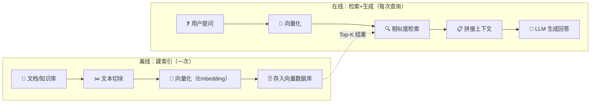

# 向量 RAG：让 LLM 能翻资料的完整指南

> 你问 LLM「公司的请假流程是什么」，它不知道。不是因为不够聪明，是因为它的知识停在训练截止日期。RAG 做的事情很简单：**先搜资料，再回答问题**——就像开卷考试。

## 什么问题 RAG 能解决

LLM 有两个硬伤：

```text
硬伤 1：知识截止日期
  GPT-4 训练数据到 2023 年底，Claude 到 2025 年初——之后发生的事情一概不知

硬伤 2：没有你的私有数据
  公司内部 wiki、产品文档、客服聊天记录——LLM 没见过，也不该见过
```

RAG（Retrieval-Augmented Generation）加了第三个步骤：

```text
没有 RAG：   用户提问 → LLM 直接回答（可能瞎编）
有了 RAG：   用户提问 → 搜索相关资料 → 把资料和问题一起给 LLM → 有据可查的回答
```

类比就是——没有 RAG 的 LLM 像闭卷考试（背了多少答多少），有 RAG 像开卷考试（可以查资料再答）。

## 整体流程



分两阶段：

- **离线建索引**——把知识库切成块、向量化、存好。做一次
- **在线检索+生成**——用户提问时实时向量化、搜 Top-K、拼进 prompt 给 LLM

## 第一步：文本切块（Chunking）

直接把一整本书向量化？不行。Embedding 模型有长度限制（通常 512-8192 tokens），太大了语义被稀释。所以要先切块。

### 固定大小切块（最简单）

```python
def chunk_by_size(text: str, chunk_size: int = 500, overlap: int = 50) -> list[str]:
    """按字符数切块，块之间有重叠"""
    chunks = []
    start = 0
    while start < len(text):
        end = start + chunk_size
        chunks.append(text[start:end])
        start = end - overlap  # 重叠 50 字符，防止关键信息被切断
    return chunks
```

重叠（overlap）很重要——如果不重叠，「请假需要直属领导审批」这句话可能被切在两块中间，检索时一段都找不到。

### 语义切块（更好）

按自然段落、句子边界切，语义更完整：

```python
from langchain.text_splitter import RecursiveCharacterTextSplitter

splitter = RecursiveCharacterTextSplitter(
    chunk_size=500,
    chunk_overlap=50,
    separators=["\n\n", "\n", "。", ".", " ", ""]  # 优先在段落、句子边界切
)
chunks = splitter.split_text(document)
```

### 块的大小怎么选

| 块大小 | 优点 | 缺点 |
|---|---|---|
| 小（100-200 tokens） | 检索精准 | 丢失上下文，可能需要拼相邻块 |
| 中（500-1000 tokens） | 平衡精度和上下文 | 多数场景的默认选择 |
| 大（2000+ tokens） | 上下文完整 | 检索精度下降，塞进 prompt 占地方 |

没有万能值——根据你的文档类型和 Embedding 模型试几组，看检索效果。

## 第二步：向量化（Embedding）

把文本变成向量——意思相近的文本，向量在高维空间里也相近：

```text
"怎么请假"       → [0.12, -0.34, 0.56, ..., 0.78]  (768 维或 1536 维)
"请假流程是什么"  → [0.11, -0.31, 0.54, ..., 0.81]  ← 这两个向量非常接近
"今天天气真好"   → [-0.45, 0.67, -0.12, ..., -0.33]  ← 这个差很远
```

### 常用 Embedding 模型

| 模型 | 维度 | 最大长度 | 特点 |
|---|---|---|---|
| `text-embedding-3-small` (OpenAI) | 512/1536 | 8192 | 便宜，质量好，支持缩短维度 |
| `text-embedding-3-large` (OpenAI) | 256/1024/3072 | 8192 | 质量更高，贵 4 倍 |
| `bge-large-zh-v1.5` (BAAI) | 1024 | 512 | 中文效果最好，本地跑 |
| `bge-m3` (BAAI) | 1024 | 8192 | 多语言，支持稀疏+稠密混合检索 |
| `jina-embeddings-v3` | 1024 | 8192 | 多语言，支持任务特定 embedding |

```python
from openai import OpenAI

client = OpenAI()

def embed(texts: list[str], model="text-embedding-3-small") -> list[list[float]]:
    """批量向量化"""
    resp = client.embeddings.create(model=model, input=texts)
    return [r.embedding for r in resp.data]

# 切好的块一次性向量化
embeddings = embed(chunks)
```

## 第三步：存入向量数据库

向量数据库专门做「在高维空间里找最近的邻居」这件事。之前已经写了三个：

- **ChromaDB**——最轻量，Python 原生，适合原型和本地项目
- **Milvus**——为十亿级向量设计，分布式、生产级
- **pgvector**——PostgreSQL 扩展，用 SQL 就能做向量检索

```python
import chromadb

# 存
client = chromadb.Client()
collection = client.create_collection("company_knowledge")

for i, (chunk, emb) in enumerate(zip(chunks, embeddings)):
    collection.add(
        ids=[f"doc_{i}"],
        embeddings=[emb],
        documents=[chunk],
        metadatas=[{"source": "employee_handbook.pdf", "page": str(i)}]
    )
```

## 第四步：检索（Retrieval）

### 基础：向量相似度搜索

```python
query_emb = embed(["员工请假需要什么流程"])[0]
results = collection.query(query_embeddings=[query_emb], n_results=5)
```

相似度度量：

| 度量 | 公式 | 适用场景 |
|---|---|---|
| 余弦相似度 | `cos(A,B) = A·B / (|A|×|B|)` | 最常用，关注方向 |
| 欧氏距离 | `|A - B|` | 关注绝对距离 |
| 点积 | `A·B` | 向量已归一化时等同于余弦 |

### 进阶：重排序（Re-ranking）

向量检索很快但不一定最准——语义相似不等于答案最相关。把 Top-K 结果用重排序模型再筛一遍：

```python
# 先用向量检索拿 Top-20
candidates = collection.query(query_embeddings=[query_emb], n_results=20)

# 再用 Cross-encoder 精准打分，取 Top-5
from sentence_transformers import CrossEncoder
reranker = CrossEncoder("BAAI/bge-reranker-v2-m3")
pairs = [[query, doc] for doc in candidates["documents"][0]]
scores = reranker.predict(pairs)
top5 = sorted(zip(scores, candidates["documents"][0]), reverse=True)[:5]
```

向量检索 = **粗筛**（快但不精确），重排序 = **精选**（慢但准）。两个组合就是 RAG 的标准配方。

### 进阶：混合检索

纯向量检索 + 关键词检索（BM25），适合精确查询场景（比如搜「error code 503」这种不适合向量化的）：

```python
# 向量检索
vector_results = vector_search(query_emb, top_k=20)

# 关键词检索
keyword_results = bm25_search(query, top_k=20)

# 融合（RRF: Reciprocal Rank Fusion）
final_results = reciprocal_rank_fusion(vector_results, keyword_results)
```

## 第五步：生成（Generation）

把检索到的内容拼进 prompt，让 LLM 基于这些内容回答：

```python
def build_rag_prompt(query: str, retrieved_docs: list[str]) -> str:
    context = "\n---\n".join(retrieved_docs)
    return f"""你是一个企业内部知识问答助手。请基于以下参考资料回答用户的问题。
如果参考资料中没有相关信息，请如实说"不知道"。

## 参考资料
{context}

## 用户问题
{query}

## 回答（请引用参考资料的来源）"""

# 调用 LLM
response = llm.chat(build_rag_prompt(query, top_docs))
```

关键设计点：

- **「不知道」指令**——没有相关文档时拒绝瞎编，比「尽量回答」更安全
- **引用来源**——让用户能核实答案的可信度
- **角色限定**——「企业内部知识问答助手」缩小 LLM 的行为边界

## 评估 RAG 系统

搭好了怎么知道好不好用？几个关键指标：

| 指标 | 含义 | 测量方式 |
|---|---|---|
| **召回率** | 相关文档被找到的比例 | 人工标注测试集 |
| **精确率** | 找到的文档中有多少是相关的 | 同上 |
| **忠实度** | 回答是否忠实于检索到的文档 | LLM 评估 / 人工 |
| **相关性** | 回答是否回答了用户的问题 | 用户反馈 / LLM 评估 |

一套基础测试集不需要很大——50-100 个问答对就够了，但必须覆盖边界情况（找不到相关文档、多相关文档、矛盾信息等）。

## 常见陷阱

**1. 塞太多块**

给 LLM 塞了 20 个检索结果，prompt 占满上下文窗口，回答反而更差。**Top-K 不是越大越好，5-10 通常就够了。**

**2. 不加「不知道」指令**

没找到相关文档时 LLM 仍然会「编」答案——因为它被训练成总是回答。加了「不知道」指令后配合检索分数阈值（低于 0.7 就不答），能大幅减少幻觉。

**3. 忽略文档预处理**

PDF 里的表格、图片、页眉页脚——直接抓文本会带进大量噪音。清洗步骤（去页眉页脚、表格转文本、分段合并）不能省。

**4. 评测只看表面**

「看起来不错」不等于「真的可用」。至少要跑一轮忠实度评估——每条回答是否真的基于检索到的文档。

## 和向量数据库系列的关系

之前的三篇文章是「武器库」——选哪个向量数据库存数据。这篇是「兵法」——从切块到检索到生成的全流程。两套一起看：

| 文章 | 内容 |
|---|---|
| [vector-rag-guide.md](vector-rag-guide.md)（本文） | RAG 全流程：切块→向量化→检索→生成 |
| [ChromaDB](chromadb-guide.md) | 轻量向量库：Python 原生，原型首选 |
| [Milvus](milvus-guide.md) | 分布式向量库：十亿级，生产首选 |
| [pgvector](pgvector-guide.md) | PostgreSQL 向量扩展：SQL 生态，混合查询首选 |

## 小结

RAG 本质就四件事：

1. **切**——把文档切成合适大小的块
2. **存**——向量化后存进向量数据库
3. **搜**——用户提问来的时候找最相关的块
4. **答**——把搜到的块当参考资料，让 LLM 回答

技术栈的选择取决于规模：几百篇文档用 ChromaDB 够用，几十万篇上 pgvector，百万以上考虑 Milvus。但流程是一样的。

RAG 不完美——它解决的是「LLM 不知道」的问题，不是「LLM 想不清楚」的问题。但它是目前成本最低、最可控、最可解释的知识增强方案。

---

**下一篇：** [ChromaDB：最轻量的 AI 原生向量数据库](chromadb-guide.md)
**返回：** [向量数据库系列](index.md)
